<a name="HOLTitle"></a>
# Building HoloLens Apps with Unity #

---

<a name="Overview"></a>
## Overview ##

Windows Holographic represents a completely new way to experience immersive software systems. By wearing a special visor device, the user is able to participate directly in a virtual world that combines the reality of their true environment with computer-generated content. This form of interaction is called "augmented reality" (AR) to differentiate it from other similar technologies that completely block out the real world during use (collectively known as "virtual reality" technologies).

This combination of computer-generated graphics with the real world opens up amazing possibilities that were previously unimaginable outside of hardcore science fiction literature. Obvious applications include immersive video games and situational awareness assistance, but also commercial/industrial inspections, healthcare, and many other uses that are yet to be identified and explored.

Currently, Microsoft offers a single device - the HoloLens - for development and consumption of these augmented reality holographic applications. This first-generation device is targeted towards software developers and AR enthusiasts, and thus is fairly bulky, with a somewhat short battery life. In the future, smaller and more affordable devices are expected to be available from Microsoft as well as OEMs.


There are multiple ways to build applications for Windows Holographic, including accessing the low-level APIs directly (all Windows Holographic applications are ultimately UWP apps that access some new APIs). These holographic APIs can be difficult to work with, so a popular way to build these applications is to use the Unity environment. Unity is most often used for building games and rich media experiences, and it supports most runtime platforms. You can learn more about Unity at [unity3d.com](https://unity3d.com/).

This hands-on lab assumes that either a physical holographic device is available for use, or the HoloLens emulator is installed and functioning. Access to a physical device is preferred, and will provide a much more rewarding experience.

<a name="Objectives"></a>
### Objectives ###

In this hands-on lab, you will learn how to:

- Install and configure a suitable development environment
- Build and test an interactive holographic experience

<a name="Prerequisites"></a>
### Prerequisites ###

The following are required to complete this hands-on lab:

- A Windows PC, meeting the minimum requirements:
  - Windows 7 SP1 or higher (Windows 10 is recommended)
  - DirectX9 (Shader Model 3.0) or later
  - At least 10 GB of disk storage available, 20+ is strongly recommended
  - 8 GB of RAM is strongly recommended
- A [HoloLens Development Edition visor](https://www.microsoft.com/microsoft-hololens/en-us/development-edition) (recommended over using just the emulator)
- This Hands-on Lab assumes that you are already familiar with how to wear your HoloLens device, and how to interact with it using Gaze and the basic interaction gestures
- Additional requirements apply for the HoloLens Emulator:
  - A 64-bit version of Windows 10 (Home edition not supported)
  - 64-bit CPU, with at least 4 cores
  - Additional 2 GB of disk storage available
  - 8 GB of RAM or more
  - BIOS Features (must be enabled): Hardware Virtualization, SLAT, DEP
  - DirectX11 or later
  - WDDM 1.2 driver or later
  - Hyper-V enabled in Windows
- [Visual Studio 2015](https://www.visualstudio.com/vs/) is used for integrated code editing, in place of Unity's embedded Mono IDE, and for deployment/debugging on a HoloLens device
- Prior experience with C# programming is very useful

<a name="Recommendations"></a>
### Recommendations ###

While developing applications for the Windows Holographic Platform is relatively straightforward, there are some pitfalls you should avoid. These recommendations can help make your development experience much more enjoyable:

- Use a modern PC or laptop for holographic application development. Unity takes a designer-centric approach, and is a fairly heavyweight environment (just as your favorite video editing software will likely be much more performance-intensive than your favorite code editor).
- Run the latest version of Windows 10 and the Windows SDK, but avoid pre-release versions of Windows.
- Do not try to develop for HoloLens from within a virtual machine (Hyper-V or otherwise).
- Be sure to have a decent video graphics adapter in your system, with the latest stable display drivers installed. Video driver glitches are one of the most frequent causes of problems encountered when building holographic apps in Unity.
- If you choose to edit code in Visual Studio, be sure to keep it updated with the latest RTM patches, and avoid third-party extensions.
- When possible, test your applications on real HoloLens hardware. The emulator is useful, but performs very differently from a real device and gestures are not very natural on the emulator.
- Even if you do not plan to use the HoloLens Emulator, it is recommended that you install it. The Emulator installer includes DirectX project templates for Visual Studio that you may want to explore (not covered in this lab).

---

<a name="Exercises"></a>
## Exercises ##

This hands-on lab includes the following exercises:

- [Exercise 1: Setting up the development environment](#Exercise1)
- [Exercise 2: Configuring your HoloLens](#Exercise2)
- [Exercise 3: Your first Holographic Application with Unity](#Exercise3)
- [Exercise 4: Using HoloToolkit to expedite holographic development](#Exercise4)
- [Exercise 5: Compiling and Debugging from Visual Studio](#Exercise5)
- [Exercise 6: Creating an interactive hologram](#Exercise6)
 
Estimated time to complete this lab: **45** minutes, plus download time.


<a name="Exercise1"></a>
## Exercise 1: Setting up the development environment ##

In this exercise, we walk through the steps needed to prepare your development environment for building applications for the Windows Holographic Platform with Unity.

1. Download and install the latest release of Visual Studio from [visualstudio.com](https://www.visualstudio.com/vs/). Any version will do, even the free Community Edition. Be sure to include the Windows 10 SDK, which contains the holographic APIs.

    

    _Be sure to include the Windows 10 SDK_

    > **NOTE:** You will need to include both the Windows 10 SDK Tools, and also version 10.0.10586 of the SDK

1. You will need to have a Microsoft Developer Account to sign-in to Visual Studio. If you don't already have one, be sure to register on the Visual Studio site and create one.

1. Launch Visual Studio, and select **Options...** from the **Tools** menu. Locate the **NuGet Package Manager** section of this dialog, and ensure that **Allow NuGet to download missing packages** and **Automatically check for missing packages during build in Visual Studio** are both checked. Your Unity builds will fail later if these have not been selected.

    

    _Be sure to enable automatic NuGet package downloads_

1. Download and install the latest version of the HoloLens Emulator package. You can find a link to the current release in the [Installation checklist](https://developer.microsoft.com/en-us/windows/holographic/install_the_tools#installation_checklist) from Microsoft's developer portal for HoloLens.

    The Emulator isn't necessary for development if you have a physical device available, but the installation package also comes with additional app templates. Also, the emulator allows you to simulate a specific room interior (captured from an actual device beforehand), which can be quite useful in certain scenarios.

    

    _HoloLens Emulator Installation_

1. Download and install the latest release of Unity from [unity32.com/unity](https://unity3d.com/unity). The Personal/Free edition will work just fine while learning.

    > **NOTE:** If you've attempted to work with Unity and HoloLens previously, you may recall needing to download a special build. HoloLens support is now fully integrated into Unity, so you no longer need to do that. The "normal" release version is sufficient now.

1. You will also need to have a Unity Account to sign-in to Unity. Be sure to register a new account on the Unity3D website if you do not already have one.

With a development environment in place, we can also install an emulated device to use when a physical HoloLens is not available. This is done in the second exercise below.


<a name="Exercise2"></a>
## Exercise 2: Configuring your HoloLens ##

In this exercise, you will configure your HoloLens and be introduced to some useful features of the HoloLens that may come in handy during development.

1. Equip your HoloLens visor and power it on.

1. Log in to Windows when prompted.

1. Launch the **Settings** app, and go to the **Update & Security** section.

    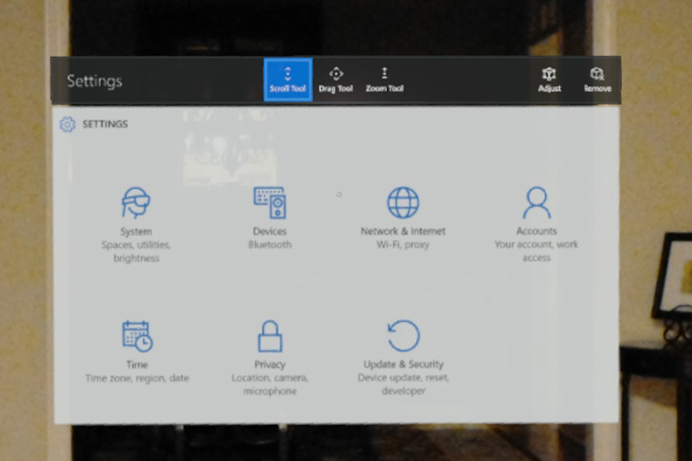

    _Tap the **Update & Security** icon in the Settings App_

1. Select the **For Developers** page.

    

    _Select **For Developers**_

1. Ensure that **Developer Mode** is toggled on, and **Remote Management via the Device Portal** (scroll to the bottom of the page to see this setting).

    

    _Enable Remote Management_

    This will enable both the ability to deploy apps to your HoloLens as well as activating a built-in web portal on the device that will come in handy. Now that the web portal has been enabled, you will need to create a login.

1. Connect the HoloLens to your Windows PC using a USB cable.

1. Browse to [http://127.0.0.1:10080](http://127.0.0.1:10080)

1. You should be presented with a Setup page that asks you to Request a pin.

    > **TIP:** If you've previously paired your HoloLens, then you will instead be prompted for an existing login and password. Once logged in, you can add credentials by clicking the Security icon in the upper right corner of the page.

    Click the **Request pin** button.

    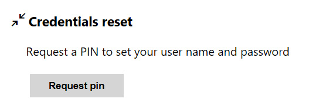

    _Resetting Credentials_

1. On the HoloLens display, you should now see a seven-digit PIN code.

    

    _Newly generated PIN code_

1. Enter this PIN code into the portal page, along with a user name and password and then click the **Pair** button.

    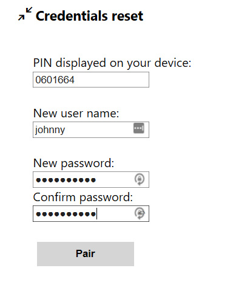

    _Pairing the HoloLens_

    > **NOTE:** This username/password will be used to access the device portal and when debugging apps, so it is important to not forget it. The only way to recover it is by performing a full reset of the HoloLens.

Spend a few minutes exploring the device portal. You will find a number of very useful features here, including diagnostic system information. One page that can be especially useful is the "Mixed Reality Capture" page, which allows you capture images and videos of what the HoloLens wearer is currently seeing. You can even see a live stream of their video/audio (delayed by a second or so).

> **TIP:** You can access the device portal via http://127.0.0.1:10080 while connected via USB, but you can also connect via Wi-Fi. After joining a Wi-Fi network on the HoloLens, find your device's IP Address in the Network Settings (or ask Cortana _"Hey Cortana, what is my IP address?"_). As long as your Windows PC is on the same Wi-Fi network, you can access the portal through that IP address.

With the HoloLens hardware ready, we are now ready to start building an application.


<a name="Exercise3"></a>
## Exercise 3: Your first Holographic Application with Unity ##

In this exercise, we will create a new Unity project and configure it (manually) to target the Windows Holographic Platform.

> **NOTE:** _In the next exercise we will see how to automate much of this; however, by going through the process manually the first time, you will learn about what is being done in the automated process and develop a slight appreciation for it._

1. Launch Unity, if it's not already running, and sign in using your Unity Account.

1. Click **+ New** to create a new Unity project. For now, the project name does not matter as this is a throw-away project.

    

    _Create a new Unity project_

1. Click the **Create Project** button to create the new empty project.

   Every holographic application needs a viewpoint to represent the person who is wearing the HoloLens visor. This is handled with a **Camera** object. Our empty project should have a camera, but if not then you will need to create one.

1. In the Scene Hierarchy panel, expand the top level node (it should be named "Untitled"). **If there is already an object named _"Main Camera"_, then skip the next step.**

1. Select **Camera** from the **GameObject** menu to create a new camera to be used as our HoloLens viewpoint.

    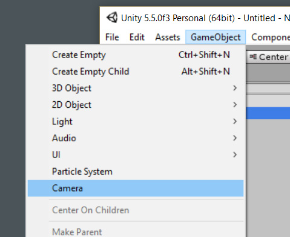

    _Create a new camera_

   This new camera must also be configured correctly for our holographic application to function properly.

1. Select the **Inspector** tab that should be docked to the right side of the Unity user interface. In the **Tag** drop-down, select **MainCamera**.

    

    _Configure as MainCamera_

1. In the **Clear Flags** drop-down, change the selection from **Skybox** to **Solid Color**.

    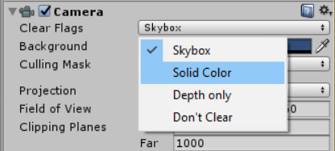

    _Configure Clear Flags as Solid Color_

1. Change the **Background** to solid black using the color palette popup.

    

    _Set Background to solid black_

1. Reset the position of the camera to **0, 0, 0**. This can be done quickly by clicking the Gear icon in the upper corner of the panel, and then selecting **Reset** from the context menu that pops up.

    > **TIP:** This is a good habit to always reset the position of any new elements placed into your scene, so that you can always depend on it's starting position.

    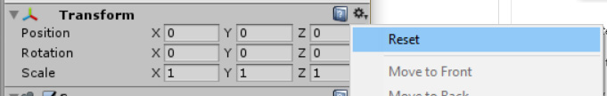

    _Reset Position_

1. Lastly, change the **Near Clipping Plane** to a more appropriate **0.85** meters from the default of 0.3. This value determines how close you can get to an object before it gets clipped out of view (otherwise you would see the "insides" of objects if you walk through them).

    

    _Set Near Clipping Plane to 0.85 meters_

    With the camera properly configured, we now need to configure the project's build settings.

    > **NOTE:** If you are accustomed to developer-oriented environments such as Visual Studio, then this next group of project-level settings might seem very odd. Don't be discouraged - this is just an result of Unity's cross-platform nature and the fact that it evolved as a designer-focused tool first.

1. Select **Build Settings...** from the **File** menu.

    

    _Build Settings_

1. In the list of Platforms, select **Windows Store** and then click the **Switch Platform** button. The Unity logo should now be drawn on the Windows Store entry instead of the default PC/Mac/Linux entry.

    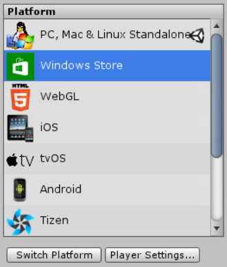

    _Switching Build Platform_

1. With **Windows Store** still selected in the list, make several changes to settings on the panel next to it:
   - Change **SDK** to **Universal 10**
   - Change **UWP Build Type** to **D3D**
   - Select the option for **Unity C# Projects** (this enables Visual Studio editing)

    

    _Windows Store Settings_

1. Click the **Player Settings...** button under the list of platforms. This will open a new region within the **Inspector** docked panel.

1. Find the **Publishing Settings** pane in the **Inspector** panel and expand it.

    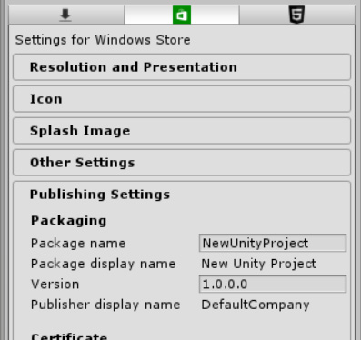

    _Publishing Settings_

1. Scroll to the very end of the **Publishing Settings** pane, where you will find the list of **Capabilities**. This is where you would declare any capabilities that your application might need to access, which might require additional permissions. **SpatialPerception** and **Microphone** are common requirements, so select those. If you intend to run your app on the HoloLens Emulator, then you will also need to select **InternetClient**.

    

    _Capabilities Settings_

1. Find the **Other Settings** pane in the **Inspector** panel and expand it.

1. Select the checkbox for **Virtual Reality Supported**. Upon selecting this option, a list of **Virtual Reality SDKs** should appear below it. Verify that **Windows Holographic** appears in that list (it will likely be the only entry in the list).

    

    _Other Settings_

1. From the **Edit** menu, select **Project Settings** and then **Quality**. This will open a new region named **QualitySettings** within the **Inspector** panel.

    

    _Quality Settings_

1. In this region, there is a matrix of options that seems like you should individually select. **_Do not do this._** Instead, notice that the header row in the matrix has small versions of the various platform icons. The green box is a mini version of the Windows Store logo - it is usually the center column of the matrix. At the bottom of each column is a small triangle - _find the small triangle under the Windows Store column, and click it_. This will display a contextual popup menu. Select the option for **Fastest** from this menu.

    > **PLEA:** Please don't ever design an application with this kind of non-intuitive user interface!

    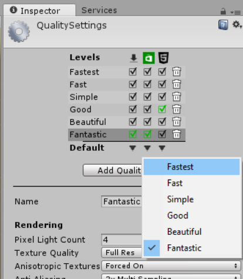

    _Quality Level_

You should now be able to add content for your application in Unity, along with any interaction script code, save the open scene (don't forget to add the newly saved scene to the **Build Settings** dialog), and then build the resulting project (again, from the **Build Settings** dialog).

***Congratulations!*** You've built a compilable Unity project that supports the Windows Holographic Platform. Of course, there's no content in this project yet, and there is a better way to get started on a new, blank project.

Next, let's backtrack and see how to automate and expedite those steps by using HoloToolkit.


<a name="Exercise4"></a>
## Exercise 4: Using HoloToolkit to expedite holographic development ##

In this exercise, we will start over with a new project, using HoloToolkit to streamline the project setup.

1. Download or clone the HoloToolkit repository from GitHub to your local Windows PC. The repository can be found at [https://github.com/Microsoft/HoloToolkit-Unity](https://github.com/Microsoft/HoloToolkit-Unity). This package is updated frequently, and you will likely want to be using the latest and greatest.

1. Open the downloaded project folder for HoloToolkit in Unity.

1. In the **Project** window pane, select the **Assets** root folder. Right-click the folder and select **Export Package...**.

    > **WARNING:** Be sure to export the entire Assets folder, including dependencies

    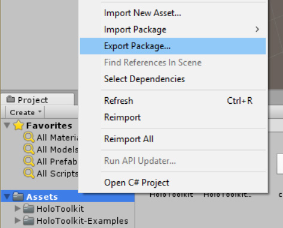

    _Exporting Assets as a Package_

1. Select a name and location for the exported package file. This package can be re-used among multiple projects, so it is a good idea to save it outside of your project folders. It is also a good idea to include the current date in the package filename so you are always aware of how old the package content might be.

1. Create a new Unity project.

1. From the **Assets** menu, select **Import Package** and then **Custom Package...**.

    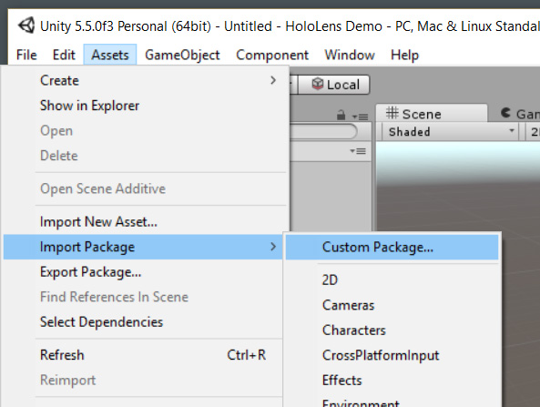

    _Importing HoloToolkit_

1. Select the package file that was exported above, and click the **Open...** button.

1. Unity gives the option of selecting which assets to import - in this case, you could unselect the **HoloToolkit-Examples** subtree to reduce the size of this application's codebase. Once you've decided on which assets to include, click the **Import** button.

    > **NOTE:** This step imports a number of very useful assets (some of which we will use in Exercise 6). It also extends the Unity Editor by adding a new menu that provides quick access to some frequently performed actions. We will make use of these shortly.

1. Find the default Main Camera in the new project's starting scene. Right-click and **Delete** it.

    

    _Delete the Default Main Camera_

1. In the **Project** panel, expand the **Assets** folder to expose the **HoloToolkit** subfolder. Expand again to find the **Input** and **Prefabs** folders.

    Drag the **HoloLensCamera.prefab** item up to the main scene node in the scene's **Hierarchy** treeview and drop it directly on that scene node. This camera is preconfigured to function properly in a HoloLens application. Remember to reset the **Rotation** of the camera after placing it.

    

    _Add a prefab Main Camera_

1. From the **HoloToolkit** menu, select the **Configure** submenu, and then select **Apply HoloLens Scene Settings**.

    Repeat this sequence, selecting **Apply HoloLens Project Settings** this time (you may be prompted to reload the project).

    Repeat one more time, selecting **Apply HoloLens Capability Settings** this time, selecting the capabilities this application will need.

    > **TIP:** You may also need to manually enable the **Unity C# Projects** build setting - these macros don't seem to always set this option properly.

    

    _Project Configuration Macros_

1. From the **HoloToolkit** menu, select **Build Window**. From here, you can directly build/export to a Visual Studio solution and also launch Visual Studio with that exported solution. This is usually a more convenient method of working than if you were not using HoloToolkit.

    - To export the current Unity project to Visual Studio, click the **Build Visual Studio SLN** button
    - To launch Visual Studio with this exported solution, click the **Open SLN** button
    - It is also possible to compile a final APPX package and deploy it directly from this dialog window, but this is not as common as compiling and deploying from Visual Studio

    > **TIP:** You only need to click the **Build Visual Studio SLN** button here when non-script assets have been changed. Script changes are automatically kept in sync between Visual Studio and Unity.

We first covered how to create a new Unity project from scratch to learn how exactly a holographic application differs from other Unity applications (mostly through certain project-level settings). After gaining an appreciation for that, we then covered a quicker method that takes care of much of that tediousness. This second method also provided some additional benefit through prefabricated components that we can use to speed up development of our own applications.


<a name="Exercise5"></a>
## Exercise 5: Compiling and Debugging from Visual Studio ##

In the previous two exercises, we walked through two different ways of creating a new holographic project in Unity. In this exercise, we will cover the steps needed to compile and run these applications.

1. In Unity, open either project that was created during the previous two exercises.

    > **NOTE:** If you are using HoloToolkit for the open project, then you can use HoloTookit's Build Window in place of steps 2 through 4 here.

1. Select **Build Settings...** from the **File** menu.

    

    _Build Settings_

1. Click the **Build** button. You will be prompted for an output folder location for Unity to place the resulting Visual Studio solution code. You should create a folder under your project for this (***"[Project Dir]\WindowsStoreApp\\"*** is usually a good location choice).

    > **NOTE:** After Unity packages resources and exports the code files, you will find two Visual Studio solution files - one in the main project folder and one in the chosen output folder. Ignore the ****.sln*** file that can be found in the main project folder.

1. Launch Visual Studio and open the ****.sln*** file that was written to your chosen output folder from the previous step. This solution file will contain three projects - you can generally ignore the one named  ***Assembly-CSharp-firstpass***. The project named ***Assembly-CSharp*** contains your script behaviors that are attached to elements throughout your Unity project, and the third one is the main application project for the App itself.

1. Verify that your main application project (will have the same name as your Unity project) is set as the **Startup Project** in Visual Studio.

1. Verify that your Visual Studio Build Configuration is set for **Debug** target, for the **x86** platform, and **Device** as the target device.

    

    _Visual Studio Build Configuration_

    > **NOTE:** Select **Device** if your HoloLens is directly connected via USB. If you wish to deploy/debug over WiFi, then you will need to select **Remote Machine** and input the IP address of your HoloLens to use remote debugging.

1. Press **F5** or select **Start Debugging** from the **Debug** menu to compile, deploy and launch the empty application.

    If this is the first time deploying from your PC to this HoloLens, you will be prompted for a **PIN code**. You can obtain this PIN code from the HoloLens device, from the Developer Settings page where Developer Mode was enabled in Exercise 2 above. Click the **Pair** button here to generate a PIN code that can be entered into Visual Studio's prompt.

    

    _Visual Studio Pairing_

    If everything goes well, Visual Studio will compile and deploy the application and then launch it. Because this application has no content yet, the only indication you will get from the HoloLens will be the Unity splash logo that always appears when using the free edition of the platform.

    > **TIP:** If you encounter build errors, first ensure that you have automatic NuGet package restore enabled in Visual Studio. You can also try **Clean All** first from the Visual Studio **Build** menu, and then **Build** the ***Assembly-CSharp-firstpass*** project by itself, followed by the ***Assembly-CSharp*** project, and then finally the main application project (sometimes, the build dependencies fail to resolve properly and manually rebuilding this way will fix it).

    > **TIP:** If your build is successful, but you don't see anything in the HoloLens or the Emulator, then double-check the project and scene configuration steps outlined in [Exercise 3](#Exercise3) above. This is often due to a missing setting (such as not enabling the Holographic SDK support).

    

    _Unity Splash Logo_

With a starter holographic project in place, we can finally move to the final exercise in this lab, where we build a simple (but complete) interaction between the user and a hologram.


<a name="Exercise6"></a>
## Exercise 6: Creating an interactive hologram ##

In this final exercise, we will create a complete holographic interaction.

1. One of the great strengths of the Unity platform is that it offers a very large array of pre-built models and artwork that you can leverage within your projects; these resources can be found in the Unity Asset Store, directly from the Unity design environment. Many of these assets are available for a modest price, but there are also many available for free. To save a great deal of time on our project, let's pull in a pre-made model from the Asset Store.

    Search the asset store for free "fountain" models. The one named "Fountain Prop" looks perfect, so select it and download into your project. You could also select another choice if you prefer.

    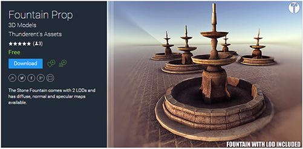

    _The "Fountain Prop" model found in the Unity Assets Store_

1. After importing the asset, you will see a new folder in the **Project Explorer** panel under the **Assets** folder named **Stone Fountain**. In this folder you should see a prefab item named "***fountain_LOD0***". Drag this prefab into your scene hierarchy to add an instance of the pre-made fountain model.

1. In the **Inspector** pane, use the **Reset Position** command of the **Transform** to move the fountain model to the center of your scene (or just set the **X**, **Y**, and **Z** positions to **0.0**).

   While we are here, let's also scale it down to **0.5** in all three dimensions (**X**, **Y** and **Z**) to make the model slightly more manageable.

   And the center of our scene isn't necessarily the best spot for the fountain, since we would literally be standing inside of it. So adjust the **Y** position to roughly **-1.5** and adjust the **Z** position to roughly **2.75**. This will place the object slightly in front of the viewer ("**Z**") and slightly below their eye level.

    

    _The "Fountain Prop" model, added to our starting scene_

1. In order to interact with the fountain, we first need to add some components to handle _Gaze_ and to provide feedback to the user, letting them know they are interacting with it. Luckily, HoloToolkit comes with some prefabs for this, which will greatly simplify things.

    Find the **DefaultCursor** prefab in the **Assets\HoloToolkit\Input\Prefabs** folder, and drag it into the scene's object hierarchy.

1. The **DefaultCursor** prefab that was just added also needs to find a **GazeManager** script in the scene (among other things). **GazeManager** is a singleton object that keeps track of where your _Gaze_ cursor is currently pointing. However, you will not find a prefab for this object if you look through your assets folders. Instead, we need to add an **InputManager** prefab, which includes a **GazeManager** as a subcomponent.

    

    _Adding the **InputManager**, along with subcomponents_

1. When this fountain is clicked, we will turn on a particle system to simulate a stream of water coming from the top of the fountain. To do this, we need to write some code to react to those click events.

    In Unity, this code is attached to game objects via a mechanism known as "_scripts_". These scripts are C# files that can be linked to one (or more) objects from within Unity, but the code itself is written using Visual Studio (or MonoDevelop for non-HoloLens projects where Visual Studio integration is not enabled). Unity scripts are quite simple in nature - you write a simple class that is instantiated as a child component of any game object that the script is attached to. These classes always inherit from the **MonoBehavior** base class, and they are allowed to communicate with other game objects as well as the Unity APIs themselves. In this case, since we intend to augment the fountain model's behavior, we should attach our script to that game object.

    To create a script, click on the newly created fountain model in the scene's object hierarchy. Then in the **Inspector** panel, scroll to the very bottom to find the **Add Component** button. When you click this button, you will see that quite a few things can be attached - the very last option should be **New Script**. The script's name is not important aside from making it easier to find again later in Unity. So in that spirit, name the script "***Fountain***", and then click the **Create and Add** button to create the new script file and attach it to the fountain.

    

    _Adding the script to our fountain_

    If you now look in your project's Assets folder, you will see the newly created script. You can double-click the script to open it within Visual Studio, however if you do so then you will likely notice that Intellisense is non-functional. This is because of how the Unity <-> Visual Studio integration works. Instead, re-export the project files ("Build SLN" in Unity) and open that exported solution file instead (or allow it to reload projects if you already had it open).

    Keep in mind that as you edit your script files in Visual Studio, your code changes are made to the original script files that Unity is using. This means that you only need to re-export the SLN from Unity when your assets are changed (modifications to scenes) or when creating/attaching a new script. _You do **not** need to re-export if the only thing changed was the code within an existing script._

    > **TIP:** You can organize your scripts and assets into whatever folder structure you prefer. Unity will keep track of where you move them to, and your objects will retain their links to the scripts even after you've re-organized them.

1. Re-export the project SLN from Unity, and open it with Visual Studio.

1. The template for new scripts provides the scaffolding for the **MonoBehavior**-based class. By default, Unity includes a `Start()` and `Update()` method. The `Start()` method is where you would place any code that needs to run once per object instance, shortly after the game object has been created and registered. The `Update()` method is called very often - once per frame. However, to respond to interaction clicks (technically, these are "_taps_") we don't need to use either of them. Instead, we need to implement the `IInputClickHandler` interface along with it's single method `OnInputClicked()`.

    Add the implementation code for this interface. For now, let's make sure that our object is receiving the click events. We will worry about the particle effects later...

    ```
    using System;
    using UnityEngine;
    using HoloToolkit.Unity.InputModule;
    
    public class Fountain : MonoBehaviour, IInputClickHandler
    {
        public void OnInputClicked(InputEventData eventData)
        {
            var gaze = InputManager.Instance.GetComponent<GazeManager>();
            if (gaze.IsGazingAtObject && gaze.HitObject == gameObject)
            {
                Debug.Log(gameObject.name + " clicked");
            }
        }
    
        // Use this for initialization
        void Start ()
        {
        }
    
        // Update is called once per frame
        void Update ()
        {
        }
    }
    ```

1. Build, deploy, and run the application on your device or emulator. The fountain should be visible, and the _Gaze_ cursor should be functional. However, you will notice that the script is not actually registering clicks in the debug output window. Terminate the app and return to Unity.

1. In order for gestures (and the built-in physics engine) to recognize and interact with objects, those objects need to have a _Collider_ attached to them. Some objects come with an attached collider (the **Cube** is one such example), but our imported fountain does not.

    Select the fountain object, click the **Add Component** button in the **Inspector** panel, and select **Mesh Collider** under the **Physics** submenu. This will cause Unity to recognize the complex mesh of the fountain as a collider.

    

    _Adding the mesh collider to the fountain object_

1. This same mesh collider will be used by the particle system so that they don't pass through each other. Before moving on, check the box to set the collider as **Convex** so that this will function properly.

    

    _Configuring the mesh collider_

    Save, re-export to Visual Studio, build, deploy and run the application again. It should now be registering clicks in the debug output window.

1. To create the particle system, we need to emit them from a fixed position at the top of the fountain. The easiest way to do this is by adding a new empty **GameObject** as a child of the fountain object, and offsetting it.

    Return to Unity, select the fountain object again, then right-click and select **Create Empty** from the popup menu. This will create an empty game node as a child element of the fountain object.

    Offset the **Z** position to just above the top of the fountain's outlet - which should be roughly **2.98**.

    

    _Adding the fountain's water outlet_
    
1. Select the new object and click **Add Component** in the **Inspector**, and this time select **Particle System** under the **Effects** submenu.

    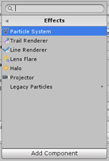

    _Adding the particle system to the fountain object_

1. In the settings for the newly added particle system, make a few modifications:
    
    > **TIP:** These are just suggestions - feel free to experiment here!

    - Set the **Start Lifetime** to **2** and the **Start Speed** to **1.2**
    - Set the **Start Size** to **0.04**
    - Enable **Looping** and **Prewarm**
    - Set the **Gravity Modifier** to **0.8**
    - Select a bluish or greenish tint for the **Start Color**
    - Set the **Shape** to **Cone**, the **Radius** to **0.01** and **Angle** to **17.0**
    - Set the **Render Mode** to **Mesh** and select **Sphere** as the type of **Mesh**
    - Choose a **Material** for the Renderer - **Default-Material** is a reasonable place to start
    - Enable the **Collision** settings, and set the **Collision Mode** to **3D**
    - Change the **Dampen** setting to **0.6** and **Bounce** to **0.7**
    - Set **Collides With** to **Everything**, change **Collision Quality** to **Medium**, and reduce **Voxel Size** to **0.25**

    

    _Configuring the particle system_

1. Save the scene in Unity, re-export to Visual Studio, and return to the "***Fountain.cs***" script that was being edited before.

1. The last step remaining is to obtain a reference to the new particle system, and `Stop()` or `Play()` accordingly whenever a click event is received. Furthermore, let's turn off the fountain during the script's `Start()` method.

    ```
    using System;
    using UnityEngine;
    using HoloToolkit.Unity.InputModule;
    
    public class Fountain : MonoBehaviour, IInputClickHandler
    {
        private ParticleSystem particles;
    
        public void OnInputClicked(InputEventData eventData)
        {
            var gaze = InputManager.Instance.GetComponent<GazeManager>();
            if (gaze.IsGazingAtObject && gaze.HitObject == gameObject)
            {
                Debug.Log(gameObject.name + " clicked");
                if (particles.isPlaying)
                {
                    particles.Stop();
                }
                else
                {
                    particles.Play();
                }
            }
        }
    
        // Use this for initialization
        void Start ()
        {
            particles = gameObject.GetComponentInChildren<ParticleSystem>();
            if (particles.isPlaying)
            {
                particles.Stop();
            }
        }
    
        // Update is called once per frame
        void Update ()
        {
        }
    }
    ```

1. Save, re-export to Visual Studio, build, deploy and run the application to test the final result:

    

    _Running the completed project - a virtual fountain in my foyer!_

While this was a fairly simple example, Unity is capable of achieving far more complex interactions. A full walkthrough of Unity itself is outside the scope of this Hands-on Lab, but we encourage you to seek out additional tutorials and resources for working in Unity so that you can explore the possibilities.


<a name="Summary"></a>
## Summary ##

In this hands-on lab you learned how to:

- Configure HoloLens hardware for application development
- Install and configure a development environment for building holographic applications
- Create a new Unity project and configure it for Windows Holographic support
- Build and run interactive applications

Developing applications for the Windows Holographic Platform is an exciting and rewarding endeavor. Holographic development can be daunting, especially for those who are new to 3D systems, but luckily the widely-used Unity environment supports targeting the platform. And once you've mastered the basics of Unity itself, you'll find it much easier to build immersive and interactive holographic applications.

----

Copyright 2016 Microsoft Corporation. All rights reserved. Except where otherwise noted, these materials are licensed under the terms of the MIT License. You may use them according to the license as is most appropriate for your project. The terms of this license can be found at https://opensource.org/licenses/MIT.