<a name="HOLTitle"></a>
# Working with Azure Virtual Machines #

---

<a name="Overview"></a>
## Overview ##

The Azure Virtual Machine service provides access to a vast array of hardware, networking, operating system, and software resources that support custom workloads in the cloud. Virtual Machines (VMs) fall into the Infrastructure-as-a-Service (IaaS) model of cloud computing, abstracting away the physical hardware while providing access to the hardware's compute resources. This arrangement affords users maximum flexibility and control, while offloading the responsibility for hardware maintenance. You can learn more about IaaS and other cloud computing models [here](https://en.wikipedia.org/wiki/Cloud_computing#Infrastructure_as_a_service_.28IaaS.29).

Microsoft has undergone profound changes in recent years. one of which is an embrace of both Linux and open-source technologies. The VMs that you create and manage in Microsoft Azure are not limited to just Windows Server images, but also include a wide selection of Linux VMs, including ones running Ubuntu, Red Hat, Debian, SUSE, Oracle, and CentOS. If none of these meet your needs, you can also [upload custom VM images]((https://azure.microsoft.com/en-us/documentation/articles/virtual-machines-linux-classic-create-upload-vhd)).
  
In this lab, you will use the gallery of preconfigured VM images in the Azure Portal to provision an Ubuntu Linux VM. You will then use a Secure Shell (SSH) terminal to log in to the VM, install Node.js and other tools in it, and configure it to act as a simple Web server. You will also get first-hand experience working with network security groups in Azure to control network traffic to and from your VM.  

<a name="Objectives"></a>
### Objectives ###

In this hands-on lab, you will learn how to:

- Provision a Linux virtual machine in Azure
- Connect to the virtual machine using SSH
- Install Node.js in the virtual machine
- Define a network security group rule to allow incoming HTTP traffic
- Stop the virtual machine to suspend further usage charges
- Use the Azure Resource Manager to delete the virtual machine and its related resources

<a name="Prerequisites"></a>
### Prerequisites ###

The following are required to complete this hands-on lab:

- An active Microsoft Azure subscription, or [sign up for a free trial](http://aka.ms/WATK-FreeTrial)
- [PuTTY](http://www.chiark.greenend.org.uk/~sgtatham/putty/download.html) (Windows users only)

<a name="Exercises"></a>
## Exercises ##

This hands-on lab includes the following exercises:

- [Exercise 1: Provision a virtual machine](#Exercise1)
- [Exercise 2: Install a Web server in the virtual machine](#Exercise2)
- [Exercise 3: Configure access to the HTTP port](#Exercise3)
- [Exercise 4: Suspend the virtual machine](#Exercise4)
- [Exercise 5: Delete the lab resources](#Exercise5)

Estimated time to complete this lab: **45** minutes.

<a name="Exercise1"></a>
## Exercise 1: Provision a virtual machine ##

The [Azure Portal](https://portal.azure.com) allows you to perform the basic operations required to create and manage virtual machines. It also provides access to a browsable marketplace of virtual-machine images that are preconfigured with popular tools and operating systems. In this exercise, you will use the Azure Portal and the Azure Marketplace to launch a Linux VM.

1. Go to the [Azure Portal](https://portal.azure.com/). If you are asked to sign in, do so using your Microsoft account.

1. Click **+ New** in the ribbon on the left. Then select **Compute**, followed by **See all**.

    

     _Adding a virtual machine_

1. Type "ubuntu" (without quotation marks) into the search box and press **Enter**. Then click **Ubuntu Server 16.04 LTS**.

    

     _Selecting an Ubuntu image_

1. Make sure **Resource Manager** is selected under **Select a deployment model**, and then click the **Create** button.

    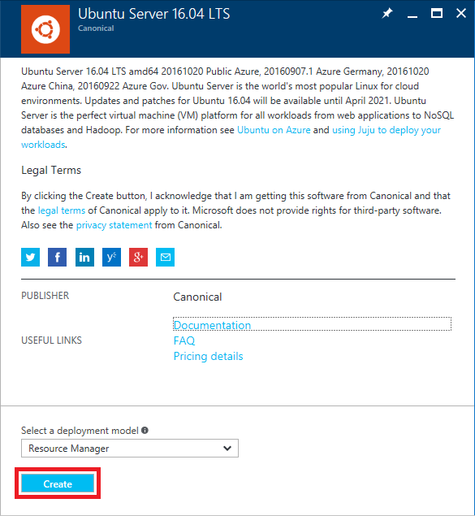

     _Selecting a deployment model_

1. In the "Basics" blade, enter "VMLab" (without quotation marks) as the VM name. Select **SSD** as the disk type and enter "azureuser" as the user name. Select **Password** as the authentication type and enter "Azure4Research" as the password. Select **Create new** under **Resource group** and enter "VMLabResourceGroup" as the resource-group name. Under **Location**, select the location nearest you. Then click **OK**.

    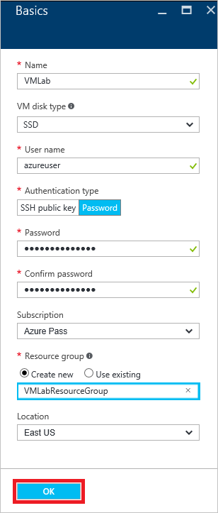

     _Specifying basic VM settings_
 
1. In the "Choose a size" blade, select **DS1_V2 Standard** and click the **Select** button.

    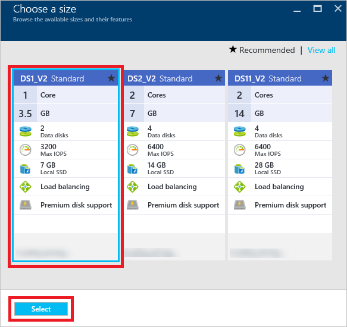

     _Selecting a virtual machine size_

1. Click the **OK** button at the bottom of the "Settings" blade to accept the default values.

1. Click the **OK** button at the bottom of the "Summary" blade to begin provisioning the virtual machine.

    

     _Reviewing the virtual machine settings_

1. When the provisioning process completes after a couple of minutes, a blade for the VM opens. Click **VMLabResourceGroup** to open the resource group that contains all of the resources related to this VM.     

    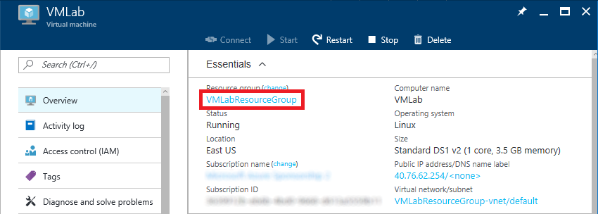

     _Opening the VM's resource group_

1. Examine the list of resources that were provisioned along with the virtual machine. These resources include:

	- The virtual machine
	- The network interface card (NIC) used by the VM
	- A network security group for the VM
	- The VM's public IP address
	- The virtual network (VNET) to which the VM belongs
	- Two storage accounts: one to store disk images for the VM, and one to store diagnostic information

    

     _The VM and associated resources_

1. Close the "VMLabResourceGroup" blade to return to the blade for the VM.

The VM is provisioned and ready to be used. The next step is to do something with it. But first, you need to connect to it via SSH.

<a name="Exercise2"></a>
## Exercise 2: install a Web server in the virtual machine

In this exercise, you will prepare your virtual machine to handle HTTP requests by installing the Node.js runtime. To work with the VM remotely, you will use a Secure Shell terminal application. On Mac and Linux systems, SSH is built into the operating system. On Windows, you will use the free third-party Windows SSH client named [PuTTY](http://www.chiark.greenend.org.uk/~sgtatham/putty/download.html).

1. Open the blade for the virtual machine you created in Exercise 1 (if it is not already open) and click the IP address.

    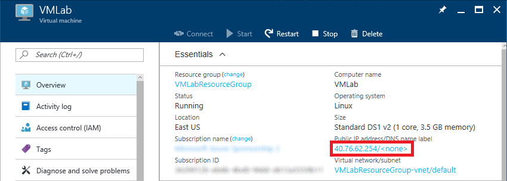

    _Opening the IP address blade_
 
1. In the "VMLab-ip" blade, click **Overview** if it isn't already selected. Then hover the mouse cursor over the **IP address** entry.  When the **Click to copy** icon appears, click it to copy the IP address to the clipboard.

    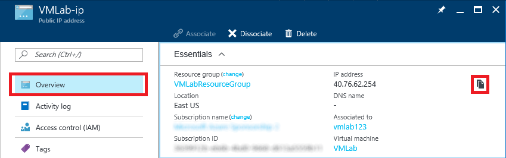

    _Copying the public IP address_

	**If you're a Windows user, skip to Step 4**. Otherwise, proceed to Step 3.

1. **Linux and macOS users only**: Open a terminal window so you can use the **ssh** command to establish a connection to the VM. Execute the following command in the terminal window, replacing *ip-address* with the IP address you copied to the clipboard in Step 2:

    <pre>
    ssh -l azureuser <i>ip-address</i></pre>

	> Because this is the first time you have connected to the virtual machine, you may be prompted with a warning asking if you trust this host. Since the host is one you created, answer **Yes**.

	Enter the SSH password ("Azure4Research") when prompted. **Now proceed to Exercise 5**. Step 4 is for Windows users only.

1. **Windows users only**: Start PuTTY. Paste the IP address that you copied to the clipboard in Step 2 into the **Host Name (or IP address)** field. Then click the **Open** button to open an SSH connection to the VM.

	> Because this is the first time you have connected to the virtual machine, you may be prompted with a warning asking if you trust this host. Since the host is one you created, answer **Yes**.

    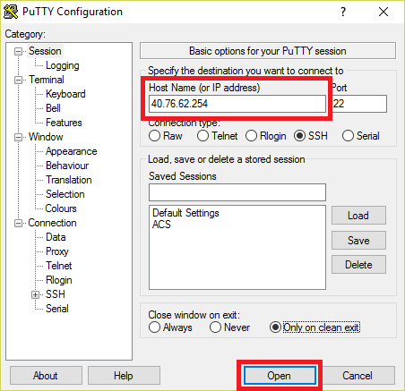

    _Connecting with PuTTY_

	A PuTTY terminal window will appear and prompt you for a user name and password. Enter the SSH user name ("azureuser") password ("Azure4Research") you specified when you created the VM.

1. In the SSH terminal window, execute the commands below one at a time to update the package lists, install the Node.js runtime, install the NPM package manager, and update the internal firewall to allow communication through port 80.

    ```
    sudo apt-get update
    sudo apt-get install nodejs
	sudo apt-get install npm
    sudo ufw allow 80
	```

1. Use the following command to open the vi editor and edit a file named **labvm.js**:

	```
    vi labvm.js
	```

1. Press the **i** key to enter Insert Mode in vi. The text "-- INSERT --" should appear in the bottom-left corner of the editor.

1. Copy the code below to the clipboard. Then press **Shift+Insert** to paste it into vi.

	```JavaScript
	var http = require('http');
	
	var server = http.createServer(function(req, res) {
	  res.writeHead(200);
	  res.end('<h1>Hello Azure VM!</h1>');
	});
	server.listen(80);
	```

1. Press the Esc key to exit Insert Mode. To finish editing and save your changes, type the following characters and press the **Enter** key:

	```
	:wq
	```

1. Execute the following command in the SSH terminal to run **labvm.js** in Node.js. This program listens for HTTP requests on port 80 and returns a fixed block of text in each response.

	```
	sudo nodejs labvm.js 
	```

The VM is almost ready to listen for HTTP requests on port 80. But first, there is some configuration you must do in the Azure Portal.
  
<a name="Exercise3"></a>
## Exercise 3: Configure access to the HTTP port

Even though you configured the firewall in the VM to allow network traffic on port 80, there is still one more step you have to perform in order for your VM to act as a Web server. That's because the virtual network that your machine resides in includes a network security group (NSG). The NSG has rules that define the types of inbound and outbound communications that are allowed, and it must be configured to allow communication on port 80. In this exercise, you will configure a rule that will allow external HTTP traffic to reach your virtual machine's network interface card (NIC).

1. In the Azure Portal, return to the blade for the virtual machine. Click **Network interfaces** to open a blade for your VM's network interface, and then click the entry for the NIC.

    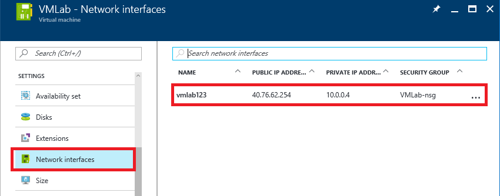

    _Opening a blade for the NIC_

1. Click **Network security group**, and then click the network security group.

    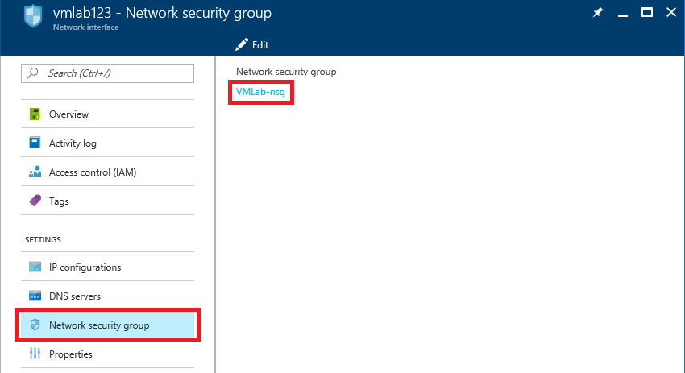

    _Opening the network security group_

1. Click **Inbound security rules**, and then click **Add** to add a new rule.

    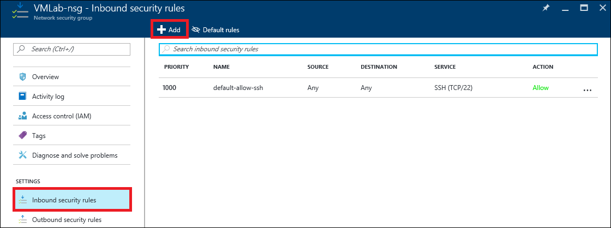

    _Adding a new inbound rule_

1. Enter the following information for the new rule:

	- Enter "Lab-VM-HTTP" (without quotation marks) in the **Name** box
	- Leave the **Priority** box set to **1010**
	- Leave the **Source** box set to **Any**
	- Under **Service**, select **HTTP**
	- Leave the **Action** selection set to **Allow**
	
	Click the **OK** button to create the rule.

    

    _Defining a new inbound rule_

1. Open a browser window and enter the IP address of your VM into the address bar. Confirm that it shows the output below.

    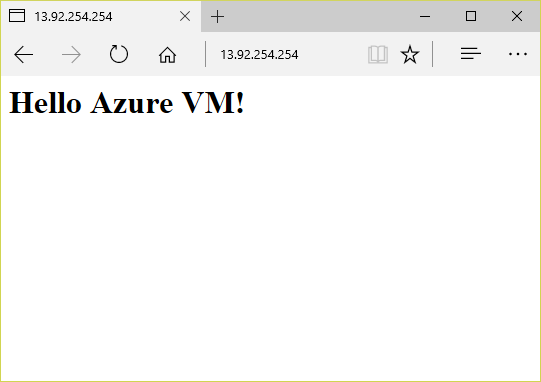

    _Output from the VM's Web server_

Congratulations! You now have an Ubuntu virtual machine running in the cloud, executing a Node.js app, and responding to HTTP requests on port 80. Feel free to close the browser window if you would like, because the next step is to learn how to suspend the VM.

<a name="Exercise4"></a>
## Exercise 4: Suspend the virtual machine

When virtual machines are running, you are being charged — even if the VM is idle. Therefore, it is advisable to stop virtual machines when they are not in use. You will still be charged for storage, but that cost is typically insignificant compared to the cost of an active VM. The Azure Portal makes it easy to stop virtual machines. VMs that you stop are easily started again later so you can pick up right where you left off.

1. In the Azure Portal, open the blade for your lab VM if it is not already open.  

1. Click the **Stop** button to stop the virtual machine.

    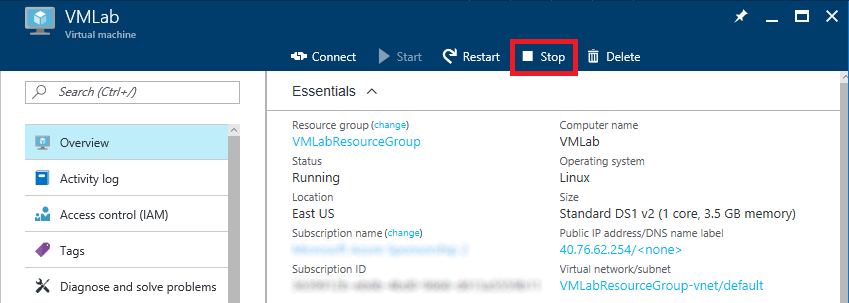

    _Stopping the virtual machine_

1. Click **Yes** when asked to confirm that you want to stop the virtual machine.

You can stop and start virtual machines in the Azure portal, but if you have a lot of VMs, that's not very efficient. In the real world, you might prefer to use an Azure CLI or PowerShell script to enumerate all of the VMs in a resource group and start or stop them all. For more information on scripting the Azure CLI, see the section entitled "How to script the Azure CLI for Mac, Linux, and Windows" in [Install and Configure the Azure CLI](https://azure.microsoft.com/en-us/documentation/articles/xplat-cli/). If you prefer visual tools to command-line tools, you can use [Azure Automation](https://azure.microsoft.com/en-us/services/automation/) to automate VM operations.

<a name="Exercise5"></a>
## Exercise 5: Delete the lab resources

Resource groups are a useful feature of Azure because they simplify the task of managing related resources. One of the most practical reasons to use resource groups is that deleting a resource group deletes all of the resources it contains. Rather than delete those resources one by one, you can delete them all at once.

In this exercise, you will delete the resource group created in [Exercise 1](#Exercise1) when you provisioned the virtual machine. Deleting the resource group deletes everything in it and prevents any further charges from being incurred for it.

1. In the Azure Portal, click **Resource groups**. Then click the "VMLabResourceGroup" resource group.

	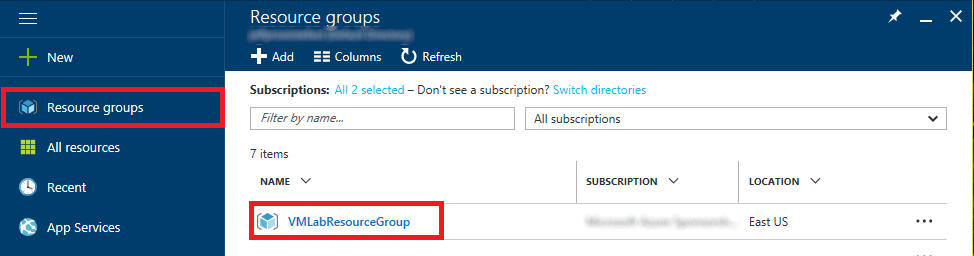

	_Opening the "VMLabResourceGroup" resource group_

1. Click the **Delete** button at the top of the resource group's blade.

	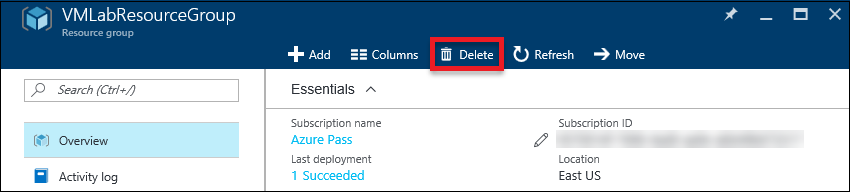

	_Deleting the resource group_

1. For safety, you are required to type in the resource group's name. (Once deleted, a resource group cannot be recovered.) Type the name of the resource group. Then click the **Delete** button to remove all traces of this lab from your account.

After a few minutes, the virtual machine and all of its resources will be deleted. Billing stops when you click the **Delete** button, so you're not charged for the time required to delete the virtual machine. Similarly, billing doesn't start until a virtual machine has been fully and successfully deployed.

## Summary ##

In this hands-on lab, you learned how to:

- Provision a Linux virtual machine in Azure
- Connect to the virtual machine using SSH
- Install Node.js in the virtual machine
- Define a network security group rule to allow incoming HTTP traffic
- Stop the virtual machine to suspend further usage charges
- Use the Azure Resource Manager to delete the virtual machine and its related resources

The Azure Virtual Machine service gives you a lot of options for configuring and deploying virtual machines. But remember, "with great power, comes great responsibility." Although VMs allow you a lot of latitude when it comes to configuration, the onus is on you to manage the VMs you create and, if desired, keep them up to date by updating software and applying relevant security patches.

---

Copyright 2016 Microsoft Corporation. All rights reserved. Except where otherwise noted, these materials are licensed under the terms of the MIT License. You may use them according to the license as is most appropriate for your project. The terms of this license can be found at https://opensource.org/licenses/MIT.