<a name="HOLTitle"></a>
# Using Azure DocumentDB #

---

<a name="Overview"></a>
## Overview ##

Whether it targets businesses, consumers, or both, an app is only as meaningful as the data that drives it. With consumer and organizational requirements changing constantly, as well as the need to store, index, and optimize data and structures as they change, the need for a more open, flexible, and schema "agnostic" data solution has been become essential. Azure DocumentDB addresses these challenges and makes it easy to adjust and adapt data models on the fly, as business logic and application scenarios change.

[DocumentDB](https://azure.microsoft.com/en-us/services/documentdb/) is a fully managed NoSQL database service built for fast performance, high availability, elastic scaling, and ease of development. As a schema-free NoSQL database, DocumentDB provides rich and familiar SQL query capabilities over JSON data, ensuring that 99% of your reads are served under 10 milliseconds and 99% of your writes are served under 15 milliseconds. These unique benefits make DocumentDB a great fit for Web, mobile, gaming, IoT, and many other applications that need seamless scale and global replication.

In this lab, you’ll create and configure an Azure DocumentDB account, database, and collection to accept the import of customer and product order information for the fictitious company Adventure Works, as well as automatically populating an Azure Search service index with customer and product information to facilitate an "autosuggest" customer order search.

<a name="Objectives"></a>
### Objectives ###

In this hands-on lab, you will learn how to:

- Create an Azure DocumentDB account, database and collections
- Populate Azure Document DB collections with documents
- Create and configure an Azure Search service and index
- Access Azure DocumentDB collections from your apps
- Query Azure Search services connected to DocumentDB content

<a name="Prerequisites"></a>
### Prerequisites ###

The following are required to complete this hands-on lab:

- An active Microsoft Azure subscription. If you don't have one, [sign up for a free trial](https://azure.microsoft.com/en-us/free/).
- [Visual Studio 2015 Community edition](https://www.visualstudio.com/en-us/products/visual-studio-community-vs.aspx) or higher
 
---

<a name="Exercises"></a>
## Exercises ##

This hands-on lab includes the following exercises:

- [Exercise 1: Create a DocumentDB instance](#Exercise1)
- [Exercise 2: Create a database and collections](#Exercise2)
- [Exercise 3: Populate collections with documents](#Exercise3)
- [Exercise 4: Connect Azure Search](#Exercise4)
- [Exercise 5: Build an Azure Web App](#Exercise5)
- [Exercise 6: Add document search to an Azure Web App](#Exercise6)

 
Estimated time to complete this lab: **60** minutes.

<a name="Exercise1"></a>
## Exercise 1: Create a DocumentDB instance ##

The first step in working with Azure DocumentDB is to create a DocumentDB instance to hold databases, collections, and documents. In this exercise, you will create and configure a DocumentDB instance.

1.	Open the [Azure Portal](https://portal.azure.com) in your browser. If you are asked to sign in, do so with your Microsoft Account.

1.	Click **+ New**, followed by **Database** and **DocumentDB (NoSQL)**.	

    

    _Creating a DocumentDB instance_

1. In the "NoSQL (DocumentDB)" blade, give the account a unique name such as "documentdbhol" and make sure a green check mark appears next to it. (You can only use numbers and lowercase letters since the name becomes part of a DNS name.) Make sure **DocumentDB** is selected for **NoSQL API**. Select **Create new** under **Resource group** and name the resource group "DocumentDBResourceGroup." Select the **Location** nearest you, and then click the **Create** button.

    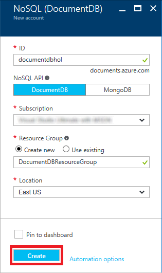

    _Specifying DocumentDB parameters_

1. Click **Resource groups** in the ribbon on the left side of the portal, and then click the resource group created for the DocumentDB instance.
 
    

    _Opening the resource group_

1. Wait until "Deploying" changes to "Succeeded," indicating that the DocumentDB instance has been deployed.

	> Refresh the page in the browser every now and then to update the deployment status. Clicking the **Refresh** button in the resource-group blade refreshes the list of resources in the resource group, but does not reliably update the deployment status.

    

    _Viewing the deployment status_

Your DocumentDB instance is now provisioned and ready for you to start working with it.

<a name="Exercise2"></a>
## Exercise 2: Create a database and collections ##

Now that you’ve deployed a DocumentDB instance, the next step is to create a database and add collections to it in preparation for storing documents. In this exercise, you will create a database and add three collections to it for storing information about customers, products, and orders.

1. Click the DocumentDB instance that you deployed in [Exercise 1](#Exercise1).

    

    _Opening the DocumentDB instance_

1. Click **+ Add Collection**.

    

    _Adding a collection_

1. Enter "Customers" (without quotation marks) as the **Collection Id** and select **10 GB** as the **STORAGE CAPACITY**. Select **Create New** under **DATABASE** and specify "CustomerOrders" as the database name. Then click the **OK** button.

    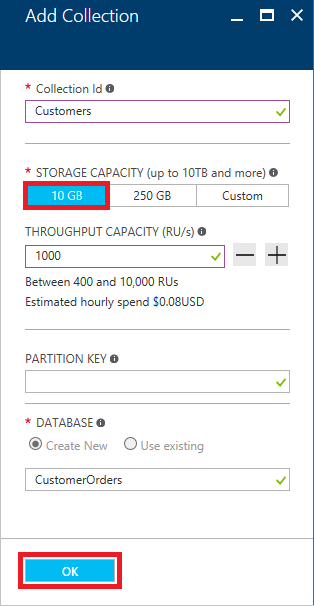

    _Creating a Customers collection_

1. Click **+ Add Collection** again. Fill in the form as shown below to create a second collection named "Orders." Be sure to add it to the existing database ("CustomerOrders") rather than create a new database. Then click **OK**.

    

    _Adding an Orders collection_

1. Click **+ Add Collection** again. Create a third collection named "Products" with the same settings as the "Customers" and "Orders" collections. Once more, be sure to add it to the existing database ("CustomerOrders") rather than create a new database.

The next step is to upload documents containing data regarding customers, products, and orders.

<a name="Exercise3"></a>
## Exercise 3: Populate collections with documents ##

There are several ways to populate DocumentDB collections with documents, including programmatic import via the [Azure SDK](https://www.nuget.org/packages/Microsoft.Azure.DocumentDB/) and the [Microsoft DocumentDB Data Migration Tool](https://www.microsoft.com/en-us/download/details.aspx?id=46436). In this exercise, you will populate your collections with data by uploading JSON documents through the Azure Portal.

1. Click **Document Explorer** in the menu on the left. Make sure **Customers** is selected in the drop-down list of collections, and click **Upload**.

    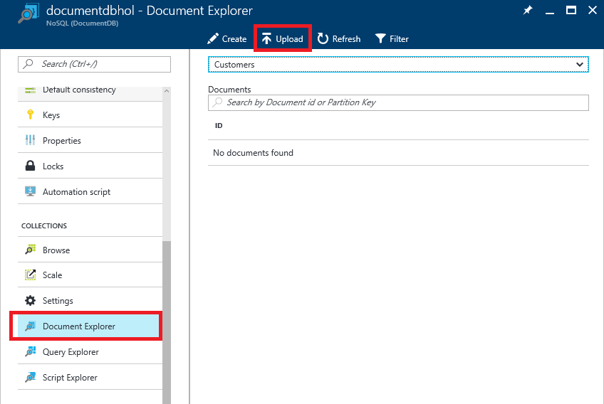

    _Opening Document Explorer_

1. Click the folder icon. Select all of the files in this lab's "Resources/Customers" folder, and then click the **Upload** button.

    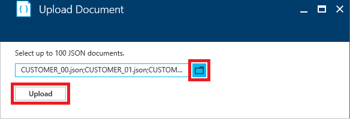

    _Uploading customer data_

	Each of the files you uploaded is a JSON document containing information about one customer. Here is one of those files:

	```JSON
	{
	  "CustomerID": "ALFKI",
	  "CompanyName": "Alfreds Futterkiste",
	  "ContactName": "Maria Anders",
	  "ContactTitle": "Sales Representative",
	  "Address": "Obere Str. 57",
	  "City": "Berlin",
	  "Region": null,
	  "PostalCode": "12209",
	  "Latitude": 52.54971,
	  "Longitude": 13.49041,
	  "Country": "Germany",
	  "Phone": "030-0074321",
	  "Fax": "030-0076545"
	}
	```

	There are 91 files in all, so the Customers collection is now populated with data regarding 91 customers.

1. Close the "Upload Document" blade and return to the "Document Explorer" blade. Select **Orders** from the drop-down list of collections and click **Upload**. Then upload all of the files in this lab's "Resources/Orders" folder to the Orders collection.

    

    _Uploading order data_

1. Repeat this process to upload all of the files in this lab's "Resources/Products" folder to the Products collection.

    

    _Uploading product data_

1. The next step is to validate the document uploads by querying one or more of the collections. Click **Query Explorer** in the menu on the left. Select **Orders** in the drop-down list of collections, and click **Run Query**.

    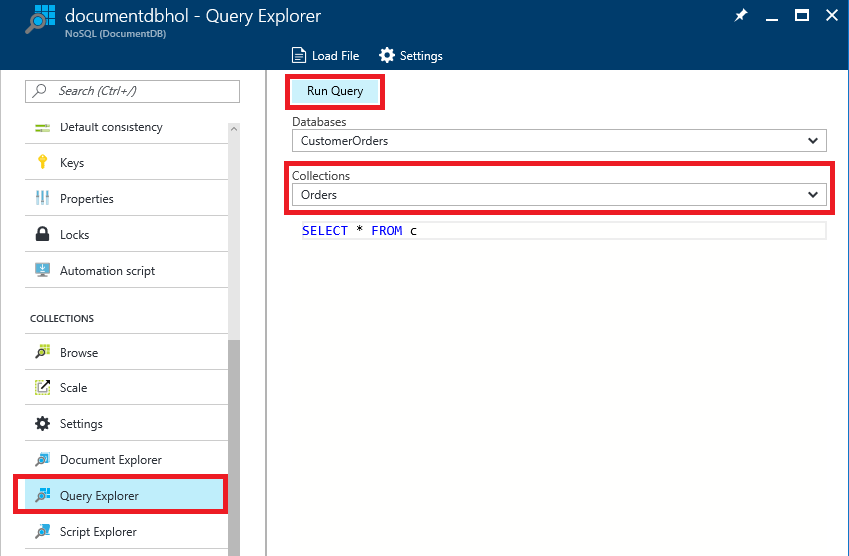

    _Querying the Orders collection_

1. Confirm that you see the query results below.

    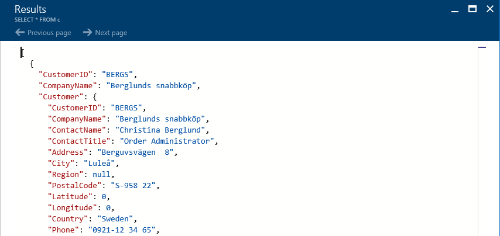

    _Query results_

1. If you would like to confirm that the product and customer uploads succeeded too, run the same query against the Products and Customers collections.

The database that you created now has three collections that are populated with data. Now let's index the data so searches can be performed quickly.

<a name="Exercise4"></a>
## Exercise 4: Connect Azure Search ##

One of the benefits of using DocumentDB is that it integrates easily with [Azure Search](https://azure.microsoft.com/services/search/). Azure Search is a managed Search-as-a-Service solution that delegates server and infrastructure management to Microsoft and lets you index data sources for lightning-fast searches. Search can be accessed through a simple [REST API](https://docs.microsoft.com/rest/api/searchservice/) or with the [Azure Search SDK](https://docs.microsoft.com/azure/search/search-howto-dotnet-sdk), enabling you to employ it in Web apps, mobile apps, and other types of applications. In this exercise, you will deploy an Azure Search instance and connect it to the DocumentDB instance that you deployed in [Exercise 1](#Exercise1).

1.	In the Azure Portal, click **+ New**, followed by **Web + Mobile** and then **Azure Search**.
	
    

    _Creating a new Azure Search instance_

1. In the "New Search Service" blade, give the account a unique name in the **URL** box and make sure a green check mark appears next to it. (You can only use numbers and lowercase letters since the name becomes part of a DNS name.) Select **Use existing** under **Resource group** and select the resource group you created for the DocumentDB instance in [Exercise 1](#Exercise1).Select the **Location** nearest you, and then click the **Create** button.

    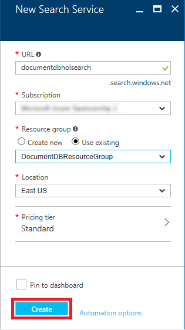

    _Specifying DocumentDB parameters_

1. Click **Resource groups** in the ribbon on the left side of the portal, and then click the resource group containing the DocumentDB instance and the Search instance.
 
    

    _Opening the resource group_

1. Wait until "Deploying" changes to "Succeeded," indicating that the Search instance has been deployed. Then click the Search service.

	> Refresh the page in the browser every now and then to update the deployment status. Clicking the **Refresh** button in the resource-group blade refreshes the list of resources in the resource group, but does not reliably update the deployment status.

    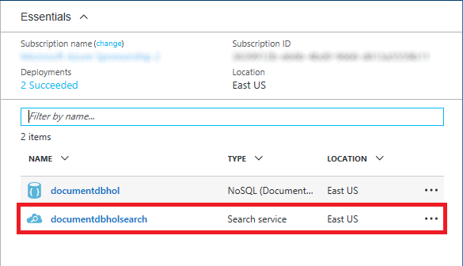

    _Opening the Search instance_

1. Click **Import data**.
	
    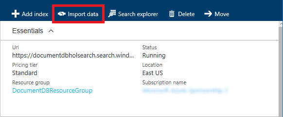

    _Importing data_

1. Click **Data Source**, followed by **DocumentDB**. In the "New data source" blade, type "customers" (without quotation marks) into the **Name** field. Click **Select an account** and select the DocumentDB instance you created in [Exercise 1](#Exercise1). Select the **CustomerOrders** database and the **Customers** collection. Then click **OK**.

    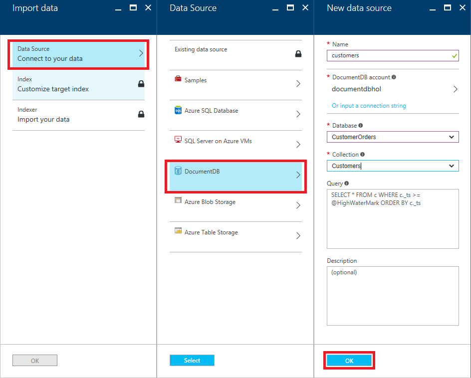

    _Connecting to a data source_

1. Click **Index** in the "Import data" blade. In the "Index" blade, type "customerindex" (without quotation marks) into the **Index name** field, and then check all five boxes in the "CompanyName" row. Then click **OK**.

    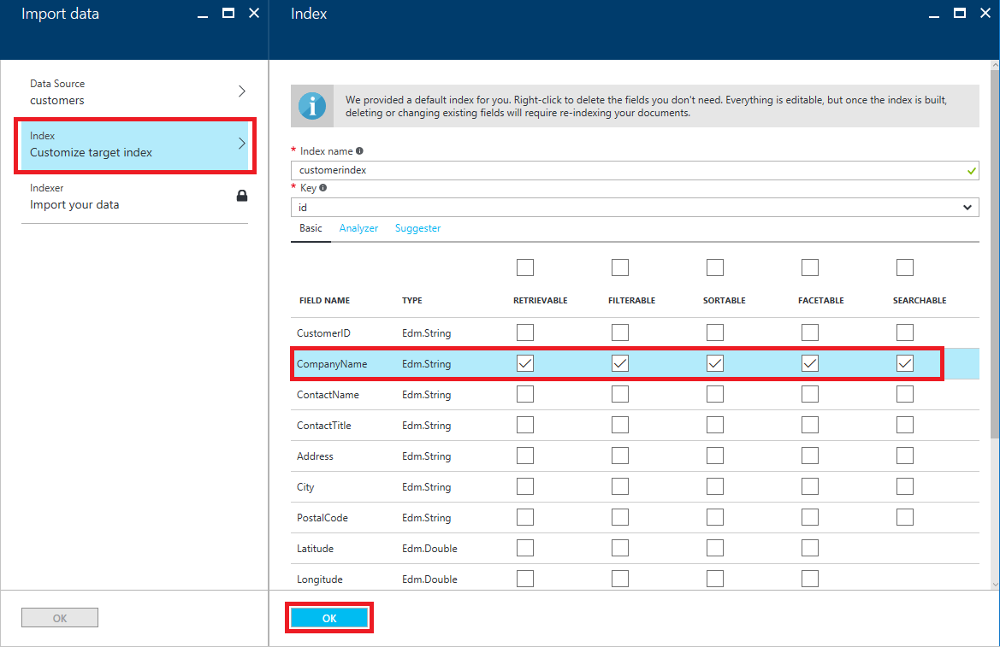

    _Configuring a search index_

1. Click **Indexer** in the "Import data" blade. In the "Indexer" blade, type "customerindexer" into the **Name** field and click **OK**. Finish up by clicking the **OK** button at the bottom of the "Import data" blade.
	
    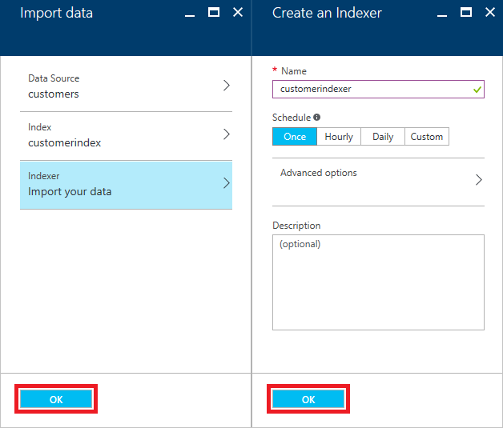

    _Configuring a search indexer_
 
With the DocumentDB database deployed and an Azure Search instance indexing it, it is time to put both to work by building a Web app that uses them to display customer, product, and order information.

<a name="Exercise5"></a>
## Exercise 5: Build an Azure Web App ##

Up to this point, most of your efforts have gone into creating and configuring services related to an Azure DocumentDB database and collection, as well as an Azure Search service, but the real value comes in being able to visualize the data returned from these services in a user experience.

In this exercise you’ll be building an Azure Web App with Visual Studio 2015 and writing code to access the Azure DocumentDB application, database, collections, and documents created in earlier exercises.

To create an Azure Web App in Visual Studio 2015:

1.	Start Visual Studio 2015 and use the **File -> New -> Project** command to create a new Visual C# **ASP.NET Web Application** project named "AdventureDoc" (short for "Adventure Works Documents").
 
    

    _Creating a new Web Application project_

1.	In the "New ASP.NET Project" dialog, select the **MVC** template. Then click the **Change Authentication** button and select **No Authentication**. (This simplifies the app by omitting authentication infrastructure.) Next, make sure the **Host in the cloud** box is checked and that **App Service** is selected in the drop-down list below the check box. Finally, click **OK**.
 
    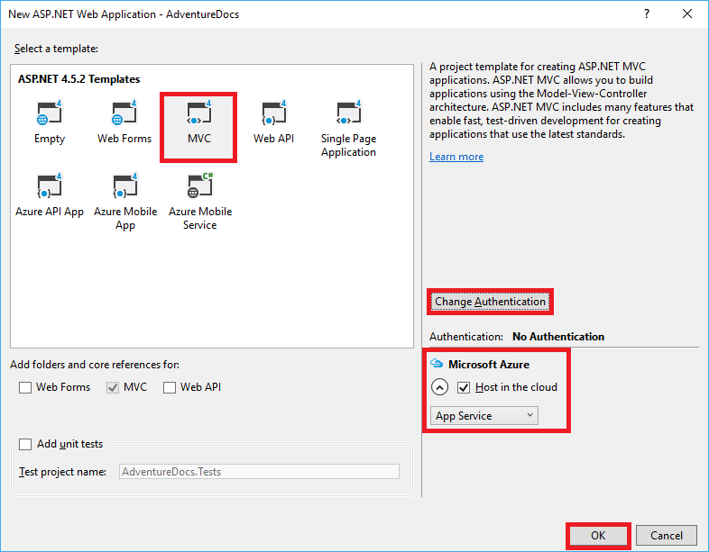

    _Creating a new ASP.NET MVC project_

1.	In the **Create App Service** dialog that ensues, enter a name into the **Web App Name** box, or accept the default. (The default name will include a bunch of numbers. Since this name will form part of the DNS name through which the app is accessed once it's deployed to Azure, it must be unique within Azure. For this reason, you probably won't be able to use the name "AdventureDocs" pictured in the screen shot.)
	
	Type "TrainingLabResouce" (without quotation marks) into the **Resource Group** box to make the App Service that's being created part of the same resource group as the Azure DocumentDB application you created in Exercise 1.

 	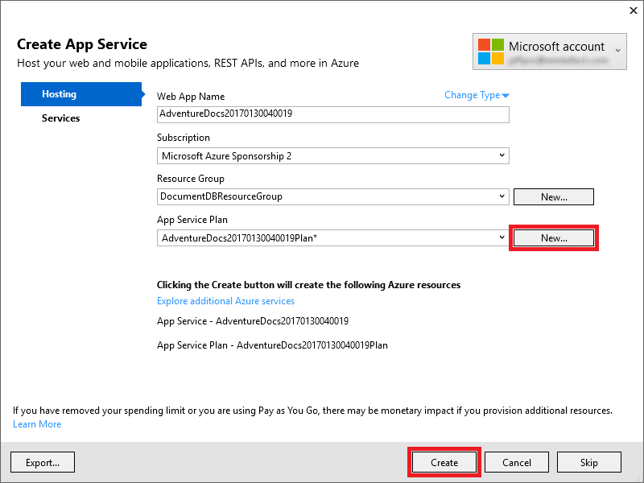

    _Creating an App Service_


	Now click the **New** button to the right of **App Service Plan** to open the "Configure App Service Plan" dialog. In that dialog, set **Location** to the same location you specified for the storage account in Exercise 1, and make sure **Free** is selected in the **Size** drop-down. Click **OK** to close the dialog.
 
    

    _Creating an App Service plan_


1.	Take a moment to review the project structure in the Solution Explorer window. Among other things, there's a folder named "Controllers" that holds the project's MVC controllers, and a folder named "View" that holds the project's views. You'll be working with assets in these folders and others as you implement the application.

1.	 Now use Visual Studio's **Debug -> Start Without Debugging** command (or simply press **Ctrl+F5**) to launch the application in your browser. Here's how the application looks in its present state:
	 
    

    _The initial application_

1.	Close the browser and return to Visual Studio. In the Solution Explorer window, right-click the **AdventureDocs** project and select **Manage NuGet Packages...**.
	 
    

    _Managing NuGet packages for the project_

1.	Click **Browse**. Then type "DocumentDB" (without quotation marks) into the search box. Click **Microsoft.Azure.DocumentDB** to select the Azure DocumentDB client library from NuGet. Finally, click **Install** to install the latest stable version of the package. This package contains APIs for accessing Azure DocumentDB from .NET applications. Click **OK** if you're prompted to review changes, and **I Accept** if prompted to accept licenses for downloaded packages.
	 
    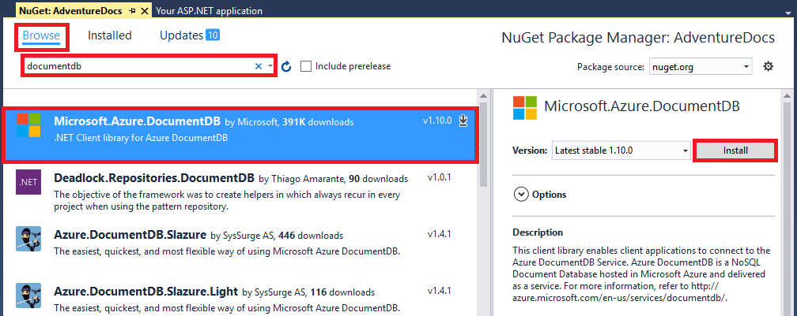

    _Installing Microsoft.Azure.DocumentDB_

1.	Repeat this process to add the NuGet package named **Microsoft.WindowsAzure.ConfigurationManager** to the project. This package contains APIs that you will use in your code to parse connection strings and access keys. Once more, OK any changes and accept any licenses presented to you.
	
    

    _Installing Microsoft.WindowsAzure.ConfigurationManager_

1.	Repeat this process to add the NuGet package named **Microsoft.Azure.Search** to the project. This package contains APIs for accessing Azure Search from .NET applications. Once more, OK any changes and accept any licenses presented to you.	
	
    

    _Installing Microsoft.Azure.Search_

1.	Repeat this process to add the NuGet package named **jQuery.UI.Combined** to the project. This package contains APIs and file elements required by MVC 5.0 for jQuery user interface elements. Once more, OK any changes and accept any licenses presented to you.
	
    

    _Installing jQuery.UI.Combined_

1.	In the Solution Explorer window, double-click **Web.config** to open it for editing.
	
    

    _The web application Web.config file_

1.	Return to the Azure Portal for a moment and open the blade for the Azure DocumentDB application you created in Exercise 1. Then .
	
    

    _Selecting the DocumentDB application_

1.	Click **Keys** in the **SETTINGS** group, then select the **Read-only Keys** tab from the **Keys** panel.
	
    

    _Viewing the DocumentDB access keys_

1.	Click the **Copy** button to the right of **URI** to copy the application endpoint the clipboard.
	
    

    _Copying the DocumentDB application endpoint_

1.	Return to Visual Studio. In *Web.config*, add the following statement to the \<appSettings\> section, replacing ***documentdb_endpoint*** with the name of the application endpoint copied to the clipboard.
	
	```C#
	<add key="DocumentDBEndpointUrl" value="documentdb_endpoint" />
	```
    	
    

    _Inserting the DocumentDBEndpoint value_

1. Return to the Azure Portal and click the **Copy** button to the right of **PRIMARY READ-ONLY KEY** to copy the application access key the clipboard.
	
    

    _Copying the DocumentDB access key_

1.	Return to Visual Studio. In *Web.config*, add the following statement to the \<appSettings\> section, replacing ***documentdb_key*** with the name of the application access key copied to the clipboard.

	```C#
	<add key="DocumentDBKey" value="documentdb_key" />
	```	
	
    

    _Inserting the DocumentDBKey value_

1.	In the Solution Explorer window, find the file named _Layout.cshtml in the **Views/Shared** folder. Double-click the **file** to open it.

    

    _Opening _Layout.cshtml_

1.	Replace the contents of Layout.cshtml with the following code and markup: 

	```c#
	<!DOCTYPE html>
	<html>
	<head>
	    <meta charset="utf-8" />
	    <meta name="viewport" content="width=device-width, initial-scale=1.0">
	    <title>@ViewBag.Title</title>
	    @Styles.Render("~/Content/css")
	    @Scripts.Render("~/bundles/modernizr")
	    @Styles.Render("~/Content/css")
	    @Styles.Render("~/Content/themes/base/css")
	    @Scripts.Render("~/bundles/modernizr")
	    @Scripts.Render("~/bundles/jquery")
	    @Scripts.Render("~/bundles/bootstrap")
	    @Scripts.Render("~/bundles/jqueryui")
	</head>
	<body>
	    <div class="navbar navbar-inverse navbar-fixed-top">
	        <div class="container">
	            <div class="navbar-header">
	                <button type="button" class="navbar-toggle" data-toggle="collapse" data-target=".navbar-collapse">
	                    <span class="icon-bar"></span>
	                    <span class="icon-bar"></span>
	                    <span class="icon-bar"></span>
	                </button>
	                @Html.ActionLink("AdventureDB", "Index", "Home", new { area = "" }, new { @class = "navbar-brand" })
	            </div>
	            <div class="navbar-collapse collapse">
	                <ul class="nav navbar-nav">
	                    <li>@Html.ActionLink("Document Search", "Index", "Home")</li>
	                    <li>@Html.ActionLink("Customer Lookup", "Lookup", "Home")</li>
	                </ul>
	            </div>
	        </div>
	    </div>
	    <div class="container body-content">
	
	        @RenderBody()
	        <hr />
	        <footer>
	            <p class="text-muted">All rights reserved. Copyright &copy;@DateTime.Now.Year AdventureDB.</p>
	        </footer>
	    </div>
	
	    @Scripts.Render("~/bundles/bootstrap")
	    @RenderSection("scripts", required: false)
	</body>
	</html>
	
	```

1.	In Solution Explorer, right-click the project's **Models** folder and select **Add -> Class**:

    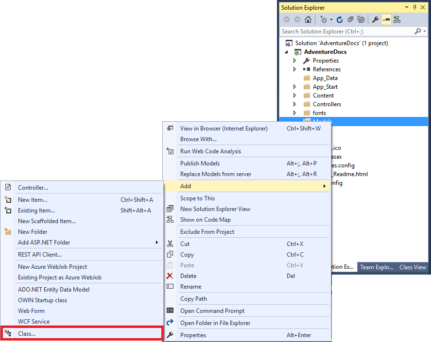

    _Adding a class to the Models folder_

1.	Type "OrderInformation.cs" (without quotation marks) into the **Name** box, and then click **OK**.

    

    _Creating the OrderInformation class_

1.	Replace the empty *OrderInformation* class with the following class definitions, and note that you are making the classes public rather than private, as well as marking the OrderInformation class as "Serializable":

	```C#
	 	[Serializable]
	    public class OrderInformation
	    {
	        public string CustomerID { get; set; }
	        public string CompanyName { get; set; }
	        public Customer Customer { get; set; }
	    }
	
	    public class Customer
	    {
	        public string CustomerID { get; set; }
	        public string CompanyName { get; set; }
	        public string ContactName { get; set; }
	        public string ContactTitle { get; set; }
	        public string Address { get; set; }
	        public string City { get; set; }
	        public object Region { get; set; }
	        public string PostalCode { get; set; }
	        public int Latitude { get; set; }
	        public int Longitude { get; set; }
	        public string Country { get; set; }
	        public string Phone { get; set; }
	        public string Fax { get; set; }
	        public Orders Orders { get; set; }
	    }
	
	    public class Orders
	    {
	        public int OrderID { get; set; }
	        public string CustomerID { get; set; }
	        public int EmployeeID { get; set; }
	        public DateTime OrderDate { get; set; }
	        public DateTime RequiredDate { get; set; }
	        public DateTime ShippedDate { get; set; }
	        public int ShipVia { get; set; }
	        public float Freight { get; set; }
	        public string ShipName { get; set; }
	        public string ShipAddress { get; set; }
	        public string ShipCity { get; set; }
	        public object ShipRegion { get; set; }
	        public string ShipPostalCode { get; set; }
	        public string ShipCountry { get; set; }
	        public Details Details { get; set; }
	    }
	
	    public class Details
	    {
	        public int OrderID { get; set; }
	        public int ProductID { get; set; }
	        public int Quantity { get; set; }
	        public float Discount { get; set; }
	        public Product Product { get; set; }
	    }
	
	    public class Product
	    {
	        public int ProductID { get; set; }
	        public string ProductName { get; set; }
	        public int SupplierID { get; set; }
	        public int CategoryID { get; set; }
	        public string QuantityPerUnit { get; set; }
	        public int UnitPrice { get; set; }
	        public int UnitsInStock { get; set; }
	        public int UnitsOnOrder { get; set; }
	        public int ReorderLevel { get; set; }
	        public bool Discontinued { get; set; }
	    }
	```

1.	Right-click the project's **Models** folder again and select **Add -> Class**:

1.	Type "SearchResultInformation.cs" (without quotation marks) into the **Name** box, and then click **OK**.
	
    

    _Creating the SearchResultInformation class_

1.	Replace the empty SearchResultInformation class with the following class definition, and note that you are making the class public rather than private:

	```C#
	 public class SearchResultInformation
	    {
	        public string Title { get; set; }
	        public string Description { get; set; }
	        public string DocumentContent { get; set; }
	    }
	```

1.	Right-click the project's **Models** folder again and select **Add -> Class**:

1.	Type "OrderViewModel.cs" (without quotation marks) into the **Name** box, and then click **OK**.	
	
    

    _Creating the OrderViewModel class_

1.	Replace the empty *OrderViewModel* class with the following class definition, and note that you are making the class public rather than private:
	
	```C#
	 public class OrderViewModel
	    {
	        public string SearchQuery { get; set; }
	        public List<SearchResultInformation> SearchResults { get; set; }
	        public List<string> Collections { get; set; }
	        public string SelectedCollectionName { get; set; }
	        public string SearchResultTitle { get; set; }
	        public string SearchResultDescription { get; set; }
	    }
	```

1.	In the Solution Explorer window, right-click the **AdventureDocs** project and select **Add -> New Folder**:
	
    

    _Adding a new folder_

1.	Type "Helpers" (without quotation marks) into the **Name** box, and then click **OK**.
	
    

    _Renaming the Helpers folder_

1.	Right-click the project's **Helpers** folder created in the previous step and select **Add -> Class**:
	
    

    _Adding a class to the Helpers folder_

1.	Type "DocumentHelper.cs" (without quotation marks) into the **Name** box, and then click **OK**.
	
    

    _Adding the DocumentHelper class to the Helpers folder_

1.	Replace the **entire contents** of the DocumentHelper class with the following using statements, namespace declaration, and class definition, and note that you are making the class public rather than private:

	```C#
	using System;
	using System.Collections.Generic;
	using System.Linq; 
	using Microsoft.Azure.Documents;
	using Microsoft.Azure.Documents.Client;
	using Newtonsoft.Json;
	using System.Threading.Tasks;
	using AdventureDocs.Models;
	
	namespace AdventureDocs.Helpers
	{
	    public class DocumentHelper
	    {
	        public static DocumentClient GetDocumentClient()
	        {
	            string endpointUrl = Microsoft.Azure.CloudConfigurationManager.GetSetting("DocumentDBEndpointUrl");
	            string primaryKey = Microsoft.Azure.CloudConfigurationManager.GetSetting("DocumentDBKey");
	
	            DocumentClient client = new DocumentClient(new Uri(endpointUrl), primaryKey);
	
	            return client;
	        }
	
	        public static async Task<List<string>> GetAvailableCollectionNamesAsync(DocumentClient client)
	        {
	            List<string> collections = new List<string>();
	
	            try
	            {
	                var dbFeed = await client.ReadDatabaseFeedAsync();
	                var defaultDb = dbFeed.FirstOrDefault();
	
	                if (defaultDb != null)
	                {
	                    FeedResponse<DocumentCollection> collFeed = await client.ReadDocumentCollectionFeedAsync(defaultDb.SelfLink);
	
	                    collections = (from feed in collFeed select feed.Id).ToList();
	                }
	            }
	            catch (Exception ex)
	            {
	
	            }
	
	            return collections;
	
	        }
	
	        public static List<SearchResultInformation> GetOrdersByOrder(DocumentClient client, string countryName)
	        {
	            FeedOptions queryOptions = new FeedOptions { MaxItemCount = -1 };
	
	            IQueryable<OrderInformation> orderQuery = client.CreateDocumentQuery<OrderInformation>(
	                    UriFactory.CreateDocumentCollectionUri("CustomerOrders", "Orders"), queryOptions)
	                    .Where(f => f.Customer.Orders.ShipCountry.ToLower().StartsWith(countryName.ToLower()));
	
	            var orderItems = orderQuery.ToList();
	
	            var results = (from item in orderItems
	                           select new SearchResultInformation()
	                           {
	                               Title = item.Customer.CompanyName,
	                               Description = item.Customer.Orders.ShipCountry,
	                               DocumentContent = JsonConvert.SerializeObject(item),
	
	                           }).ToList();
	
	
	            return results.Select(r => r.Title).Distinct().Select(title => results.First(r => r.Title == title)).ToList();
	        }
	
	        public static List<SearchResultInformation> GetOrdersByCustomer(DocumentClient client, string companyName)
	        {
	            FeedOptions queryOptions = new FeedOptions { MaxItemCount = -1 };
	
	            IQueryable<OrderInformation> orderQuery = client.CreateDocumentQuery<OrderInformation>(
	                    UriFactory.CreateDocumentCollectionUri("CustomerOrders", "Orders"), queryOptions)
	                     .Where(f => f.Customer.CompanyName.ToLower().StartsWith(companyName.ToLower()));
	
	
	            var orderItems = orderQuery.ToList();
	
	            List<SearchResultInformation> results = (from item in orderItems
	                                                     select new SearchResultInformation()
	                                                     {
	                                                         Title = item.Customer.CompanyName,
	                                                         Description = item.Customer.Country,
	                                                         DocumentContent = JsonConvert.SerializeObject(item),
	
	                                                     }).ToList();
	
	            return results.Select(r => r.Title).Distinct().Select(title => results.First(r => r.Title == title)).ToList();
	        }
	
	        public static List<SearchResultInformation> GetOrdersByProduct(DocumentClient client, string productName)
	        {
	            FeedOptions queryOptions = new FeedOptions { MaxItemCount = -1 };
	
	            IQueryable<OrderInformation> orderQuery = client.CreateDocumentQuery<OrderInformation>(
	                    UriFactory.CreateDocumentCollectionUri("CustomerOrders", "Orders"), queryOptions)
	                    .Where(f => f.Customer.Orders.Details.Product.ProductName.ToLower().StartsWith(productName.ToLower()));
	
	            var orderItems = orderQuery.ToList();
	
	            var results = (from item in orderItems
	                           select new SearchResultInformation()
	                           {
	                               Title = item.Customer.Orders.Details.Product.ProductName,
	                               Description = item.Customer.Orders.Details.Product.QuantityPerUnit,
	                               DocumentContent = JsonConvert.SerializeObject(item),
	
	                           }).ToList();
	
	
	            return results.Select(r => r.Title).Distinct().Select(title => results.First(r => r.Title == title)).ToList();
	        }
	    }
	}
	```

1.	In the Solution Explorer, find *HomeController.cs* in the **Controllers** folder and double-click it to open it.
	
    

    _Opening the HomeController.cs_

1.	Add the following using statements to the top of the file:

	```C#
	using System.Threading.Tasks;
	using AdventureDocs.Models;
	```

1.	Replace the **Index** method in HomeController.cs with the following implementation:

	```C#
	 public async Task<ActionResult> Index()
	        {
	            var model = new OrderViewModel() { SearchResults = new List<SearchResultInformation>() };
	
	            var documentClient = Helpers.DocumentHelper.GetDocumentClient();
	
	            var availableCollections = await Helpers.DocumentHelper.GetAvailableCollectionNamesAsync(documentClient);
	
	            var searchResults = (List<SearchResultInformation>)TempData["SearchResults"];
	            var searchQuery = (string)Request["SearchQuery"];
	
	            if (searchResults != null)
	            {
	                model.SearchQuery = (string)TempData["SearchQuery"];
	                model.SearchResults = (List<SearchResultInformation>)TempData["SearchResults"];
	
	                model.SelectedCollectionName = (string)TempData["SelectedCollectionName"];
	                model.SearchResultTitle = $"{model.SelectedCollectionName}";
	                model.SearchResultDescription = $"The following results were found in {model.SelectedCollectionName} for '{model.SearchQuery.ToUpper()}':";
	            }
	            else if (!string.IsNullOrEmpty(searchQuery))
	            {
	                model.SearchQuery = searchQuery;
	
	                searchResults = Helpers.DocumentHelper.GetOrdersByCustomer(documentClient, searchQuery);
	
	                model.SearchResults = searchResults;
	
	                model.SelectedCollectionName = "Customers";
	                model.SearchResultTitle = $"{model.SelectedCollectionName}";
	                model.SearchResultDescription = $"The following results were found in {model.SelectedCollectionName} for '{model.SearchQuery.ToUpper()}':";
	            }
	            else
	            {
	                model.SearchQuery = "";
	                model.SelectedCollectionName = "Customers";
	                model.SearchResultTitle = "";
	                model.SearchResultDescription = "";
	            }
	
	            model.Collections = availableCollections;
	
	
	            return View(model);
	        }
	
	```
	
1.	Add the following methods to the **HomeController** class in HomeController.cs:
	
	```C#
	        public ActionResult Lookup()
	        {
	            ViewBag.Message = "Your application description page.";
	
	            return View();
	        }
	      
	        [HttpGet]
	        public ActionResult ViewSource(string[] content)
	        {
	            return new JsonResult
	            {
	                JsonRequestBehavior = JsonRequestBehavior.AllowGet,
	                Data = content[0]
	            };
	
	        }
	
	        [HttpPost]
	        public ActionResult Search(OrderViewModel model)
	        {
	            ViewBag.Message = "Your application description page.";
	
	            string searchQuery = model.SearchQuery + "";
	
	            var documentClient = Helpers.DocumentHelper.GetDocumentClient();
	
	            List<SearchResultInformation> searchResults = new List<SearchResultInformation>();
	
	            switch (model.SelectedCollectionName)
	            {
	                case "Customers":
	                    searchResults = Helpers.DocumentHelper.GetOrdersByCustomer(documentClient, searchQuery);
	                    break;
	                case "Products":
	                    searchResults = Helpers.DocumentHelper.GetOrdersByProduct(documentClient, searchQuery);
	                    break;
	                case "Orders":
	                    searchResults = Helpers.DocumentHelper.GetOrdersByOrder(documentClient, searchQuery);
	                    break;
	                default:
	                    break;
	            }
	
	            TempData["SearchQuery"] = searchQuery;
	            TempData["SearchResults"] = searchResults;
	            TempData["SelectedCollectionName"] = model.SelectedCollectionName;
	
	            return RedirectToAction("Index");
	        }
	```

1.	In the Solution Explorer, find Index.cshmtl in the **Views/Home** folder and double-click it to open it. This is the view that serves as the application's home page.

1.	Replace the contents of Index.cshtml with the following code and markup:

	```C#
	@{
	    ViewBag.Title = "AdventureDocs";
	}
	
	<div class="row">
	    @model AdventureDocs.Models.OrderViewModel
	    <div>
	        <h2>Document Search</h2>
	        <p>
	            To search documents in your Azure DocumentDB database, enter a value, select a DocumentDB collection, and click Search.
	        </p>
	
	        @using (Html.BeginForm("Search", "Home", FormMethod.Post))
	            {
	            <div>Search for:</div>
	            @Html.TextBoxFor(o => Model.SearchQuery)
	            <p></p>
	                <div>Select a collection:</div>
	
	                @Html.DropDownListFor(x => x.SelectedCollectionName, new SelectList(Model.Collections))
	
	                <input type="submit" value="Search">
	
	        }
	
	
	        <div>
	            <h4>@Html.DisplayFor(o => Model.SearchResultTitle)</h4>
	            <div>@Html.DisplayFor(o => Model.SearchResultDescription)</div>
	            <table style="margin:10px" border="0" cellpadding="3">
	
	                @foreach (var item in Model.SearchResults)
	            {
	                    <tr>
	                        <td>
	                            <strong>@Html.DisplayFor(modelItem => item.Title)</strong>
	                        </td>
	                        <td>
	                            <em>@Html.DisplayFor(modelItem => item.Description)</em>
	                        </td>
	
	                        <td>
	                            @Html.ActionLink(
	                            linkText: "[view document]",
	                            actionName: "ViewSource",
	                            controllerName: "Home",
	                            routeValues: new { content = item.DocumentContent },
	                            htmlAttributes: null)
	                        </td>
	                    </tr>
	                }
	            </table>
	        </div>
	
	    </div>
	</div>
	
	```

1.	Find About.cshmtl in the **Views/Home** folder. Right-click the **file** and select **Rename** and replace "About" with "Lookup" (without quotation marks) into the **Name** box, and then click **OK**.
	
    

    _Selecting the About.cshtml file_
	
    

    _Renaming the About.cshtml file_

1.	Double-click the Lookup.cshtml file to open it. This is the view that will serve as the document lookup page.

1.	Replace the contents of Lookup.cshtml with the following code and markup:

	```C#
	@Scripts.Render("~/bundles/jqueryui")
	
	<script type="text/javascript">
	    $(document).ready(function () {
	 
	    $('#customers').autocomplete({
	        source: '@Url.Action("Suggest")',
	        autoFocus: true,
	        select: function (event, ui) {
	
	            if (ui.item) {
	                $("#SearchQuery").val(ui.item.value);
	                $("form").submit();
	            }
	            }
	
	            }); 
	            })
	</script>
	
	<div class="row">
	
	    <div class="col-md-4">
	        <h2>Customer Lookup</h2>
	        <p>
	            To search documents in your Azure DocumentDB database, enter a value and select an autosuggested customer.
	        </p>
	        <div>Search for:</div>
	        <input id="customers" name="customers">
	        <form action="/" method="post">
	            <input hidden="hidden" id="SearchQuery" name="SearchQuery" type="text" />
	        </form>
	    </div>
	
	    <div style="height:400px" class="col-md-4"></div>
	
	</div>
	```

1.	In the Solution Explorer, find BundleConfig.cs in the **App_Start** folder and double-click it to open it. This is the view that serves as the application's home page.

1.	Add the following code at the end of the **RegisterBundles** method:

	```C#
	  	bundles.Add(new ScriptBundle("~/bundles/jqueryui").Include("~/Scripts/jquery-ui-{version}.js"));
	    bundles.Add(new StyleBundle("~/Content/themes/base/css").Include(
	            "~/Content/themes/base/jquery.ui.core.css",
	            "~/Content/themes/base/jquery.ui.autocomplete.css",
	            "~/Content/themes/base/jquery.ui.theme.css"));
	```

1.	Use Visual Studio's **Debug -> Start Without Debugging** command (or press **Ctrl+F5**) to launch the application in your browser. 

1.	**Type** the letter "a" (without quotes) in the **Search for** and click the **Search** button. After a few seconds, a listing of all customer documents starting with the letter A on the page:
	
    

    _Viewing Customer documents_

1.	Change the **Select a collection** dropdown to **Products** and click the **Search** button. After a few seconds, a listing of all customer documents starting with the letter A appears on the page:
	
    

    _Viewing Product documents_

1.	Replace the letter "a" in the **Search for** with the letter "m", change the **Select a collection** dropdown to **Orders** and click the **Search** button. After a few seconds, a listing of all customer orders shipped to countries starting with the letter M appears on the page:
	
    

    _Viewing Order documents_

1.	The Orders listing displays the CompanyName and ShipRegion values returned from search results associated with documents on the Orders collection. To view an entire document, click **[view document]** in the far right column for an order. A new web page appears with the entire JSON-formatted document displayed.
	
    

    _Viewing Order document markup_	

Although your web app is able to easily access documents in your Customers, Products, and Orders collections, and you’ve written code to retrieve and view documents and schemas, your current search method searches for documents based on arbitrary characters entered by a user. It’s far more intuitive for a user to select from values "guaranteed" to exist in the document data. To create this experience, it’s time to add an "Autosuggest" control by leveraging Azure Search in [Exercise 6: Add document search to an Azure Web App](#Exercise6").

<a name="Exercise6"></a>
## Exercise 6: Add document search to an Azure Web App ##

Azure Search services deliver a "highly-performant" mechanism for providing super-fast retrieval of meaningful, indexed values in various data stores, based on identified and configured indexes. These values can be retrieved and displayed to users to provide a "lookup" of information "known to exist", as it draws from the actual values stored, such as documents in the Customers collection populated in Exercise 2.

To add document search to your web app:   

1.	Right-click the project's **Helpers** folder created in the previous step and select **Add -> Class**:
	
    

    _Adding a class to the Helpers folder_

1.	Type "SearchHelper.cs" (without quotation marks) into the **Name** box, and then click **OK**.
	
    

    _Adding the SearchHelper class to the Helpers folder_

1.	**Replace** the **entire contents** of the SearchHelper class with the following using statements, namespace declaration, and class definition, and note that you are making the class public rather than private:
	
	```C#
	using Microsoft.Azure.Search;
	using Microsoft.Azure.Search.Models;
	using System;
	using System.Collections.Generic;
	using System.Linq;
	using System.Threading.Tasks;
	using System.Web;
	using AdventureDocs.Models;
	
	namespace AdventureDocs.Helpers
	{
	    public static class SearchHelper
	    {
	        public static List<string> GetSuggestions(string query)
	        {
	            List<string> suggestions = new List<string>();
	
	            string searchServiceName = Microsoft.Azure.CloudConfigurationManager.GetSetting("SearchServiceName");
	            string searchServiceKey = Microsoft.Azure.CloudConfigurationManager.GetSetting("SearchServiceKey");
	
	            SearchServiceClient serviceClient = new SearchServiceClient(searchServiceName, new SearchCredentials(searchServiceKey));
	
	            ISearchIndexClient indexClient = serviceClient.Indexes.GetClient("customerindex");
	
	            DocumentSearchResult<Customer> response = indexClient.Documents.Search<Customer>($"{query.Trim()}*");
	
	            suggestions = (from result in response.Results
	                           select result.Document.CompanyName).ToList();
	
	            return suggestions;
	        }
	    }
	}
	```

1. In the Solution Explorer window, double-click *Web.config* to open it for editing and add the following statement to the \<appSettings\> section, replacing ***search_service_name*** with the name of the Azure Search service created in Exercise 4.
	
    

    _Replacing the SearchServiceName value_

1.	Return to the Azure Portal for a moment and open the blade for the Azure Search service you created in Exercise 4. Then click **Keys** in the "GENERAL" panel. 
	
    

    _Selecting the Search service Keys settings_

1.	Click **Manage query keys** to open the "Keys" panel, and then select and copy the **<empty> key value** to copy the query key to the clipboard. 


    

    _Copying the Search query key to the clipboard_


1.	Return to Visual Studio. In Web.config, add the following statement to the \<appSettings\> section, replacing **search_service_key** with the query key you copied to the clipboard in the previous step.
	
    

    _Replacing the SearchServiceKey value_

1.	In Solution Explorer, find **HomeController.cs** in the "Controllers" folder and double-click it to open it.

1.	Add the following methods to the **HomeController** class in HomeController.cs:
	
	```C#
	[HttpPost]
	        public ActionResult AutoSearch(string item)
	        {
	            ViewBag.Message = "Your application description page.";
	
	            string searchQuery = item + "";
	
	            TempData["SearchQuery"] = searchQuery;
	            TempData["SelectedCollectionName"] = "Customers";
	
	            return RedirectToAction("Index");
	        }
	
	        [HttpGet]
	        public ActionResult Suggest(string term)
	        {
	            List<string> suggestions = new List<string>();
	
	            suggestions = Helpers.SearchHelper.GetSuggestions(term);
	
	            return new JsonResult
	            {
	                JsonRequestBehavior = JsonRequestBehavior.AllowGet,
	                Data = suggestions
	            };
	
	        }
	```

1.	Use Visual Studio's **Debug -> Start Without Debugging** command (or press **Ctrl+F5**) to launch the application in your browser. 

1.	Click the **Customer Lookup** link in the top navigation to navigate to the **Customer Lookup** view.

1.	Type the characters "ar" (without quotes) in the **Search for** entry and after a short delay an "autosuggestion" list will appear, populated with actual customers from documents in the Customers collection.

    

    _Using the Azure Search integrated autosuggest control_


1.	Select **Around the Horn** from the list of customers. After a few seconds, a single document for the customer *Around the Horn* appears on the Document Search view.
	
    

    _Viewing the Azure Search integrated autosuggest result_

1.	Click **[view document]** in the far right column to view the entire document indexed and retrieved by the Azure Search service.

	

    _Viewing the Azure Search integrated autosuggest result_

In this exercise you added code to connect an Azure Search service to your existing document search experience, providing a super-fast retrieval of document information for display to a user in the form of a "lookup" control. Although you used the values from a Customer CompanyName field, adding additional lookups is as easy and accessing values in any fields included in the index created in Exercise 4. 

<a name="Summary"></a>
## Summary ##

In this hands-on lab you learned how to:

- Create an Azure DocumentDB account, database and collections
- Populate Azure Document DB collections with documents
- Create and configure an Azure Search service and index
- Access Azure DocumentDB collections from your apps
- Query Azure Search services connected to DocumentDB content

This is just a beginning, as there’s a whole lot more you can do to leverage the power of Azure DocumentDB. Start experimenting with other DocumentDB features, especially triggers, stored procedures, and user-defined functions, and identify other ways you can enhance your data and search strategies through integrating Azure DocumentDB into your application ecosystems.

----

Copyright 2016 Microsoft Corporation. All rights reserved. Except where otherwise noted, these materials are licensed under the terms of the MIT License. You may use them according to the license as is most appropriate for your project. The terms of this license can be found at https://opensource.org/licenses/MIT.