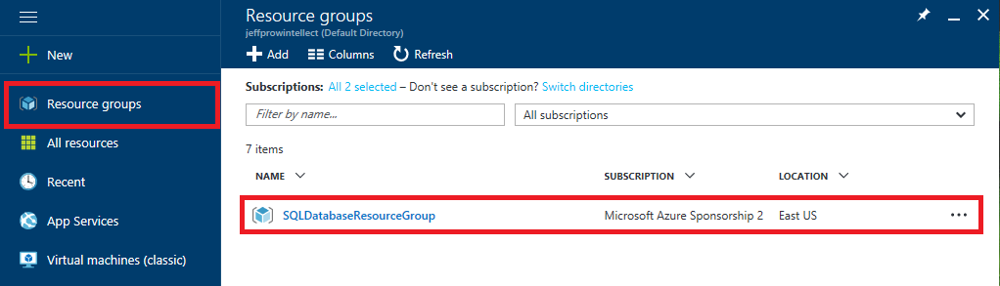

<a name="HOLTitle"></a>
# Using Azure SQL Database #

---

<a name="Overview"></a>
## Overview ##

[Azure SQL Database](https://azure.microsoft.com/en-us/services/sql-database/) is a cloud-based relational database service based on Microsoft's SQL Server engine. It delivers predictable performance, dynamic scalability, and robust data protection so you can focus on app development rather than managing virtual machines and physical infrastructure. SQL Database supports existing SQL Server tools, libraries, and APIs, making it simple to migrate existing database solutions to the cloud and to use those solutions without climbing a learning curve. And it features the largest compliance portfolio in the industry, including [HIPAA](https://www.microsoft.com/en-us/trustcenter/Compliance/HIPAA), [FERPA](https://www.microsoft.com/en-us/trustcenter/Compliance/FERPA), and even [Singapore MTCS Level 3](https://www.microsoft.com/en-us/TrustCenter/Compliance/MTCS).

One of the advantages of running SQL Database on Microsoft Azure is being able to scale performance up or down, manually or automatically, to quickly adapt to changing demand. SQL Database features a broad spectrum of performance levels, with each level offering guaranteed performance. It also offers [elastic pools](https://docs.microsoft.com/azure/sql-database/sql-database-design-patterns-multi-tenancy-saas-applications) for hosting multitenant apps without the usual trade-off in performance, management, and security.  

In this lab, you will create an Azure SQL Database and populate it with records. You will create an Azure API App to communicate with the database, create a Universal Windows Platform app to access the APIs, and use features of SQL Database to limit the information returned to users based on their role in the organization.

<a name="Objectives"></a>
### Objectives ###

In this hands-on lab, you will learn how to:

- Create an Azure SQL Database
- Populate an Azure SQL Database with records
- Access Azure SQL Database records from your apps
- Filter and mask records based on user permissions

<a name="Prerequisites"></a>
### Prerequisites ###

The following are required to complete this hands-on lab:

- An active Microsoft Azure subscription. If you don't have one, [sign up for a free trial](http://aka.ms/WATK-FreeTrial).
- Windows 10
- [Visual Studio 2015 Community edition](https://www.visualstudio.com/en-us/products/visual-studio-community-vs.aspx) or higher with the Windows 10 SDK installed
- [SQL Server Data Tools for Visual Studio 2015](https://msdn.microsoft.com/en-us/library/mt204009.aspx)

---

<a name="Exercises"></a>
## Exercises ##

This hands-on lab includes the following exercises:

- [Exercise 1: Create an Azure SQL Database](#Exercise1)
- [Exercise 2: Add records to the database](#Exercise2)
- [Exercise 3: Create an Azure API App](#Exercise3)
- [Exercise 4: Build a UWP app that consumes the database](#Exercise4)
- [Exercise 5: Manage record permissions and masks](#Exercise5)
- [Exercise 6: Delete the resource group](#Exercise6)
 
Estimated time to complete this lab: **60** minutes.

<a name="Exercise1"></a>
## Exercise 1: Create an Azure SQL Database ##

The first step in working with Azure SQL Database is to create a database to hold your data. In this exercise, you will create an Azure SQL Database and configure database server settings.

1. Open the [Azure Portal](https://portal.azure.com) in your browser. If you are asked to sign in, do so with your Microsoft Account.

1. Click **+ New**, followed by **Database** and **SQL Database**.

    

    _Creating a new Azure SQL Database_

1. In the "SQL Database" blade, enter "Northwind" (without quotation marks) as the database name. Select **Create new** under **Resource group** and name the resource group "SQLDatabaseResourceGroup." Leave **Select source** set to **Blank database** and click **Server - Configure required settings**.

	> Using the name "Northwind" for your database is required for the exercises in this lab.

    

    _Configuring an Azure SQL Database_

1. Click **Create a new server**. In the "New Server" blade, enter a unique name for **Server name** and make sure a green check mark appears next to it. (You can only use numbers and lowercase letters since the name becomes part of a DNS name.) Specify "sqladmin" as the user name and "Password_1" as the password. Select the location nearest you, and then click the **Select** button. 
 
    

    _Creating a database server_
	
1. Click the **Create** button at the bottom of the "SQL Database" blade.
 
    

    _Creating the database_	

1. Click **Resource groups** in the ribbon on the left side of the portal, and then click the resource group created for the SQL Database.
 
    

    _Opening the resource group_

1. Wait until "Deploying" changes to "Succeeded," indicating that the SQL Database has been deployed.

	> Refresh the page in the browser every now and then to update the deployment status. Clicking the **Refresh** button in the resource-group blade refreshes the list of resources in the resource group, but does not reliably update the deployment status.

    

    _Viewing the deployment status_

Your Azure SQL Database is now provisioned and ready to be populated with data. For that, you will use the SQL Server Data Tools for Visual Studio 2015.

<a name="Exercise2"></a>
## Exercise 2: Add records to the database ##

Now that you've created a SQL Database in Azure, the next step is to add data. In this exercise, you will populate the Northwind database created in [Exercise 1](#Exercise1) with customer, product, and order records using the SQL Server Data Tools (SSDT) in Visual Studio. If you haven't installed [SSDT](https://msdn.microsoft.com/en-us/library/mt204009.aspx), please take a moment to do so now.

1. Click the SQL Database that you deployed in [Exercise 1](#Exercise1).

    

    _Opening the Northwind database_	

1. Click **Tools**. Then click **Open in Visual Studio** in the "Tools" blade, and click the **Open in Visual Studio** button in the "Open in Visual Studio" blade. 

	> You may be prompted to allow the Microsoft Visual Studio Web Protocol Handler to switch from your browser to Visual Studio. If you are, click **Yes**.
 
    

    _Opening the database in Visual Studio_	
 
1. In Visual Studio's "Connect" dialog, enter the password ("Password_1") you specified in Exercise 1, Step 4. Then check the **Remember Password** box and click **Connect**. 
 
    

    _Connecting to the database from Visual Studio_	

1. When prompted to create a new firewall rule, accept the defaults and click **OK**. This will allow Visual Studio to get through the firewall on the server and connect to the SQL Database.

    

    _Creating a new firewall rule_	

1. In Visual Studio's SQL Server Object Explorer (SSOE), right-click the node representing the database server that you deployed in the previous exercise and select **New Query...**.
 
    

    _Starting a new query_	

1. Use the **Edit -> Insert File as Text...** command to insert the file named **Create MASTER logins.sql** located in the "Resources" folder of this lab.
 
    

    _Inserting "Create MASTER logins.sql"_	

1. Right-click anywhere in the script and select **Execute**. This script creates the user logins used in subsequent exercises.
 
    

    _Executing the script_	

1. In the SQL Server Object Explorer, expand the node for your database server and right-click the Northwind database. Then select **New Query...** from the context menu.
 
    

    _Starting a new query_	

1. Use the **Edit -> Insert File as Text...** command to insert the file named **Create NORTHWIND tables.sql** located in the "Resources" folder of this lab. Then right-click anywhere in the script and select **Execute**. This script creates tables and other objects in the Northwind database and typically takes 2 to 5 minutes to run.

1. At this point, it might be helpful to familiarize yourself with some of the tables created by the script that just executed. Expand the "Northwind" node in SSOE, and then expand the "Tables" node to reveal the tables in the database. Right-click the Customers table and select **View Data** from the context menu.
 
    

    _Opening the Customers table_		

1. Confirm that you see a list of customers like the one below.
 
    

    _Viewing customer records_		

1. Open other tables in the database to see what's in them, especially the Employees and Orders tables.

Your SQL Database is now populated with customers, products, orders, and other information. You will be adding additional functionality to the database in later exercises to facilitate row-level security. But for now, the next step is to make the database accessible to applications over the Web.

<a name="Exercise3"></a>
## Exercise 3: Create an Azure API App ##

Most modern apps — mobile apps especially — store data remotely, either in an on-premises database or in the cloud. In order to access this data, developers often deploy a Web service that connects to the database and provides methods for performing actions such as creating, reading, updating, and deleting records. In this exercise, you will create an [Azure API App](https://azure.microsoft.com/services/app-service/api/) to front-end your SQL Database, and in [Exercise 4](#Exercise4), you will write an app that connects to the database through the API App.

1. In Visual Studio, select **File -> New -> Project** to create a new project. In the "New Project" dialog, select the Visual C# **ASP.NET Web Application** template and name the project "OrderViewServices." Then click **OK**.

    

    _Creating a new project_		
 
1. In the "New ASP.NET Project" dialog, select the **Azure API App** template, make sure **Host in the cloud** is checked, and click **OK**.
 
    

    _Configuring the project_		

1.	In the "Create App Service" dialog, make sure **SQLDatabaseResourceGroup** is selected under **Resource Group**. (This will add the Azure API App to the same resource group as the SQL Database, which is handy because deleting the resource group will delete both.) Then click the **New** button next to **App Service Plan** and select the location nearest you for hosting the Web App, and **Free** as the **Size.** Click **OK** to dismiss the "Configure App Service Plan" dialog. Then click **Create** at the bottom of the "Create App Service" dialog.
 
    

    _Creating an App Service_		 

1. Take a moment to review the project structure in the Solution Explorer window. Among other things, there's a folder named "Controllers" that holds the project's API controllers, and a folder named "Models" that holds the project's model classes. You will be working with assets in these folders and others as you implement the API App.

1. With the basic project structure in place, the next step is to add logic to access the SQL Database in Azure. You will start by connecting an [Entity Framework](https://msdn.microsoft.com/library/aa937723(v=vs.113).aspx) model to the database. In Solution Explorer, right-click the project and use the **Add -> New Folder** command to create a folder named "Data" at the root of the project.
 
    

    _Adding a new folder to the project_		 

1. Right-click the "Data" folder and select **Add -> New Item...**. In the "Add New Item" dialog, select **ADO.NET Entity Data Model** and type "OrdersModel" into the **Name** field. Then click the **Add** button.
 
    

    _Adding Adding an entity data model_		 

1. Select **EF Designer from database** and click **Next**.
 
    

    _Selecting the EF Designer_		 

1. Click the **New Connection** button.
 
    

    _Creating a new connection_		 

1. If you are prompted to choose a data source, select **Microsoft SQL Server** and click **Continue**.

	

	_Choosing a data source_

1. In the **Server name** box, type the name that you assigned to the database server in Exercise 1, Step 4, followed by ".database.windows.net." Change **Authentication type** to **SQL Server Authentication**, and enter the user name ("sqladmin") and password ("Password_1") for the database server. Select **Northwind** under **Select or enter a database name**, and then click **OK**.
 
    

    _Setting connection properties_	
	
1. Select **No, exclude sensitive data from the connection string**. (Selecting this option will keep the database password out of the project's Web.config file.) Then click **Next**.

    

    _Setting connection string properties_	

1. Select **Entity Framework 6.x** and click **Next**.

    

    _Specifying the Entity Framework version_		
	
1. Expand the Tables node and check the **dbo** box. This will allow all of the tables in the database to be accessed through the Entity Framework model. Then click **Finish**.
 
    

    _Specifying which tables to include in the model_			

1. Confirm that **OrdersModel.edmx** is added to the project and that the data model is depicted as shown below.

    

    _The OrdersModel data model_			
	
1. Now it is time to write code to access the data model. In Solution Explorer, right-click the "Models" folder and select **Add -> Class...** to add a class file to the "Models" folder. Type "OrderInformation.cs" (without quotation marks) into the **Name** box, and then click **OK**.

    

    _Adding the OrderInformation class_				
	
1. Replace the empty *OrderInformation* class with the following class definitions, and note that you are making the classes public rather than private. The purpose of these classes is to model the data for customers, products, and orders.
	
	```C#
	public class OrderInformation
	{
	    public int OrderId { get; set; }
	    public string CustomerId { get; set; }
	    public Nullable<int> EmployeeId { get; set; }
	    public string EmployeeName { get; set; }
	    public Nullable<System.DateTime> OrderDate { get; set; }
	    public Nullable<System.DateTime> RequiredDate { get; set; }
	    public Nullable<System.DateTime> ShippedDate { get; set; }
	    public Nullable<int> ShipVia { get; set; }
	    public Nullable<decimal> Freight { get; set; }
	    public string ShipName { get; set; }
	    public string ShipAddress { get; set; }
	    public string ShipCity { get; set; }
	    public string ShipRegion { get; set; }
	    public string ShipPostalCode { get; set; }
	    public string ShipCountry { get; set; }
	    public List<OrderDetailInformation> OrderDetails { get; set; }
	    public CustomerInformation Customer { get; set; }
	}
	
	public class CustomerInformation
	{
	    public string CustomerId { get; set; }
	    public string CompanyName { get; set; }
	    public string ContactName { get; set; }
	    public string ContactTitle { get; set; }
	    public string Address { get; set; }
	    public string City { get; set; }
	    public string Region { get; set; }
	    public string PostalCode { get; set; }
	    public string Country { get; set; }
	    public string Phone { get; set; }
	    public string Fax { get; set; }
	}
	
	public class OrderDetailInformation
	{
	    public int OrderId { get; set; }
	    public int ProductId { get; set; }
	    public decimal UnitPrice { get; set; }
	    public short Quantity { get; set; }
	    public float Discount { get; set; }
	    public ProductInformation Product { get; set; }
	}
	
	public class ProductInformation
	{
	    public int ProductId { get; set; }
	    public string ProductName { get; set; }
	    public Nullable<int> SupplierId { get; set; }
	    public Nullable<int> CategoryId { get; set; }
	    public string QuantityPerUnit { get; set; }
	    public Nullable<decimal> UnitPrice { get; set; }
	    public Nullable<short> UnitsInStock { get; set; }
	    public Nullable<short> UnitsOnOrder { get; set; }
	    public Nullable<short> ReorderLevel { get; set; }
	    public bool Discontinued { get; set; }
	}
	```	
	
1. In Solution Explorer, right-click the project and use the **Add -> New Folder** command to add a folder named "Helpers" to the root of the project.
 
1. Right-click the "Helpers" folder and use the **Add -> Class...** command to add a class file named **OrderHelper.cs**. Then replace the contents of the file with the statements below. The methods in this class provide access to order data via the Entity Framework data model:

	```C#
	using OrderViewServices.Models;
	using System;
	using System.Collections.Generic;
	using System.Linq;
	using System.Web;
	
	namespace OrderViewServices.Helpers
	{
	    public static class OrderHelper
	    {
	        public static string CreateConnectionString()
	        {
                string userName = (string)System.Web.HttpContext.Current.Cache["CurrentUser"];
                string password = "Password_1";

                if (string.IsNullOrEmpty(userName))
                {
                    userName = "sqladmin";
                    password = "Password_1";
                }

                string serverName = "database_server_name";
                return string.Format("data source={0}.database.windows.net;initial catalog=Northwind;user id={1};password={2};MultipleActiveResultSets=True;App=EntityFramework", serverName, userName, password);
	        }
	
	        public static List<OrderInformation> GetOrders()
	        {
	            List<OrderInformation> orders = new List<OrderInformation>();
	
	            using (Data.NorthwindEntities entities = new Data.NorthwindEntities())
	            {
	                entities.Database.Connection.ConnectionString = CreateConnectionString();
	                entities.Database.Connection.Open();
	
	                try
	                {
	                    foreach (var result in entities.Orders.OrderByDescending(o => o.OrderDate).Take(20))
	                    {
	                        orders.Add(result.ToOrderInformation());
	                    }
	                }
	                catch (System.Data.Entity.Infrastructure.DbUpdateException ex)
	                {
	
	                }
	                finally
	                {
	                    entities.Database.Connection.Close();
	                }
	
	                return orders;
	            }
	        }
	
	        public static OrderInformation GetOrder(int orderId)
	        {
	            OrderInformation order = null;
	
	            using (Data.NorthwindEntities entities = new Data.NorthwindEntities())
	            {
	                entities.Database.Connection.ConnectionString = CreateConnectionString();
	                entities.Database.Connection.Open();
	
	                try
	                {
	                    var result = entities.Orders.Where(w => w.OrderID == orderId).FirstOrDefault();
	
	                    if (result != null)
	                    {
	                        order = result.ToOrderInformation();
	                    }
	                }
	                catch (System.Data.Entity.Infrastructure.DbUpdateException ex)
	                {
	
	                }
	                finally
	                {
	                    entities.Database.Connection.Close();
	                }
	
	                return order;
	            }
	        }
	    }
	}
	```

1. Locate the *CreateConnectionString* method near the top of the file and replace *database_server_name* on line 22 with the name you assigned to the database server in Exercise 1, Step 4. 

1. In Solution Explorer, right-click the project and use the **Add -> New Folder** command to add a folder named "Extensions" to the root of the project.

1. Right-click the "Extensions" folder and use the **Add -> Class...** command to add a class file named **ListExtensions.cs**. Then replace the contents of the file with the following statements:

	```C#
	using OrderViewServices.Models;
	using System;
	using System.Collections.Generic;
	using System.Linq;
	using System.Web;
	
	namespace OrderViewServices
	{
	    public static class ListExtensions
	    {
	        public static OrderInformation ToOrderInformation(this Data.Order order)
	        {
	            return new OrderInformation()
	            {
	                Customer = order.Customer.ToCustomerInformation(),
	                OrderDetails = order.Order_Details.ToOrderDetailInformationList(),
	
	                CustomerId = order.CustomerID,
	                EmployeeId = order.EmployeeID,
	                EmployeeName = order.EmployeeName,
	                Freight = order.Freight,
	                OrderDate = order.OrderDate,
	                OrderId = order.OrderID,
	                RequiredDate = order.RequiredDate,
	                ShipAddress = order.ShipAddress,
	                ShipCity = order.ShipCity,
	                ShipCountry = order.ShipCountry,
	                ShipName = order.ShipName,
	                ShippedDate = order.ShippedDate,
	                ShipPostalCode = order.ShipPostalCode,
	                ShipRegion = order.ShipRegion,
	                ShipVia = order.ShipVia,
	            };
	        }
	
	        private static List<OrderDetailInformation> ToOrderDetailInformationList(this ICollection<Data.Order_Detail> orderDetails)
	        {
	            return (from detail in orderDetails select detail.ToOrderDetailInformation()).ToList();
	        }
	
	        public static OrderDetailInformation ToOrderDetailInformation(this Data.Order_Detail orderDetail)
	        {
	            return new OrderDetailInformation()
	            {
	                Discount = orderDetail.Discount,
	                OrderId = orderDetail.OrderID,
	                ProductId = orderDetail.ProductID,
	                Quantity = orderDetail.Quantity,
	                UnitPrice = orderDetail.UnitPrice,
	
	                Product = orderDetail.Product.ToProductInformation(),
	            };
	        }
	
	        public static CustomerInformation ToCustomerInformation(this Data.Customer customer)
	        {
	            return new CustomerInformation()
	            {
	                Address = customer.Address,
	                City = customer.City,
	                CompanyName = customer.CompanyName,
	                ContactName = customer.ContactName,
	                ContactTitle = customer.ContactTitle,
	                Country = customer.Country,
	                CustomerId = customer.CustomerID,
	                Fax = customer.Fax,
	                Phone = customer.Phone,
	                PostalCode = customer.PostalCode,
	                Region = customer.Region,
	
	            };
	        }
	
	        public static ProductInformation ToProductInformation(this Data.Product product)
	        {
	            return new ProductInformation()
	            {
	                CategoryId = product.CategoryID,
	                Discontinued = product.Discontinued,
	                ProductId = product.ProductID,
	                ProductName = product.ProductName,
	                QuantityPerUnit = product.QuantityPerUnit,
	                ReorderLevel = product.ReorderLevel,
	                SupplierId = product.SupplierID,
	                UnitPrice = product.UnitPrice,
	                UnitsInStock = product.UnitsInStock,
	                UnitsOnOrder = product.UnitsOnOrder,
	            };
	        }
	    }
	}
	```

1. In Solution Explorer, right-click the "Controllers" folder and select **Add -> Controller...**.

1. Select **Web API 2 Controller – Empty** and click **Add**. Name the controller "OrdersController" and add it to the project.
 
    

    _Adding a new controller_	

1. Add the following using statement to the top of the file:

	```C#
	using OrderViewServices.Models;
	```

1. Add the following API controller methods to the *OrdersController* class:
 
	```C#
	public IEnumerable<OrderInformation> GetOrders()
    {
        return Helpers.OrderHelper.GetOrders();
    }
         
    public OrderInformation Get(int id)
    {
        return Helpers.OrderHelper.GetOrder(id);
    }
               
    public IHttpActionResult Post(string value)
    {
        System.Web.HttpContext.Current.Cache["CurrentUser"] = value;
        return Created("CurrentUser", value);
    }
	```

1. You can use your browser to test the API App by calling methods and seeing what's returned. Use Visual Studio's **Debug -> Start Without Debugging** command (or simply press **Ctrl+F5**) to launch the application in your browser. Initially, you will see a 403 error because no method was specified. But now append "/api/Orders" to the URL in the browser's address bar and press **Enter**. This will call the *GetOrders* method in the *OrdersController class*. Confirm that an array of JSON objects representing orders is returned:
 
    

    _JSON returned by the GetOrders method_	

1. The next step is to deploy the app to the cloud. Visual Studio makes it easy. (Remember that **Host in the cloud** box you checked at the beginning of this exercise?) Begin by right-clicking the project in Solution Explorer and selecting **Publish...** from the context menu. In the ensuing dialog, make sure **Web Deploy** is selected as the publish method, and then click the **Publish** button.

	> Web Deploy is an awesome feature of Visual Studio that lets you publish apps to the cloud without having to manually FTP a bunch of files. Moreover, Web Deploy only publishes files that have changed, so if you have a large project with thousands of files and change just one or two, republishing takes almost no time at all. Web Deploy also works with many third-party hosting services such as GoDaddy.
 
    

    _Publishing the API app_	

1. After a few moments, the app will appear in a browser window. Note the URL in the address bar. You will need this URL in the next exercise, so copy it into your favorite text editor where you can easily retrieve it. The app is no longer running locally; it's on the Web, where it's accessible to apps and other services.
 
    

    _The published API app_	

Now that you have a Web service through which the Azure SQL Database that you created can be accessed, the next step is to write an app that uses it.

<a name="Exercise4"></a>
## Exercise 4: Build a UWP app that consumes the database ##

The whole reason for creating and deploying your Azure SQL Database API App is so you can build smart apps that can interact with the data in your Azure SQL Database. There are a variety of ways to build such apps. You could call the service from a Web app using JavaScript and AJAX, for example, or you could use Visual Studio to write a Xamarin app that runs on iOS, Android, and Windows and places calls to the service using .NET's HttpClient class.

In this exercise, you will write a client app that targets the Universal Windows Platform, or UWP. The beauty of such apps is that they run on a variety of Windows devices, including PCs, tablets, phones, and even on Xbox One. The app you will write enables you to access orders for a specific salesperson as well as viewing order and customer details.

To create a Windows Store app:

1. In order to build and run UWP apps on a Windows 10 PC, you must enable developer mode on the device. To ensure that developer mode is enabled, click the **Windows** button (also known as the Start button) in the lower-left corner of the desktop. Then select **Settings** from the menu and click **Update & security** in the **Settings** dialog. Now click **For developers** on the left and select **Developer mode** on the right, as shown below.
 
    

    _Enabling developer mode_	
 
1. In Visual Studio, right-click over the **OrderViewServices solution** and select **Add > New Project** to create a new **Blank App (Universal Windows)** project named "OrderView."

	>Ensure you right-click over the **solution** and not the project in this step.
 
    

    _Adding a new UWP project_	
 
1. Click **OK** to accept the default target version and minimum version. A new UWP app names OrderView will be added to your OrderViewServices solution.
 
    

    _Setting the target versions_ 
 
    

    _Adding a new UWP project_	
 
1. In the Solution Explorer, right-click the new **OrderView** project and select **Set as startup project**.
 
    

    _Setting the startup project_ 
 
1. Again, in the Solution Explorer, right-click over the **OrderView** project and select **Deploy**. This will deploy your app to the local computer and is required prior to running an application when it’s part of a mixed-platform solution.
 
    

    _Deploying the project_ 
 
1. Now use Visual Studio's **Debug -> Start Without Debugging** command (or simply press **Ctrl+F5**) to launch the application on your computer. Here's how the application looks in its present state:
 
    

    _The blank OrderView app_  

The shell for your application has been created successfully, now it’s time to write code to access the Azure SQL Database API methods created in the previous exercise, and add user interface elements to visualize the data. 

1. In the Solution Explorer, right-click the **OrderView** project and select **Add > New Folder** and name the new folder **Common**.
 
    

    _The new Common folder_  

1. Right-click the new **Common** folder and select **Add -> Class**.

1. Type "BindableBase.cs" (without quotation marks) into the **Name** box, and then click **OK**.
 
    

    _Adding the BindableBase class_  

1. Replace the entire contents of the class file with the following code:

	```C#
	using System;
	using System.ComponentModel;
	using System.Runtime.CompilerServices;	
	
	namespace OrderView.Common
	{
	    /// <summary>
	    /// Implementation of <see cref="INotifyPropertyChanged"/> to simplify models.
	    /// </summary>
	
	    public abstract class BindableBase : INotifyPropertyChanged
	    {
	        /// <summary>
	        /// Multicast event for property change notifications.
	        /// </summary>
	        public event PropertyChangedEventHandler PropertyChanged;
	
	        /// <summary>
	        /// Checks if a property already matches a desired value.  Sets the property and
	        /// notifies listeners only when necessary.
	        /// </summary>
	        /// <typeparam name="T">Type of the property.</typeparam>
	        /// <param name="storage">Reference to a property with both getter and setter.</param>
	        /// <param name="value">Desired value for the property.</param>
	        /// <param name="propertyName">Name of the property used to notify listeners.  This
	        /// value is optional and can be provided automatically when invoked from compilers that
	        /// support CallerMemberName.</param>
	        /// <returns>True if the value was changed, false if the existing value matched the
	        /// desired value.</returns>
	        protected bool SetProperty<T>(ref T storage, T value, [CallerMemberName] String propertyName = null)
	        {
	            if (object.Equals(storage, value)) return false;
	
	            storage = value;
	            this.OnPropertyChanged(propertyName);
	            return true;
	        }
	
	        /// <summary>
	        /// Notifies listeners that a property value has changed.
	        /// </summary>
	        /// <param name="propertyName">Name of the property used to notify listeners.  This
	        /// value is optional and can be provided automatically when invoked from compilers
	        /// that support <see cref="CallerMemberNameAttribute"/>.</param>
	        protected void OnPropertyChanged([CallerMemberName] string propertyName = null)
	        {
	            var eventHandler = this.PropertyChanged;
	            if (eventHandler != null)
	            {
	                eventHandler(this, new PropertyChangedEventArgs(propertyName));
	            }
	        }
	    }
	}
	```

1. In the Solution Explorer, right-click the **OrderView** project and select **Add > New Folder** and name the new folder **Models**.
 
    

    _Adding the Models folder_  

1. Right-click the new **Models** folder and select **Add -> Class**.

1. Type "OrderInformation.cs" (without quotation marks) into the **Name** box, and then click **OK**.
 
    

    _Adding the OrderInformation class_  

1. Replace the empty **OrderInformation** class with the following class definitions, and note that you are making the class public rather than private:
 
    

    _The empty OrderInformation class_  

	```C#
  
	public class SalespersonInformation
    {
        public string Label { get; set; }
        public string UserName { get; set; }
    }
    public class ProductInformation
    {
        public int ProductId { get; set; }
        public string ProductName { get; set; }
        public Nullable<int> SupplierId { get; set; }
        public Nullable<int> CategoryId { get; set; }
        public string QuantityPerUnit { get; set; }
        public Nullable<decimal> UnitPrice { get; set; }
        public Nullable<short> UnitsInStock { get; set; }
        public Nullable<short> UnitsOnOrder { get; set; }
        public Nullable<short> ReorderLevel { get; set; }
        public bool Discontinued { get; set; }
    }

    public class SuggestionInformation
    {
        public string odatacontext { get; set; }
        public Value[] value { get; set; }
    }

    public class Value
    {
        public float searchscore { get; set; }
        public string CustomerID { get; set; }
        public string CompanyName { get; set; }
    }

    public class CustomerInformation
    {
        public string CustomerId { get; set; }
        public string CompanyName { get; set; }
        public string ContactName { get; set; }
        public string ContactTitle { get; set; }
        public string Address { get; set; }
        public string City { get; set; }
        public string Region { get; set; }
        public string PostalCode { get; set; }
        public string Country { get; set; }
        public string Phone { get; set; }
        public string Fax { get; set; }
    }
    public class OrderInformation
    {
        public int OrderId { get; set; }
        public string CustomerId { get; set; }
        public Nullable<int> EmployeeId { get; set; }
        public string EmployeeName { get; set; }
        public Nullable<System.DateTime> OrderDate { get; set; }
        public Nullable<System.DateTime> RequiredDate { get; set; }
        public Nullable<System.DateTime> ShippedDate { get; set; }
        public Nullable<int> ShipVia { get; set; }
        public Nullable<decimal> Freight { get; set; }
        public string ShipName { get; set; }
        public string ShipAddress { get; set; }
        public string ShipCity { get; set; }
        public string ShipRegion { get; set; }
        public string ShipPostalCode { get; set; }
        public string ShipCountry { get; set; }
        public List<OrderDetailInformation> OrderDetails { get; set; }
        public CustomerInformation Customer { get; set; }

    }

    public class OrderDetailInformation
    {
        public int OrderId { get; set; }
        public int ProductId { get; set; }
        public decimal UnitPrice { get; set; }
        public short Quantity { get; set; }
        public float Discount { get; set; }

        public ProductInformation Product { get; set; }
    }
	```

	>Just as in the previous exercise, these class definitions will provide the model for your customer, product, and order data.

1. Right-click once more over the **Models** folder and select **Add -> Class**.

1. Type "MainViewModel.cs" (without quotation marks) into the **Name** box, and then click **OK**.
 
    

    _Adding the MainViewModel class_  

1. Replace the empty **MainViewModel** class with the following class definitions, and note that you are implementing the BindableBase class created earlier:

	```C#
	using System;
	using System.Collections.Generic;
	using System.Collections.ObjectModel;
	using System.Linq;
	using System.Text;
	using System.Threading.Tasks;
	using OrderView.Models;
	
	namespace OrderView.Models
	{
	    public class MainViewModel : Common.BindableBase
	    {
	        private ObservableCollection<OrderInformation> _currentOrders;
	        public ObservableCollection<OrderInformation> CurrentOrders
	        {
	            get { return this._currentOrders; }
	            set { this.SetProperty(ref this._currentOrders, value); }
	        }
	
	        private List<SalespersonInformation> _salespersons;
	        public List<SalespersonInformation> Salespersons
	        {
	            get { return this._salespersons; }
	            set { this.SetProperty(ref this._salespersons, value); }
	        }
	
	        private SalespersonInformation _selectedSalesperson;
	        public SalespersonInformation SelectedSalesperson
	        {
	            get { return this._selectedSalesperson; }
	            set { this.SetProperty(ref this._selectedSalesperson, value); }
	        }
	
	
	        private ObservableCollection<string> _searchSuggestions;
	        public ObservableCollection<string> SearchSuggestions
	        {
	            get { return this._searchSuggestions; }
	            set { this.SetProperty(ref this._searchSuggestions, value); }
	        }
	
	        private bool _isLoading;
	
	        public bool IsLoading
	        {
	            get { return this._isLoading; }
	            set { this.SetProperty(ref this._isLoading, value); }
	        }
	
	        public const string OrderApiUrl = "";
	
	        public void Initialize()
	        {
	            this.CurrentOrders = new ObservableCollection<OrderInformation>();
	            this.SearchSuggestions = new ObservableCollection<string>();
	            this.Salespersons = Helpers.OrderHelper.GetSalespersons();
	
	            this.SelectedSalesperson = this.Salespersons.FirstOrDefault();	
	        }
	 
	        public void FilterByCustomer(string selectedCustomer)
	        {
	            LoadOrdersAsync(selectedCustomer);
	        }
	
	
	        public void ChangeUser(SalespersonInformation salesperson)
	        {
	            this.SelectedSalesperson = salesperson;
	
	            LoadOrdersAsync();
	        }
	
	        public async void LoadOrdersAsync(string filter)
	        {
	            this.IsLoading = true;
	
	            await Helpers.OrderHelper.SetUserAsync(this.SelectedSalesperson.UserName);
	
	            this.CurrentOrders.Clear();
	
	            var orders = await Helpers.OrderHelper.GetOrdersAsync(filter);
	
	            foreach (var order in orders)
	            {
	                this.CurrentOrders.Add(order);
	            }
	
	            this.IsLoading = false;
	
	        }
	
	        public async void LoadOrdersAsync()
	        {
	            this.IsLoading = true;
	
	            await Helpers.OrderHelper.SetUserAsync(this.SelectedSalesperson.UserName);
	
	            this.CurrentOrders.Clear();
	
	            var orders = await Helpers.OrderHelper.GetOrdersAsync();
	
	            foreach (var order in orders)
	            {
	                this.CurrentOrders.Add(order);
	            }
	
	            this.IsLoading = false;
	
	        }
	    }
	}
	```

1. In the Solution Explorer, right-click the **OrderView** project and select **Add > New Folder** and name the new folder **Helpers**.
 
    

    _The new Helpers folder_  

1. Right-click the new **Helpers** folder and select **Add -> Class**.

1. Type "OrderHelper.cs" (without quotation marks) into the **Name** box, and then click **OK**.
 
    

    _Creating the OrderHelper class_  

1. Replace the entire contents of the class file with the following class definition, and note that you are making the class public rather than private, as well as marking the methods as static:

	```C#
	using OrderView.Models;
	using System;
	using System.Collections.Generic;
	using System.Linq;
	using System.Net.Http;
	using System.Runtime.Serialization.Json;
	using System.Text;
	using System.Threading.Tasks;
	
	namespace OrderView.Helpers
	{
	    public static class OrderHelper
	    {
	        public const string OrderApiUrl = "order_api_url";
	
	        public static List<SalespersonInformation> GetSalespersons()
	        {
	            List<SalespersonInformation> salespersons = new List<SalespersonInformation>();
	
	            salespersons.Add(new SalespersonInformation() { Label = "Janet (Sales Manager)", UserName = "Janet" });
	            salespersons.Add(new SalespersonInformation() { Label = "Andrew (Salesperson)", UserName = "Andrew" });
	            salespersons.Add(new SalespersonInformation() { Label = "Nancy (Salesperson)", UserName = "Nancy" });
	
	            return salespersons;
	        }
	
	        public static async Task<List<OrderInformation>> GetOrdersAsync(string filter)
	        {
	            List<OrderInformation> orders = new List<OrderInformation>();
	
	            Uri requestUri = new Uri(OrderApiUrl + "/api/Orders");
	            HttpClient client = new System.Net.Http.HttpClient();
	            HttpResponseMessage response = await client.GetAsync(requestUri);
	
	            var stream = await response.Content.ReadAsStreamAsync();
	            stream.Position = 0;
	
	            var settings = new DataContractJsonSerializerSettings { DateTimeFormat = new System.Runtime.Serialization.DateTimeFormat("yyyy-MM-dd'T'HH:mm:ss") };
	
	            DataContractJsonSerializer ser = new DataContractJsonSerializer(typeof(List<OrderInformation>), settings);
	            orders = (List<OrderInformation>)ser.ReadObject(stream);
	
	            return orders.Where(w => w.Customer.CompanyName.Equals(filter)).ToList();
	        }
	
	        public static async Task<List<OrderInformation>> GetOrdersAsync()
	        {
	            List<OrderInformation> orders = new List<OrderInformation>();
	
	            Uri requestUri = new Uri(OrderApiUrl + "api/Orders");
	            HttpClient client = new System.Net.Http.HttpClient();
	            HttpResponseMessage response = await client.GetAsync(requestUri);
	
	            var stream = await response.Content.ReadAsStreamAsync();
	            stream.Position = 0;
	
	            var settings = new DataContractJsonSerializerSettings { DateTimeFormat = new System.Runtime.Serialization.DateTimeFormat("yyyy-MM-dd'T'HH:mm:ss") };
	
	            DataContractJsonSerializer ser = new DataContractJsonSerializer(typeof(List<OrderInformation>), settings);
	            orders = (List<OrderInformation>)ser.ReadObject(stream);
	
	            return orders;
	        }
	
	        public static async Task<bool> SetUserAsync(string userName)
	        {
	            Uri requestUri = new Uri(OrderApiUrl + $"/api/Orders?value={userName}");
	
	            var client = new System.Net.Http.HttpClient();
	            HttpResponseMessage respon = await client.PostAsync(requestUri, null);
	
	            return respon.IsSuccessStatusCode;
	        }
	    }
	}
	```
 
	>These methods will be used to access the API methods created earlier in the previous exercise.

1. Locate the **OrderViewApi** property at the top of the class definition and replace **“order_api_url”** highlighted below with the **URL** value of your Azure API App from the last step in Exercise 3.
 
    

    _Replacing the order_api_url value_  

1. Open MainPage.xaml and find the empty Grid element highlighted below.
 
    

    _The empty Grid element_  

1. Replace the empty Grid with the following markup:

	```C#
	<Page.Resources>
        <Style x:Key="SmallerLabelStyle" TargetType="TextBlock">
            <Setter Property="FontSize" Value="12"/>
            <Setter Property="FontWeight" Value="Light"/>
        </Style>
    </Page.Resources>

    <Grid Background="{ThemeResource ApplicationPageBackgroundThemeBrush}">
        <Grid.RowDefinitions>
            <RowDefinition Height="Auto"/>
            <RowDefinition/>
        </Grid.RowDefinitions>

        <ComboBox VerticalAlignment="Center" HorizontalAlignment="Left" ItemsSource="{Binding Salespersons}" SelectedItem="{Binding SelectedSalesperson, Mode=TwoWay}" SelectionChanged="OnEmployeeChanged" Width="240" Margin="40,40,40,0">
            <ComboBox.Header>
                <TextBlock Margin="0,0,0,-5" FontSize="12" FontWeight="Light" Text="SELECT SALESPERSON"/>
            </ComboBox.Header>
            <ComboBox.ItemTemplate>
                <DataTemplate>
                    <TextBlock FontWeight="Light" Text="{Binding Label}" />
                </DataTemplate>
            </ComboBox.ItemTemplate>
        </ComboBox>
 
        <ScrollViewer Grid.Row="1" Margin="40">

            <GridView ItemsSource="{Binding CurrentOrders}">
                <GridView.ItemTemplate>
                    <DataTemplate>
                        <Grid Margin="10" Width="300" Tapped="OnShowCustomer">
                            <FlyoutBase.AttachedFlyout>
                                <Flyout Placement="Top" >
                                    <Grid>
                                        <StackPanel Margin="10">
                                            <TextBlock FontWeight="SemiBold" Text="{Binding Customer.CompanyName}" />
                                            <TextBlock Style="{StaticResource SmallerLabelStyle}" Text="{Binding Customer.Address}" />
                                            <TextBlock Style="{StaticResource SmallerLabelStyle}" Text="{Binding Customer.City}" />
                                            <TextBlock Style="{StaticResource SmallerLabelStyle}" Text="{Binding Customer.PostalCode}" />
                                            <TextBlock Style="{StaticResource SmallerLabelStyle}" Text="{Binding Customer.Country}" />
                                            <TextBlock Style="{StaticResource SmallerLabelStyle}" Text="{Binding Customer.Phone}" />
                                            <TextBlock Style="{StaticResource SmallerLabelStyle}" Text="{Binding Customer.Fax}" />
                                        </StackPanel>
                                    </Grid>
                                </Flyout>
                            </FlyoutBase.AttachedFlyout>

                            <Grid.ColumnDefinitions>
                                <ColumnDefinition Width="Auto"/>
                                <ColumnDefinition />
                            </Grid.ColumnDefinitions>

                            <TextBlock Margin="0,0,10,0" VerticalAlignment="Top" HorizontalAlignment="Left" FontSize="36" Text="" FontFamily="{ThemeResource SymbolThemeFontFamily}"/>

                            <StackPanel Grid.Column="1">

                                <TextBlock Style="{ThemeResource CaptionTextBlockStyle}" Text="CUSTOMER"/>
                                <TextBlock FontWeight="SemiBold" Text="{Binding Customer.CompanyName}"/>

                                <TextBlock Margin="0,10,0,0" Style="{ThemeResource CaptionTextBlockStyle}" Text="SALESPERSON"/>
                                <TextBlock FontWeight="SemiBold" Text="{Binding EmployeeName}"/>

                                <TextBlock Margin="0,10,0,0" Style="{ThemeResource CaptionTextBlockStyle}" Text="ORDER NO"/>
                                <TextBlock FontWeight="SemiBold" Text="{Binding OrderId}"/>

                                <TextBlock Margin="0,10,0,0" Style="{ThemeResource CaptionTextBlockStyle}" Text="ORDER DATE"/>
                                <TextBlock FontWeight="SemiBold" Text="{Binding OrderDate}"/>

                                <TextBlock Margin="0,10,0,0" Style="{ThemeResource CaptionTextBlockStyle}">
                            <Run Text="TOTAL ITEMS"/>
                            <Run FontWeight="SemiBold" Text="{Binding OrderDetails.Count}"/>
                                </TextBlock>

                            </StackPanel>

                        </Grid>
                    </DataTemplate>
                </GridView.ItemTemplate>
                <GridView.ItemsPanel>
                    <ItemsPanelTemplate>
                        <ItemsWrapGrid Orientation="Horizontal"/>
                    </ItemsPanelTemplate>
                </GridView.ItemsPanel>
            </GridView>
        </ScrollViewer>

        <ProgressRing Grid.Row="1" VerticalAlignment="Center" HorizontalAlignment="Center" Width="160" Height="160" IsActive="{Binding IsLoading}" IsEnabled="{Binding IsLoading}"/>

    </Grid>
	```
	>The markup that you just inserted is Extensible Application Markup Language, or XAML. XAML is a language created by Microsoft for building user interfaces. It was originally created for WPF, but has since been repurposed for universal Windows apps. Combined with Xamarin Forms, it can even be used to build user interfaces for iOS and Android. It is an extremely expressive language that enjoys designer support in Visual Studio and other popular tools.

1. Now open MainPage.xaml.cs and add the following using statement to those already at the top of the page:

	```C#
	using OrderView.Models;
	```

1. Still in MainPage.xaml.cs, replace everything inside the **MainPage** class with the following code:

	```C#
	MainViewModel ViewModel = new MainViewModel();

    public MainPage()
    {
        this.InitializeComponent();
        this.Loaded += MainPage_Loaded;
    }

    private void MainPage_Loaded(object sender, RoutedEventArgs e)
    {
        this.ViewModel.Initialize();

        this.DataContext = this.ViewModel;
    }	

    private void OnEmployeeChanged(object sender, SelectionChangedEventArgs e)
    {
        if (this.ViewModel.SelectedSalesperson != null) this.ViewModel.ChangeUser(this.ViewModel.SelectedSalesperson);
    }	 

    private void OnShowCustomer(object sender, TappedRoutedEventArgs e)
    {
        FlyoutBase.ShowAttachedFlyout(sender as FrameworkElement);	
    }

    private void OnSuggestionChosen(AutoSuggestBox sender, AutoSuggestBoxSuggestionChosenEventArgs args)
    {
        this.ViewModel.FilterByCustomer((string)args.SelectedItem);
    }
	```

1. In the Solution Explorer, right-click over the **OrderView** project and select **Deploy**. This will deploy your app to the local computer and is required prior to running an application when it’s part of a mixed-platform solution.
 
    

    _Deploying the project_ 

1. Now use Visual Studio's **Debug -> Start Without Debugging** command (or simply press **Ctrl+F5**) to launch the application on your computer. Here's how the application looks in its completed state:
 
    

    _Running the completed UWP app_ 

When you populated your Azure SQL Database in Exercise 2, three (3) users were created: Janet, Andrew, and Nancy. Janet is a Sales Manager and should have permission to view all orders, however Andrew and Nancy are Salespersons, and should only be able to view orders they created. The current state of your OrderView app shows all orders regardless of which user is using the app. To simulate viewing orders, the app contains a selection dropdown control to view orders “AS” a specific user. Review how the list of orders being returned does not change when you select a different salesperson. 

To limit as Salesperson’s ability to view only their orders, we can take advantage of Azure SQL Database **row-level security**.

There is also information in each customer record that should be “private” and not available for viewing through your app. In this scenario customer phone numbers should be “hidden” from users, however we don’t want to add the complexity into our code to “check and filter” the labels based on a user’s role. Instead we can implement Azure SQL Database **dynamic data masking** to mask these values in our application.

In the next exercise you will add row-level security and dynamic data masking to your Azure SQL Database to make sure Salesperson are only able to view the records and fields allowed in the requirements.

<a name="Exercise5"></a>
## Exercise 5: Manage record permissions and masks ##

In this exercise add row-level security and dynamic data masking to your Azure SQL Database to ensure Salesperson are only able to see the orders allowed by their organizational role (such as Sales Manager or Salesperson) as well as hiding the phone numbers for all customers.

To add row-level security to your Azure SQL Database:

1. In Visual Studio 2015, navigate to the **SQL Server Object Explorer**, and expand the server node to view the **Northwind** database.
 
    

    _Expanding the server node to the Northwind database_ 

1.  Right-click over the **Northwind** database and select **New Query…**.
  
     

    _Selecting the New Query command_		

1. From the Visual Studio menu select **Edit > Insert File as Text** and browse to the **Resources > Scripts** folder included with this lab.
 
    

    _Selecting the Insert File as Text command_	

1. Select the **Apply NORTHWIND security.sql** script and click **Open**.
 
    

    _Opening the Apply NORTHWIND security script_	

1. When the script loads in the main Visual Studio pane, right-click over **any area in the script** and select **Execute**.
 
    

    _Executing the Apply NORTHWIND security script_	
	
	>This script will execute and add row-level security to the Orders table. When the script has completed executing a Query completed message will appear at the bottom of the query windows. Row-level security has now been added to your database. 
	
	

    _Query executed succesfully message_

Now let’s make sure customer phone numbers are hidden from users accessing your Azure SQL Database.	

To add dynamic data masking to your Azure SQL Database we need to go back to the Azure Portal:

1. Open the Azure Management Portal, if asked to login, do so with your Microsoft Account.

1. Click the **“hamburger”** icon in the Azure Portal to open the side drawer.

1. Click **Resource Groups** followed by **TrainingLabResources**.

1. Click the **Northwind** database created in Exercise 1 to view database properties.	
 
	

    _Selecting the Northwind database_

1. In the **Northwind** database properties **SETTINGS** section, select **Dynamic data masking** to open the **Dynamic data masking** panel.
 
	

    _Opening the Dynamic data masking panel_

1. In the **Masking rules panel**, locate the **Customers | Phone** masking recommendation and click the **Add Mask** button. A new mask named dbo_Customers_Phone has been created for customer phone number, with a default mask as 0, xxxx, 01-01-1900. 
 
	

    _Adding the customer phone mask_
 
	This mask would meet the requirements; however, it gives the impression this value contains a date. Let’s change the mask to something more appropriate.

1. Click the new **dbo_Customers_Phone** mask to open the **Edit Masking Rule** panel.

1. Select **Custom string** from the **Masking field format** selection list, and then enter "xxxxxxx" (without the quotation marks) in the **Padding String** box.

1. Click **Update** in the **Edit Masking Rule** menu, and the **Save** in the** Dynamic data masking** panel. Dynamic data masking has now been added to your Azure SQL Database.
 
	

    _Updating the customer phone mask_ 
 
	

    _Saving Dynamic data mask changes_ 

To view and verify row-level security and dynamic data masking, let’s go back to the OrderView app and review how orders are returned when we select different Salespersons. 

1. Use Visual Studio's **Debug -> Start Without Debugging** command (or simply press **Ctrl+F5**) to launch the application on your computer.

1. When the app loads, notice how the selected salesperson (Janet, as Sales Manager) is able to view records from multiple employees.
 
	

    _Viewing Sales Manager row-level security in the app_
 
1. Now select **Andrew** from the **SELECT SALESPERSON** drop down and review how only orders created by Andrew are available for review.
 
	

    _Viewing Salesperson row-level security in the app_
 
1. To verify dynamic data masking, tap a **CUSTOMER NAME** label for any order. A small window will open with customer details, including a customer’s phone and fax number. A customer’s phone number is not available for viewing, but is instead “masked” as the value entered in Step 8 (“xxxxxx’).
 
	

    _Viewing a masked customer phone number_ 

Notice how you didn’t need to make any changes to your data access layer (you’re Azure API App) in order to limit the information available to salespersons. A few simple scripts or settings in the database itself were enough to create these types of security features.

You’ve now create an Azure SQL Database, written and deployed an Azure API app to serve as the data access layer, and created a simple UWP app to view orders based on a selected salesperson. 

<a id="Exercise6"/></a>
## Exercise 6: Delete the resource group

In this exercise, you will delete the resource group created in [Exercise 1](#Exercise1) when you created the SQL Database. Deleting the resource group deletes everything in it, including the SQL Database, database server, API Service, and other resources created during the course of this lab, and prevents any further charges from being incurred for it.

1. In the Azure Portal, open the blade for the resource group created for the SQL Database. Then click the **Delete** button at the top of the blade.

	

	_Deleting the resource group_

1. For safety, you are required to type in the resource group's name. (Once deleted, a resource group cannot be recovered.) Type the name of the resource group. Then click the **Delete** button to remove all traces of this lab from your account.

After a few minutes, the resource group and all of its resources will be deleted.

<a name="Summary"></a>
## Summary ##

In this hands-on lab you learned how to:

- Create an Azure SQL Database
- Populate an Azure SQL Database with records
- Access Azure SQL records from your apps
- Filter and mask records based on user permissions

This is just a beginning, as there’s a whole lot more you can do to leverage the power of Azure SQL Database. Start experimenting with other Azure SQL Database features, especially dynamic data masking and geo-replication, as well as creating stored procedures, user-defined functions, and identifying other ways you can enhance your data strategies through the integration of Azure SQL Database into your application ecosystems.

----

Copyright 2016 Microsoft Corporation. All rights reserved. Except where otherwise noted, these materials are licensed under the terms of the MIT License. You may use them according to the license as is most appropriate for your project. The terms of this license can be found at https://opensource.org/licenses/MIT.