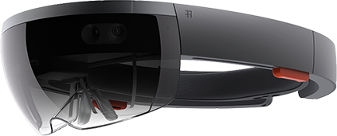
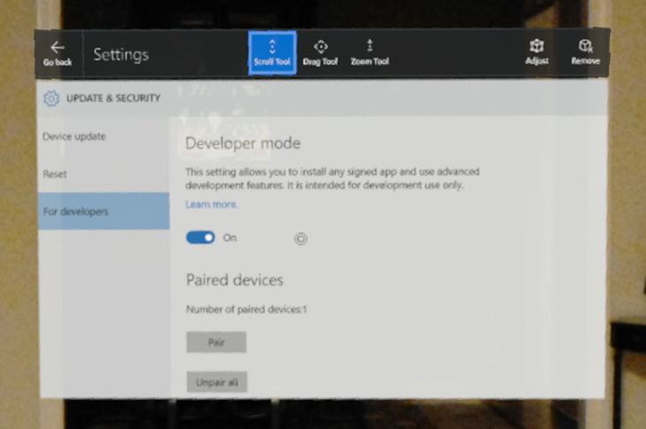
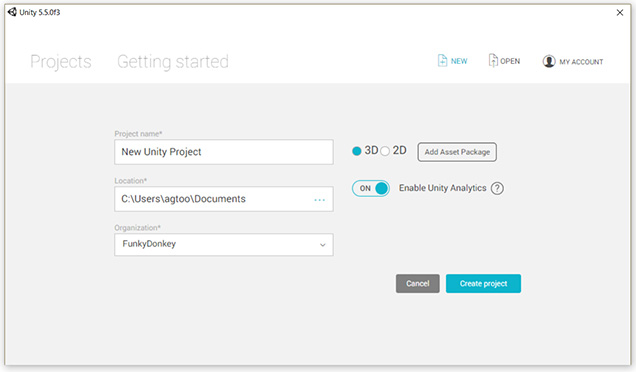
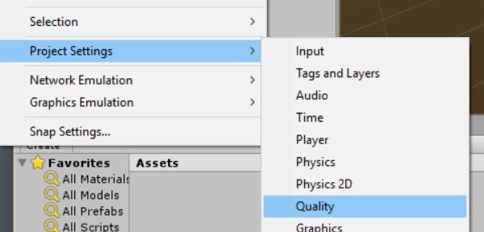
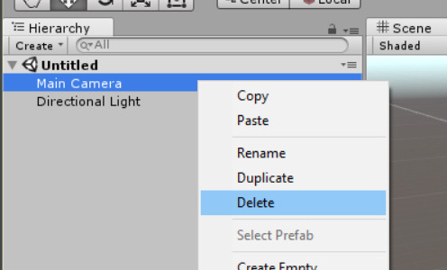
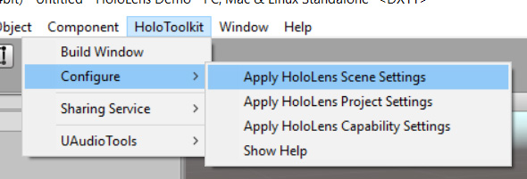
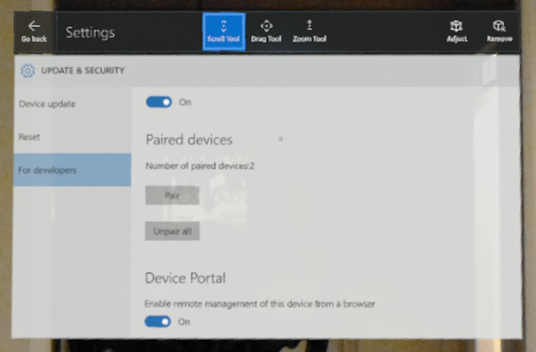
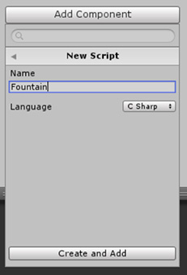
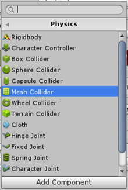

<a name="HOLTitle"></a>
# Building HoloLens Apps with Unity #

---

<a name="Overview"></a>
## Overview ##

[Windows Holographic](https://developer.microsoft.com/en-us/windows/holographic) is a platform that enables software developers to build a new generation of applications that elevate immersion to new heights. Traditional virtual-reality (VR) platforms immerse users in a world that *replaces* the world around them. Windows Holographic is a *mixed reality* (MR) platform that injects three-dimensional computer-generated content into the world around you and lets you interact with that content. Imagine learning how a jet engine works by walking around a virtual jet engine floating in the room in front of you, watching the parts rotate and gases flow through the turbine blades, and waving a hand to peel away layers to reveal what's inside. That is mixed reality. And it is just one example of the kinds of experiences that Windows Holographic makes possible.

Microsoft's [HoloLens](https://www.microsoft.com/microsoft-hololens/en-us), pictured below, is a Windows Holographic device that represents the leading edge of mixed-reality hardware. This first-generation device is targeted towards software developers and MR enthusiasts. It is the world's first self-contained holographic computer, and it enables users to engage with digital content and interact with holograms. Worn like a set of glasses, it lets the real world come through while enhancing that world with holographic objects.



There are multiple ways to build applications for Windows Holographic, including accessing the low-level APIs directly. Rather than write to the APIs directly, most developers choose to use [Unity](https://unity3d.com/) instead. Unity abstracts the underlying APIs and provides a rich environment for building and testing holographic apps. Supplemented by a vibrant ecosystem that includes an [asset store](https://www.assetstore.unity3d.com) and an active community of developers, Unity is also available in several editions, including a [Personal Edition](https://store.unity.com/products/unity-personal) that you can use for free.

In this lab, you will use Unity to build a holographic application, experience mixed-reality first-hand, and see what it takes to build apps for Microsoft HoloLens. You can run the app in Microsoft's [HoloLens emulator](https://developer.microsoft.com/en-us/windows/holographic/using_the_hololens_emulator), or run it on a real device if you have access to a HoloLens. Obviously, the latter provides a higher-fidelity and more immersive experience. 

<a name="Objectives"></a>
### Objectives ###

In this hands-on lab, you will learn how to:

- Install and configure a suitable development environment
- Build and test an interactive holographic experience

<a name="Prerequisites"></a>
### Prerequisites ###

The following are required to complete this hands-on lab:

- A PC with 64-bit Windows 10 (Home Edition is not supported) and a 64-bit CPU with at least 4 cores
- At least 20 GB of available disk storage
- At least 8 GB of RAM
- BIOS features (must be enabled): Hardware Virtualization, SLAT, DEP
- DirectX11 or later
- WDDM 1.2 driver or later
- Hyper-V enabled in Windows
- [Visual Studio 2015](https://www.visualstudio.com/vs/) with the Windows 10 SDK installed

In addition, a [HoloLens Development Edition visor](https://www.microsoft.com/microsoft-hololens/development-edition) is recommended by not required.

<a name="Recommendations"></a>
### Recommendations ###

While developing applications for the Windows Holographic platform is relatively straightforward, there are some pitfalls you should avoid. The following recommendations can help make the development experience more enjoyable:

- Use a modern PC or laptop for holographic application development. Unity takes a designer-centric approach, and is a fairly demanding environment (just as your favorite video editing software will likely be much more performance-intensive than your favorite code editor).
- Run the latest version of Windows 10 and the Windows SDK, but avoid pre-release versions of Windows.
- Do not try to develop for HoloLens from within a virtual machine (Hyper-V or otherwise).
- Be sure to have a decent video graphics adapter in your system, with the latest stable display drivers installed. Video driver glitches are one of the most common causes of problems encountered when building holographic apps in Unity.
- If you choose to edit code in Visual Studio, be sure to keep it updated with the latest patches, and use as few third-party extensions as possible.
- When possible, test your applications on real HoloLens hardware. The emulator is useful, but performs very differently from a real device and gestures are not very natural on the emulator.
- Even if you do not plan to use the HoloLens emulator, it is recommended that you install it. The installer for the emulator includes DirectX project templates for Visual Studio that you may want to explore.

---

<a name="Exercises"></a>
## Exercises ##

This hands-on lab includes the following exercises:

- [Exercise 1: Set up your development environment](#Exercise1)
- [Exercise 2: Configure your HoloLens](#Exercise2)
- [Exercise 3: Build your first holographic application with Unity](#Exercise3)
- [Exercise 4: Use HoloToolkit to expedite holographic development](#Exercise4)
- [Exercise 5: Compile and Debug in Visual Studio](#Exercise5)
- [Exercise 6: Create an interactive hologram](#Exercise6)
 
Estimated time to complete this lab: **45** minutes, plus download time.

<a name="Exercise1"></a>
## Exercise 1: Set up your development environment ##

In this exercise, you will prepare your development environment so you can build applications for the Windows Holographic platform with Unity.

1. If you haven't already, download and install the latest release of Visual Studio from https://www.visualstudio.com/vs/. Any version will do, even the free Community Edition. Be sure to install the Universal Windows App Development Tools, since HoloLens apps are Universal Windows Platform (UWP) apps.

    

    _Installing UWP tools when installing Visual Studio_

1. Launch Visual Studio and select **Options...** from the **Tools** menu. Under the General settings for NuGet Package Manager, ensure that **Allow NuGet to download missing packages** and **Automatically check for missing packages during build in Visual Studio** are both checked. Your Unity builds will fail later if these features are not enabled.

    

    _Enabling NuGet options_

1. Download and install the latest version of the HoloLens emulator package. You can find a link to the current release in the [Installation checklist](https://developer.microsoft.com/en-us/windows/holographic/install_the_tools#installation_checklist) on Microsoft's HoloLens developer portal.

    > The emulator isn't strictly necessary if you have a HoloLens available, but the installation package also comes with additional app templates. Also, the emulator allows you to simulate a specific room interior (captured from an actual device beforehand), which can be quite useful in certain scenarios.

    

    _Installing the HoloLens emulator_

1. Download and install the latest release of Unity from https://unity3d.com/unity. The free Personal Edition will work just fine while you are learning.

    > If you've worked with Unity and HoloLens previously, you may recall needing to download a special build. HoloLens support is now fully integrated into Unity, so you no longer need to do that. The "normal" release version is sufficient now.

1. You must have a Unity account to sign in to Unity. Go to https://id.unity.com/en/conversations/41750435-f67a-4881-a6e5-5dec3c05f731019f and create an account if you do not already have one.

Your development environment is now configured. If you have a HoloLens device, proceed to [Exercise 2](#Exercise2). Otherwise, skip to [Exercise 3](#Exercise3).

<a name="Exercise2"></a>
## Exercise 2: Configure your HoloLens ##

In this exercise, you will configure your HoloLens and pair it with your PC. It is assumed that you are familiar with basic HoloLens gestures such as "blooming" to open the Windows Start menu and "air tapping" to select items on the screen in front of you. If you aren't familiar with these gestures, read up on them at https://support.microsoft.com/en-us/help/12644/hololens-use-gestures.

1. Don your HoloLens visor and power it on.

1. On the HoloLens, log in to Windows. Launch the Settings app, and select **Update & Security**.

    

    _Opening Update & Security settings_

1. Select **For Developers**, and make sure **Developer Mode** is toggled on. Then scroll to the bottom of the page and make sure **Enable remote management of this device from a browser** is turned on, too. This will enable you to deploy apps to your HoloLens as well as activate a built-in Web portal on the device.

    

    _Enabling developer mode and remote management_

1. Now that the Web portal is enabled, you will need to create a login for your device. Connect the HoloLens to your Windows PC using a USB cable. Then browse to http://127.0.0.1:10080 on your PC.

1. When presented with a setup page that asks you to request a pin, click the **Request pin** button.

    > If you've previously paired your HoloLens to your PC, you will instead be prompted for a user name and password. Once logged in, you can add credentials by clicking the Security icon in the upper right corner of the page.

    

    _Requesting a PIN_

1. On the HoloLens display, you should now see a seven-digit PIN code.

    

    _The requested PIN_

1. Enter this PIN code on your PC, along with a user name and password. Then click the **Pair** button.

    > The username and password you enter will be used to access the device portal when debugging apps, so it is important not to forget them. The only way to recover them is by performing a full reset of the HoloLens.

    

    _Pairing the HoloLens with your PC_

1. Spend a few minutes exploring the device portal. You will find a number of useful features here, including diagnostic system information. One page that is especially useful is the "Mixed Reality Capture" page, which allows you to capture images and videos depicting what the person wearing the HoloLens is  seeing. You can even see a live stream of their video and audio (delayed by a second or so).

	> You can access the device portal via http://127.0.0.1:10080 while connected via USB, but you can also connect via Wi-Fi. After joining a Wi-Fi network on the HoloLens, find your device's IP Address in the Network Settings (or ask Cortana _"Hey Cortana, what is my IP address?"_). As long as your Windows PC is on the same Wi-Fi network, you can access the portal through that IP address.

With the HoloLens hardware configured, you are now ready to start building an application.

<a name="Exercise3"></a>
## Exercise 3: Build your first holographic application with Unity ##

In this exercise, you will create a new Unity project and configure it (manually) to target the Windows Holographic platform. In the next exercise, you will learn how to automate much of this. However, going through the process manually the first time helps you understand — and develop an appreciation for — what's happening and why.

1. Launch Unity and sign in using your Unity Account.

1. Click **+ New** to create a new Unity project. For now, the project name does not matter since this is a throw-away project. Enter any project name that you like. Make sure **3D** is selected, and then click the **Create project** button.

    

    _Creating a new Unity project_

1. Every holographic application needs a viewpoint to represent the person who is wearing the HoloLens visor. This is handled with a *Camera* object. Your empty project should have a camera, but if it doesn't, then you will need  to create one.

	In the Scene Hierarchy panel, expand the top-level node (it should be named "Untitled"). **If there is already an object there named "MainCamera," then proceed to the next step.** Otherwise, select **Camera** from the **GameObject** menu to create a new camera.

    

    _Creating a new camera_

1. The camera must be configured correctly for the holographic application to function properly. Go to the "Inspector" tab docked to the right side of the Unity user interface. In the **Tag** drop-down, select **MainCamera**.

    

    _Selecting MainCamera_

1. In the **Clear Flags** drop-down, select **Solid Color**.

    

    _Configuring the Clear Flags_

1. Change **Background** to solid black using the "Color" popup.

    

    _Setting the camera background_

1. Click the Gear icon in the upper-right corner of the panel, and select **Reset** from the context menu to reset the camera position 0, 0, 0.

    > It is a good habit to **always** reset the position of any new elements added to your scene so that each has a known starting position.

    

    _Resetting the camera position_

1. Lastly, set **Near Clipping Plane** to **0.85** meters rather than the default of 0.3. This value determines how close you can get to an object before it gets clipped out of view. (Otherwise, you would see the "insides" of objects if you walked through them).

    

    _Setting the distance to the near clipping plane_

1. With the main camera properly configured, you now need to configure the project's build settings. Select **Build Settings...** from the **File** menu.

    > If you are accustomed to developer-oriented environments such as Visual Studio, this next group of settings might seem very odd. Don't be discouraged — this is just a result of Unity's cross-platform nature and the fact that it originally evolved as a designer-focused tool.

    

    _Accessing build settings_

1. In the list of platforms, select **Windows Store** and then click the **Switch Platform** button.

    

    _Switching build platforms_

1. With **Windows Store** still selected in the list, make the following changes to the settings in the panel next to it:

   - Set **SDK** to **Universal 10**
   - Set **UWP Build Type** to **D3D**
   - Check the **Unity C# Projects** box (this enables Visual Studio editing)

    

    _Changing platform settings_

1. Click the **Player Settings...** button under the list of platforms. This will open a new region within the "Inspector" panel. Click **Publishing Settings** in the "Inspector" panel to display the project's publishing settings.

    

    _Viewing publishing settings_

1. Scroll to the end of the "Publishing Settings" pane, where you will find a "Capabilities" list. This is where you declare any capabilities that your application requires, which might require additional permissions. **SpatialPerception** and **Microphone** are common requirements, so check those. Also check **InternetClient** so you can run the app in the HoloLens emulator.

    

    _Specifying the app's capabilities_

1. Find the "Other Settings" pane in the "Inspector" panel and expand it. Then check the **Virtual Reality Supported** box. Upon selecting this option, a list of Virtual Reality SDKs should appear below. Verify that **Windows Holographic** appears in that list (it will likely be the only entry in the list).

    

    _Specifying other settings_

1. From the **Edit** menu, select **Project Settings** and then **Quality**. This will open a new region named "QualitySettings" within the "Inspector" panel.

    

    _Accessing quality settings_

1. In this region, there is a matrix of options that you might be tempted to select. **Do not select anything.** Instead, notice that the header row in the matrix contains small platform icons. The green box is a miniature version of the Windows Store logo; it is usually the center column of the matrix. At the bottom of each column is a small triangle. Click the triangle under the Windows Store column, and then select **Fastest** from the ensuing menu.

    

    _Setting the quality Level_

1. You should now be able to add content to your application in Unity, along with any scripts required for interaction. Save the open scene (don't forget to add the newly saved scene to the "Build Settings" dialog), and then build the resulting project (again, from the "Build Settings" dialog).

Congratulations! You've created and built a Unity project that supports the Windows Holographic platform. Of course, there's no content in this project yet, and there is a better way to get started on a new project without having to manually apply all these settings. Let's learn how to automate these steps by using HoloToolkit.

<a name="Exercise4"></a>
## Exercise 4: Use HoloToolkit to expedite holographic development ##

In this exercise, we will start over with a new project, using HoloToolkit to streamline the project setup.

1. Download or clone the HoloToolkit repository from GitHub to your local Windows PC. The repository can be found at [https://github.com/Microsoft/HoloToolkit-Unity](https://github.com/Microsoft/HoloToolkit-Unity). This package is updated frequently, and you will likely want to be using the latest and greatest.

1. Open the downloaded project folder for HoloToolkit in Unity.

1. In the **Project** window pane, select the **Assets** root folder. Right-click the folder and select **Export Package...**.

    > **WARNING:** Be sure to export the entire Assets folder, including dependencies

    

    _Exporting Assets as a Package_

1. Select a name and location for the exported package file. This package can be re-used among multiple projects, so it is a good idea to save it outside of your project folders. It is also a good idea to include the current date in the package filename so you are always aware of how old the package content might be.

1. Create a new Unity project.

1. From the **Assets** menu, select **Import Package** and then **Custom Package...**.

    

    _Importing HoloToolkit_

1. Select the package file that was exported above, and click the **Open...** button.

1. Unity gives the option of selecting which assets to import - in this case, you could unselect the **HoloToolkit-Examples** subtree to reduce the size of this application's codebase. Once you've decided on which assets to include, click the **Import** button.

    > **NOTE:** This step imports a number of very useful assets (some of which we will use in Exercise 6). It also extends the Unity Editor by adding a new menu that provides quick access to some frequently performed actions. We will make use of these shortly.

1. Find the default Main Camera in the new project's starting scene. Right-click and **Delete** it.

    

    _Delete the Default Main Camera_

1. In the **Project** panel, expand the **Assets** folder to expose the **HoloToolkit** subfolder. Expand again to find the **Input** and **Prefabs** folders.

    Drag the **HoloLensCamera.prefab** item up to the main scene node in the scene's **Hierarchy** treeview and drop it directly on that scene node. This camera is preconfigured to function properly in a HoloLens application. Remember to reset the **Rotation** of the camera after placing it.

    

    _Add a prefab Main Camera_

1. From the **HoloToolkit** menu, select the **Configure** submenu, and then select **Apply HoloLens Scene Settings**.

    Repeat this sequence, selecting **Apply HoloLens Project Settings** this time (you may be prompted to reload the project).

    Repeat one more time, selecting **Apply HoloLens Capability Settings** this time, selecting the capabilities this application will need.

    > **TIP:** You may also need to manually enable the **Unity C# Projects** build setting - these macros don't seem to always set this option properly.

    

    _Project Configuration Macros_

1. From the **HoloToolkit** menu, select **Build Window**. From here, you can directly build/export to a Visual Studio solution and also launch Visual Studio with that exported solution. This is usually a more convenient method of working than if you were not using HoloToolkit.

    - To export the current Unity project to Visual Studio, click the **Build Visual Studio SLN** button
    - To launch Visual Studio with this exported solution, click the **Open SLN** button
    - It is also possible to compile a final APPX package and deploy it directly from this dialog window, but this is not as common as compiling and deploying from Visual Studio

    > **TIP:** You only need to click the **Build Visual Studio SLN** button here when non-script assets have been changed. Script changes are automatically kept in sync between Visual Studio and Unity.

We first covered how to create a new Unity project from scratch to learn how exactly a holographic application differs from other Unity applications (mostly through certain project-level settings). After gaining an appreciation for that, we then covered a quicker method that takes care of much of that tediousness. This second method also provided some additional benefit through prefabricated components that we can use to speed up development of our own applications.

<a name="Exercise5"></a>
## Exercise 5: Compile and Debug in Visual Studio ##

In the previous two exercises, we walked through two different ways of creating a new holographic project in Unity. In this exercise, we will cover the steps needed to compile and run these applications.

1. In Unity, open either project that was created during the previous two exercises.

    > **NOTE:** If you are using HoloToolkit for the open project, then you can use HoloTookit's Build Window in place of steps 2 through 4 here.

1. Select **Build Settings...** from the **File** menu.

    

    _Build Settings_

1. Click the **Build** button. You will be prompted for an output folder location for Unity to place the resulting Visual Studio solution code. You should create a folder under your project for this (***"[Project Dir]\WindowsStoreApp\\"*** is usually a good location choice).

    > **NOTE:** After Unity packages resources and exports the code files, you will find two Visual Studio solution files - one in the main project folder and one in the chosen output folder. Ignore the ****.sln*** file that can be found in the main project folder.

1. Launch Visual Studio and open the ****.sln*** file that was written to your chosen output folder from the previous step. This solution file will contain three projects - you can generally ignore the one named  ***Assembly-CSharp-firstpass***. The project named ***Assembly-CSharp*** contains your script behaviors that are attached to elements throughout your Unity project, and the third one is the main application project for the App itself.

1. Verify that your main application project (will have the same name as your Unity project) is set as the **Startup Project** in Visual Studio.

1. Verify that your Visual Studio Build Configuration is set for **Debug** target, for the **x86** platform, and **Device** as the target device.

    

    _Visual Studio Build Configuration_

    > **NOTE:** Select **Device** if your HoloLens is directly connected via USB. If you wish to deploy/debug over WiFi, then you will need to select **Remote Machine** and input the IP address of your HoloLens to use remote debugging.

1. Press **F5** or select **Start Debugging** from the **Debug** menu to compile, deploy and launch the empty application.

    If this is the first time deploying from your PC to this HoloLens, you will be prompted for a **PIN code**. You can obtain this PIN code from the HoloLens device, from the Developer Settings page where Developer Mode was enabled in Exercise 2 above. Click the **Pair** button here to generate a PIN code that can be entered into Visual Studio's prompt.

    

    _Visual Studio Pairing_

    If everything goes well, Visual Studio will compile and deploy the application and then launch it. Because this application has no content yet, the only indication you will get from the HoloLens will be the Unity splash logo that always appears when using the free edition of the platform.

    > **TIP:** If you encounter build errors, first ensure that you have automatic NuGet package restore enabled in Visual Studio. You can also try **Clean All** first from the Visual Studio **Build** menu, and then **Build** the ***Assembly-CSharp-firstpass*** project by itself, followed by the ***Assembly-CSharp*** project, and then finally the main application project (sometimes, the build dependencies fail to resolve properly and manually rebuilding this way will fix it).

    > **TIP:** If your build is successful, but you don't see anything in the HoloLens or the Emulator, then double-check the project and scene configuration steps outlined in [Exercise 3](#Exercise3) above. This is often due to a missing setting (such as not enabling the Holographic SDK support).

    

    _Unity Splash Logo_

With a starter holographic project in place, we can finally move to the final exercise in this lab, where we build a simple (but complete) interaction between the user and a hologram.

<a name="Exercise6"></a>
## Exercise 6: Create an interactive hologram ##

In this final exercise, we will create a complete holographic interaction.

1. One of the great strengths of the Unity platform is that it offers a very large array of pre-built models and artwork that you can leverage within your projects; these resources can be found in the Unity Asset Store, directly from the Unity design environment. Many of these assets are available for a modest price, but there are also many available for free. To save a great deal of time on our project, let's pull in a pre-made model from the Asset Store.

    Search the asset store for free "fountain" models. The one named "Fountain Prop" looks perfect, so select it and download into your project. You could also select another choice if you prefer.

    

    _The "Fountain Prop" model found in the Unity Assets Store_

1. After importing the asset, you will see a new folder in the **Project Explorer** panel under the **Assets** folder named **Stone Fountain**. In this folder you should see a prefab item named "***fountain_LOD0***". Drag this prefab into your scene hierarchy to add an instance of the pre-made fountain model.

1. In the **Inspector** pane, use the **Reset Position** command of the **Transform** to move the fountain model to the center of your scene (or just set the **X**, **Y**, and **Z** positions to **0.0**).

   While we are here, let's also scale it down to **0.5** in all three dimensions (**X**, **Y** and **Z**) to make the model slightly more manageable.

   And the center of our scene isn't necessarily the best spot for the fountain, since we would literally be standing inside of it. So adjust the **Y** position to roughly **-1.5** and adjust the **Z** position to roughly **2.75**. This will place the object slightly in front of the viewer ("**Z**") and slightly below their eye level.

    

    _The "Fountain Prop" model, added to our starting scene_

1. In order to interact with the fountain, we first need to add some components to handle _Gaze_ and to provide feedback to the user, letting them know they are interacting with it. Luckily, HoloToolkit comes with some prefabs for this, which will greatly simplify things.

    Find the **DefaultCursor** prefab in the **Assets\HoloToolkit\Input\Prefabs** folder, and drag it into the scene's object hierarchy.

1. The **DefaultCursor** prefab that was just added also needs to find a **GazeManager** script in the scene (among other things). **GazeManager** is a singleton object that keeps track of where your _Gaze_ cursor is currently pointing. However, you will not find a prefab for this object if you look through your assets folders. Instead, we need to add an **InputManager** prefab, which includes a **GazeManager** as a subcomponent.

    

    _Adding the **InputManager**, along with subcomponents_

1. When this fountain is clicked, we will turn on a particle system to simulate a stream of water coming from the top of the fountain. To do this, we need to write some code to react to those click events.

    In Unity, this code is attached to game objects via a mechanism known as "_scripts_". These scripts are C# files that can be linked to one (or more) objects from within Unity, but the code itself is written using Visual Studio (or MonoDevelop for non-HoloLens projects where Visual Studio integration is not enabled). Unity scripts are quite simple in nature - you write a simple class that is instantiated as a child component of any game object that the script is attached to. These classes always inherit from the **MonoBehavior** base class, and they are allowed to communicate with other game objects as well as the Unity APIs themselves. In this case, since we intend to augment the fountain model's behavior, we should attach our script to that game object.

    To create a script, click on the newly created fountain model in the scene's object hierarchy. Then in the **Inspector** panel, scroll to the very bottom to find the **Add Component** button. When you click this button, you will see that quite a few things can be attached - the very last option should be **New Script**. The script's name is not important aside from making it easier to find again later in Unity. So in that spirit, name the script "***Fountain***", and then click the **Create and Add** button to create the new script file and attach it to the fountain.

    

    _Adding the script to our fountain_

    If you now look in your project's Assets folder, you will see the newly created script. You can double-click the script to open it within Visual Studio, however if you do so then you will likely notice that Intellisense is non-functional. This is because of how the Unity <-> Visual Studio integration works. Instead, re-export the project files ("Build SLN" in Unity) and open that exported solution file instead (or allow it to reload projects if you already had it open).

    Keep in mind that as you edit your script files in Visual Studio, your code changes are made to the original script files that Unity is using. This means that you only need to re-export the SLN from Unity when your assets are changed (modifications to scenes) or when creating/attaching a new script. _You do **not** need to re-export if the only thing changed was the code within an existing script._

    > **TIP:** You can organize your scripts and assets into whatever folder structure you prefer. Unity will keep track of where you move them to, and your objects will retain their links to the scripts even after you've re-organized them.

1. Re-export the project SLN from Unity, and open it with Visual Studio.

1. The template for new scripts provides the scaffolding for the **MonoBehavior**-based class. By default, Unity includes a `Start()` and `Update()` method. The `Start()` method is where you would place any code that needs to run once per object instance, shortly after the game object has been created and registered. The `Update()` method is called very often - once per frame. However, to respond to interaction clicks (technically, these are "_taps_") we don't need to use either of them. Instead, we need to implement the `IInputClickHandler` interface along with its single method `OnInputClicked()`.

    Add the implementation code for this interface. For now, let's make sure that our object is receiving the click events. We will worry about the particle effects later...

    ```C#
    using System;
    using UnityEngine;
    using HoloToolkit.Unity.InputModule;
    
    public class Fountain : MonoBehaviour, IInputClickHandler
    {
        public void OnInputClicked(InputEventData eventData)
        {
            var gaze = InputManager.Instance.GetComponent<GazeManager>();
            if (gaze.IsGazingAtObject && gaze.HitObject == gameObject)
            {
                Debug.Log(gameObject.name + " clicked");
            }
        }
    
        // Use this for initialization
        void Start ()
        {
        }
    
        // Update is called once per frame
        void Update ()
        {
        }
    }
    ```

1. Build, deploy, and run the application on your device or emulator. The fountain should be visible, and the _Gaze_ cursor should be functional. However, you will notice that the script is not actually registering clicks in the debug output window. Terminate the app and return to Unity.

1. In order for gestures (and the built-in physics engine) to recognize and interact with objects, those objects need to have a _Collider_ attached to them. Some objects come with an attached collider (the **Cube** is one such example), but our imported fountain does not.

    Select the fountain object, click the **Add Component** button in the **Inspector** panel, and select **Mesh Collider** under the **Physics** submenu. This will cause Unity to recognize the complex mesh of the fountain as a collider.

    

    _Adding the mesh collider to the fountain object_

1. This same mesh collider will be used by the particle system so that they don't pass through each other. Before moving on, check the box to set the collider as **Convex** so that this will function properly.

    

    _Configuring the mesh collider_

    Save, re-export to Visual Studio, build, deploy and run the application again. It should now be registering clicks in the debug output window.

1. To create the particle system, we need to emit them from a fixed position at the top of the fountain. The easiest way to do this is by adding a new empty **GameObject** as a child of the fountain object, and offsetting it.

    Return to Unity, select the fountain object again, then right-click and select **Create Empty** from the popup menu. This will create an empty game node as a child element of the fountain object.

    Offset the **Z** position to just above the top of the fountain's outlet - which should be roughly **2.98**.

    

    _Adding the fountain's water outlet_
    
1. Select the new object and click **Add Component** in the **Inspector**, and this time select **Particle System** under the **Effects** submenu.

    

    _Adding the particle system to the fountain object_

1. In the settings for the newly added particle system, make a few modifications:
    
    > **TIP:** These are just suggestions - feel free to experiment here!

    - Set the **Start Lifetime** to **2** and the **Start Speed** to **1.2**
    - Set the **Start Size** to **0.04**
    - Enable **Looping** and **Prewarm**
    - Set the **Gravity Modifier** to **0.8**
    - Select a bluish or greenish tint for the **Start Color**
    - Set the **Shape** to **Cone**, the **Radius** to **0.01** and **Angle** to **17.0**
    - Set the **Render Mode** to **Mesh** and select **Sphere** as the type of **Mesh**
    - Choose a **Material** for the Renderer - **Default-Material** is a reasonable place to start
    - Enable the **Collision** settings, and set the **Collision Mode** to **3D**
    - Change the **Dampen** setting to **0.6** and **Bounce** to **0.7**
    - Set **Collides With** to **Everything**, change **Collision Quality** to **Medium**, and reduce **Voxel Size** to **0.25**

    

    _Configuring the particle system_

1. Save the scene in Unity, re-export to Visual Studio, and return to the "***Fountain.cs***" script that was being edited before.

1. The last step remaining is to obtain a reference to the new particle system, and `Stop()` or `Play()` accordingly whenever a click event is received. Furthermore, let's turn off the fountain during the script's `Start()` method.

    ```C#
    using System;
    using UnityEngine;
    using HoloToolkit.Unity.InputModule;
    
    public class Fountain : MonoBehaviour, IInputClickHandler
    {
        private ParticleSystem particles;
    
        public void OnInputClicked(InputEventData eventData)
        {
            var gaze = InputManager.Instance.GetComponent<GazeManager>();
            if (gaze.IsGazingAtObject && gaze.HitObject == gameObject)
            {
                Debug.Log(gameObject.name + " clicked");
                if (particles.isPlaying)
                {
                    particles.Stop();
                }
                else
                {
                    particles.Play();
                }
            }
        }
    
        // Use this for initialization
        void Start ()
        {
            particles = gameObject.GetComponentInChildren<ParticleSystem>();
            if (particles.isPlaying)
            {
                particles.Stop();
            }
        }
    
        // Update is called once per frame
        void Update ()
        {
        }
    }
    ```

1. Save, re-export to Visual Studio, build, deploy and run the application to test the final result:

    

    _Running the completed project - a virtual fountain in my foyer!_

While this was a fairly simple example, Unity is capable of achieving far more complex interactions. A full walkthrough of Unity itself is outside the scope of this Hands-on Lab, but we encourage you to seek out additional tutorials and resources for working in Unity so that you can explore the possibilities.


<a name="Summary"></a>
## Summary ##

In this hands-on lab you learned how to:

- Configure HoloLens hardware for application development
- Install and configure a development environment for building holographic applications
- Create a new Unity project and configure it for Windows Holographic support
- Build and run interactive applications

Developing applications for the Windows Holographic Platform is an exciting and rewarding endeavor. Holographic development can be daunting, especially for those who are new to 3D systems, but luckily the widely-used Unity environment supports targeting the platform. And once you've mastered the basics of Unity itself, you'll find it much easier to build immersive and interactive holographic applications.

----

Copyright 2016 Microsoft Corporation. All rights reserved. Except where otherwise noted, these materials are licensed under the terms of the MIT License. You may use them according to the license as is most appropriate for your project. The terms of this license can be found at https://opensource.org/licenses/MIT.