<a name="HOLTitle"></a>
# Building Cross-Platform Mobile Apps with Visual Studio, Apache Cordova, and Microsoft Azure #

---

<a name="Overview"></a>
## Overview ##

[Apache Cordova](https://cordova.apache.org/) is an open-source framework for developing cross-platform mobile apps using industry-standard technologies such as HTML5, CSS3, and JavaScript. It is especially useful in organizations that already have expertise in developing Web apps. In Cordova, your app is basically built as a Web application, with the Cordova framework managing the presentation of a platform-specific WebView control that displays the app assets and coordinates communication between the app and the underlying operating system. Essentially, your app runs as an "app within an app."

The [Visual Studio tools for Apache Cordova](https://www.visualstudio.com/vs/cordova/) extend Visual Studio to support the development of Cordova apps that target Windows, iOS, and Android. These tools provide project templates for creating Cordova apps in JavaScript and TypeScript. The Visual Studio IDE is a powerful productivity tool, and it includes features such as syntax highlighting, Intellisense, GUI-facilitated project and plugin configuration, integrated source control, integrated debugging, and built-in deployment tooling.

[Azure Mobile Apps](https://azure.microsoft.com/en-us/services/app-service/mobile/) are part of the [Azure App Service](https://azure.microsoft.com/en-us/services/app-service/) platform-as-a-service offering and include numerous features that aid in the development of cross-platform mobile apps, including support for single sign-on, push notifications across a range of devices, offline syncing, and [Easy Tables](https://blog.xamarin.com/getting-started-azure-mobile-apps-easy-tables/) for back-end storage. If every great front end needs a great back end as well, Azure Mobile Apps are designed to make implementing rich server-side infrastructure as simple as possible.

In this lab, you will learn how to use Visual Studio 2017 and Apache Cordova to create cross-platform mobile apps. You will also deploy an Azure App Service Mobile Apps instance and learn how to use Cordova to access this service and extend your apps to the cloud.

<a name="Objectives"></a>
### Objectives ###

In this hands-on lab, you will learn how to:

- Create a new Cordova project in Visual Studio 2017
- Use Cordova Simulate to test Cordova apps
- Incorporate platform-specific resources in Cordova apps
- Use a Cordova Plugin to access device functionality
- Connect Cordova apps to Azure Mobile Apps

<a name="Prerequisites"></a>
### Prerequisites ###

The following are required to complete this hands-on lab:

- [Google Chrome](https://www.google.com/chrome/browser)
- [Visual Studio 2017 RC](https://www.visualstudio.com/vs/visual-studio-2017-rc) Community Edition or higher with the "Mobile Development with JavaScript" workload installed
- An active Microsoft Azure subscription. If you don't have one, [sign up for a free trial](http://aka.ms/WATK-FreeTrial)

<a name="Exercises"></a>
## Exercises ##

This hands-on lab includes the following exercises:

- [Exercise 1: Create a Cordova Project in Visual Studio](#Exercise1)
- [Exercise 2: Add platform-specific code](#Exercise2)
- [Exercise 3: Add a Cordova plugin](#Exercise3)
- [Exercise 4: Connect to an Azure App Service Mobile App](#Exercise4)

Estimated time to complete this lab: **90** minutes.

<a name="Exercise1"></a>
## Exercise 1: Create a Cordova Project in Visual Studio ##

The Visual Studio Tools for Apache Cordova allow you to use Visual Studio 2017 to build, manage, and test Cordova apps that run on Android, iOS, and Windows. In this exercise, you will create a new Cordova project in Visual Studio and debug it using the Cordova Simulate application simulator, which runs your app in a simulated environment in Google Chrome. You can learn more about Cordova Simulate at https://taco.visualstudio.com/en-us/docs/vs-taco-2017-cordova-simulate/.

> While your Cordova project will run in Cordova Simulate, if you want to deploy the app to Apple's iOS emulator, to Apple devices, or to the Apple App Store, you will have to have access to a Mac running XCode.

1. Launch Visual Studio 2017 and create a new project by selecting **File** -> **New** -> **Project**.

    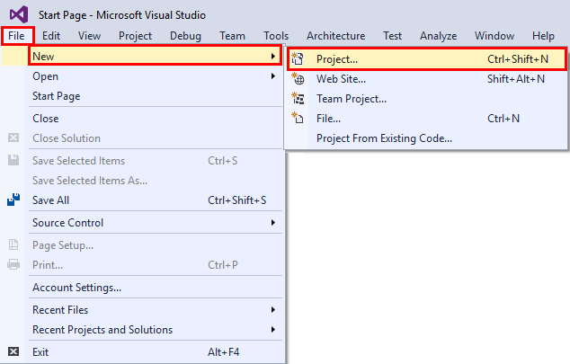

     _Creating a new project_

1. In the "New Project" dialog, select **Mobile Apps** under **JavaScript**. (Note that **JavaScript** may be listed directly under the **Templates** node, or it may be under **Other Languages**, depending on how Visual Studio is configured.) Select **Blank App (Apache Cordova)** as the project type and enter "BasicCordovaApp" as the project name. Then click **OK**.

    

     _Entering project settings_

1. Take a moment to examine the solution that was created. Key elements include:

	- The **Dependencies** folder, which contains any Bower or NPM packages loaded into the project
	- The **merges** folder, which contains files that pertain to specific platforms
	- The **res** folder, which contains resources such as icons and splash-screen images
	- The **www** folder, which contains HTML, CSS, and JavaScript assets, including the **index.html** file that that serves as the app's home page
	- Several files at the root level, including **config.xml**, which includes settings that Cordova uses to build and run your app

    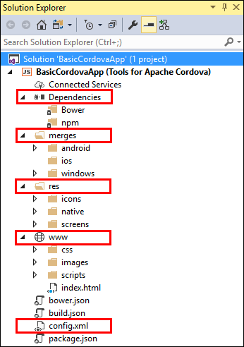

     _The Cordova solution_

1. Select **Build Solution** from Visual Studio's **Build** menu to build the project. 

	> The first time you build your project, Visual Studio will retrieve the Cordova runtime version that is specified in the project's config.xml file. Because of this, your first build will take a little extra time and requires an active Internet connection.

1. The next step is to run your Cordova app in Cordova Simulate with the Visual Studio debugger attached. Cordova Simulate supports Android and iOS applications, but it does not currently support Windows apps. To simulate your app on Android, click **Simulate in Browser - Nexus 7 (Tablet)**.

    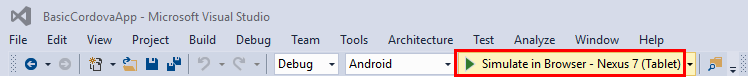

     _Launching the app in Cordova Simulate_

1. Wait a few seconds for Google Chrome to open and show the running app.

	> If you are warned that "Windows Firewall has blocked some features of this app," click **Allow access** to allow the simulator running in Chrome to get through the firewall.
 
    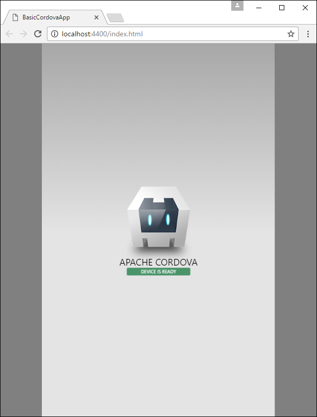

     _App running in Cordova Simulate_

1. Return to Visual Studio and to the DOM Explorer that opened when you launched the app. DOM Explorer shows an interactive view of the app's HTML DOM (Document Object Model). It also allows you to make changes to the HTML and related style elements while your app is running and preview these changes in the user interface.

    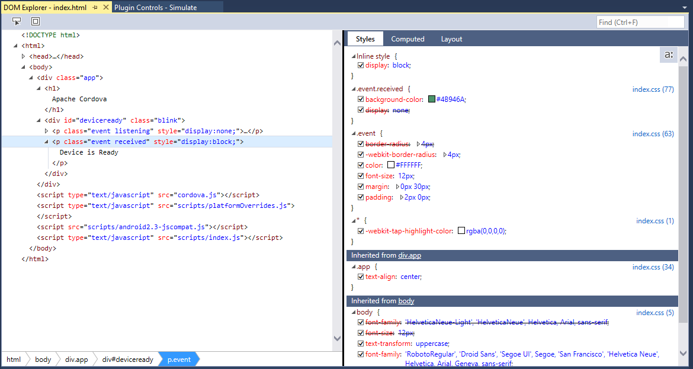

     _The DOM Explorer in Visual Studio_

1. To demonstrate interactive changes in DOM Explorer, select the ```<p class="event received">``` element highlighted on the left below. Then, in the "Styles" panel on the right, change the ```background-color``` attribute of the ```.event.received``` style selector to "blue." Now go back to the Chrome and examine the app. What changed, and why?

	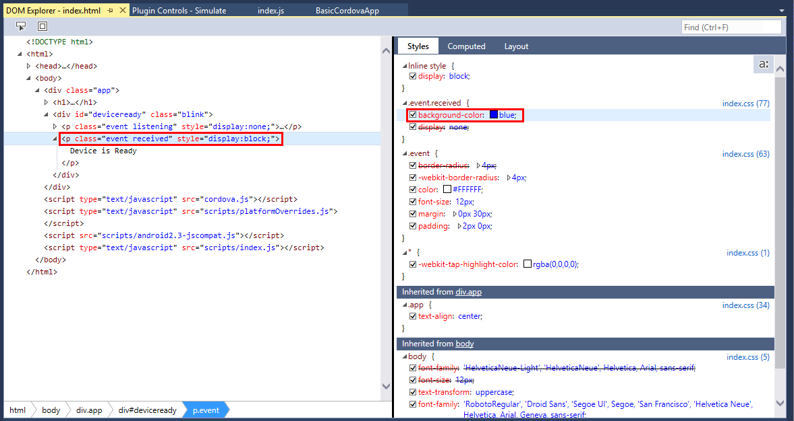

	_Modifying the DOM in DOM Explorer_
	
1. Return to Visual Studio and select **Stop Debugging** from the **Debug** menu.
	
1. Next you will modify some of the JavaScript code in the app and learn how to use breakpoints to debug it. Begin by going to Solution Explorer and double-clicking the **index.js** file in the **www/scripts** folder to open it for editing. Then replace the existing ```onPause``` and ```onResume``` functions with the functions below:	

	```JavaScript
    function onPause() {
        // TODO: This application has been suspended. Save application state here.
        console.log("Pausing");
    };
    
    function onResume() {
        // TODO: This application has been reactivated. Restore application state here.
        console.log("Resuming");
    };
	```

1. Add a breakpoint to the ```console.log``` statement in ```onPause``` by putting the cursor on the line and pressing **F9**, or by cicking in the vertical bar to the left of the line number.

	

	_Setting a breakpoint_

1. Select **Start Debugging** from the **Debug** menu (or press **F5**) to launch the application again.

1. Click the **Plugin Controls - Simulate** tab in Visual Studio and locate the "Events" panel. Select **pause** from the list of events, and then click **Fire Event** to simulate a ```pause``` event.

	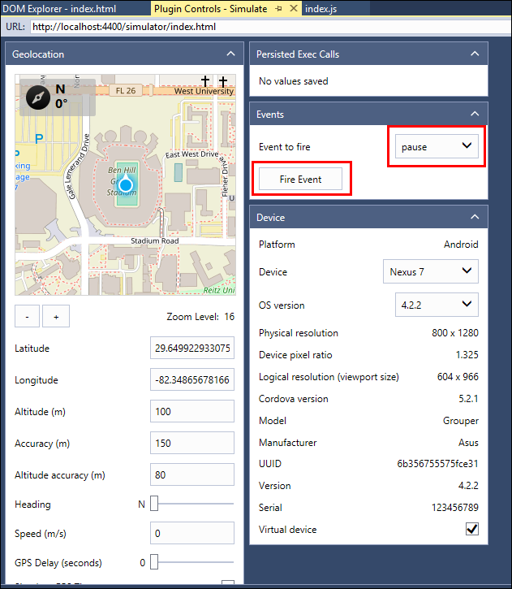

	_Simulating a pause event_
	
1. Observe that Visual Studio pauses execution at the breakpoint you set in **index.js**. Resume execution by selecting **Continue** from the **Debug** menu , clicking the **Continue** button in the toolbar, or pressing **F5**, and notice that "Pausing" appears in the JavaScript console.

	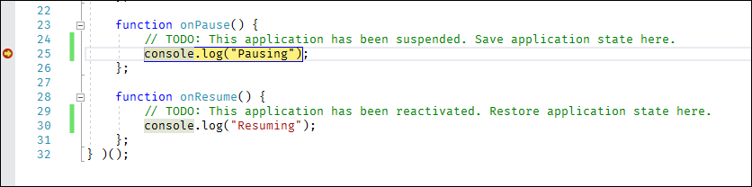
	
	_Hitting a breakpoint in Visual Studio_

1. Simulate a ```resume``` event by returning to **Plugin Controls - Simulate** and selecting **resume** from the list of events and clicking the **Fire Event** button. Notice that "Resuming" appears in the JavaScript console.
 
1. Select **Stop Debugging** from the **Debug** menu to stop debugging.

1. Click the breakpoint to remove it.

You now know how to create a Cordova project, how to launch it in Cordova Simulate, how to use DOM Explorer to view and even modify DOM elements, and how to perform basic debugging tasks. The next step is to write some code to make the app do something useful.

<a name="Exercise2"></a>
## Exercise 2: Add platform-specific code ##

Apache Cordova projects include the **merges** folder in order to support platform-specific elements. This is useful when you need to support different features on different platforms, or comply with design standards that differ from one platform to the next. In this exercise, you will modify the app you built in the previous exercise to show different content on different platforms.

> The JavaScript in this exercise will use the jQuery library to manipulate DOM content.  When writing a Cordova project, you will most likely be using a JavaScript framework like AngularJS or the Ionic framework to facilitate the Single Page Application (SPA) model of web development.  This lab, however, will opt to simply use jQuery for DOM manipulation in order to simplify the discussion.

1. Right-click the project in Solution Explorer and select **Add -> New Item...** to add a new file to the project. Select **Text File** as the file type and name the file **.bowerrc**. Then click the **Add** button.

	
	
	_Adding .bowerrc to the project_

1. Add the following JSON to the new file, and then save your changes:

	```JSON
	{
	  "directory": "www/lib"
	}
	```

	> When you use Bower to import a JavaScript library, it often will bring in a variety of files.  You can either download the content to an intermediate location and individually copy just the files you want to your project — generally a manual process — or you can use the Bower configuration file to indicate you want Visual Studio to download the content. In this example, you are specifying that the entire Bower package contents should be downloaded to the app's **www/lib** folder. 

1. Use the **Build -> Build Solution** command to build the project.
	
1. The next step is to use the Bower package manager to include jQuery in your project. Begin by selecting **Manage Bower Packages...** from the **Project** menu.

1. Click **Browse**, and then select **jQuery** and click the **Install** button on the right.

	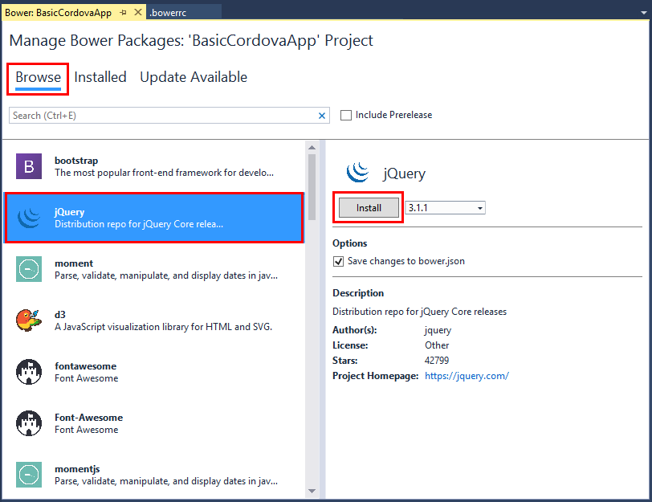

	_Including the jQuery Bower package_

1. Open **index.html**, which is located in the project's **www** folder.

1. Add the following line of markup after the line that reads ```<h1>Apache Cordova</h1>```:

	```html
	<h2 id="ex2Platform">Override Platform</h2>
	```

1. Add the following line before the first ```<script>``` element at the end of the file:

	```html
	<script type="text/javascript" src="lib/jquery/dist/jquery.js"></script>
	```

1. Save your changes to **index.html**.

1. In Solution Explorer, double-click the **platformOverrides.js** file in the **merges/android/scripts** folder to open it for editing.

1. Add the following line of code to the end of the self-executing function body to locate the element whose ID is "ex2Platform" and replace its contents with the word "Android:"

	```JavaScript
	$("#ex2Platform").html("Android");
	```

1. Save your changes to **platformOverrides.js**.

1. Right-click the **merges/iOS** folder in Solution Explorer and select **Add -> New Folder...** from the context menu. Name the new folder "scripts."

1. Right-click the **scripts** folder that you just created and select **Add -> New Item...** from the context menu.

1. In the ensuing dialog, select **JavaScript File** as the file type and name the file **platformOverrides.js**. Then click the **Add** button to add the file to the folder.

1. Add the following code, which locates the element whose ID is "ex2Platform" and replaces its contents with the word "iOS", to the **platformOverrides.js** file you just created:

	```JavaScript
	(function () {
	    $("#ex2Platform").html("iOS");
	} ());
	```

1. Save your changes to **platformOverrides.js**.

1. The next step is to run the app on iOS and Android and see the effects of the per-platform code. Make sure that **Android** is selected in the drop-down list of platforms and one of the **Simulate in Browser** options is selected. Then click **Simulate in Browser** to run the app in Cordova Simulate.

	

	_Simulating the app on Android_

1. Confirm that the app displays "Android" as the platform name.

	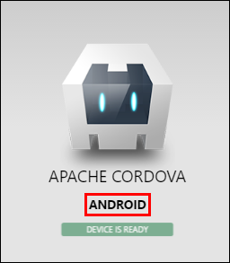

	_BasicCordovaApp running on Android_

1. Stop the debugger. Then select **iOS** as the platform and make sure one of the **Simulate in Browser** options is selected. Then click **Simulate in Browser** to run the app in Cordova Simulate.

	

	_Simulating the app on iOS_

1. Confirm that the app displays "iOS" as the platform name.

	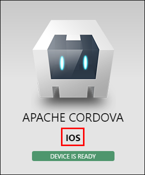

	_BasicCordovaApp running on iOS_

1. Stop the debugger.

Now that you know how to include platform-specific code in your app by placing it in platform-specific **platformOverrides.js** files, a great next step is learning about Cordova plugins.

<a name="Exercise3"></a>
## Exercise 3: Add a Cordova plugin ##

In Apache Cordova development, plugins provide access to native device capabilities that are outside the scope of what a traditional Web app can do. This includes access to device information, access to sensors like accelerometers, GPS, and Bluetooth, and access to device information services such as contacts and the file system. Plugins are cross-platform libraries that provide a JavaScript wrapper over the native code that provides the desired functionality.

Plugins are configured in the **config.xml** file. The Visual Studio Tools for Apache Cordova includes a list of predefined "core" plugins that can be selected from the designer UI. You can also add custom plugins that you download or write yourself.

In this exercise, you will use the Device plugin to customize the UI with information about the operating system and device ID.

1. Start by locating the **config.xml** file in the Solution Explorer. Double-click the file to open it in the Visual Studio designer.

1. Select **Plugins** and make sure **Core** is selected. Scroll through the the list of available core plugins and select the **Device** plugin. Then click the **Add** button to install the plugin.

	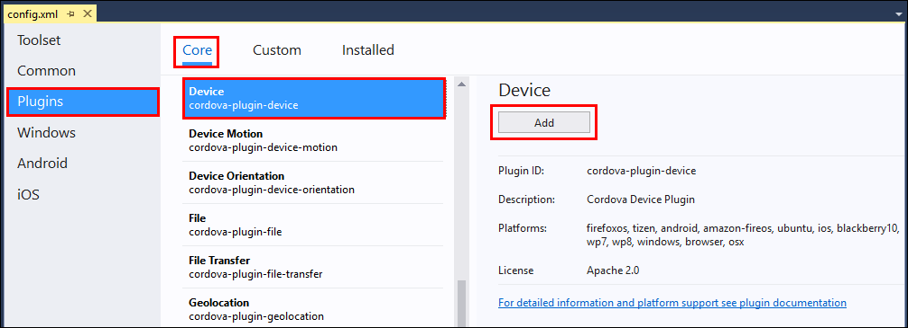

	_Installing the Device plugin_

1. Reopen the **index.html** file that you edited in the previous exercise.  Below the ```<h2 id="ex2Platform">Override Platform</h2>``` element that you added previously, add the following statements. Then save the file.

	```HTML
	<h2 id="ex3Platform">Plugin Platform</h2>
	<h2 id="ex3Id">Plugin Device ID</h2>
	```

1.  Reopen the **index.js** file that you edited in [Exercise 1](#Exercise1). Add the following statements to the *onDeviceReady* function. Then save the file.

	```JavaScript
	var devicePlatform = device.platform;
	var deviceId = device.uuid;
	$("#ex3Platform").html(devicePlatform);
	$("#ex3Id").html("ID: " + deviceId);
	```

	This code retrieves the Platform and UUID values from the Device plugin, and then updates the appropriate user-interface elements with the values. The *onDeviceReady* function is called in response to the *deviceready* event, which is fired when the Cordova framework has been fully loaded and is ready to be used by your code.

1.  Select either **Android** or **iOS** in the platform drop-down and make sure that one of the **Simulate in Browser** options is selected. Then click **Simulate in Browser** to run the app in Cordova Simulate.

	Confirm that a new platform value ("iOS" or "Android") is displayed in addition to the one you added in [Exercise 2](#Exercise2), and that a device ID is displayed as well.  

	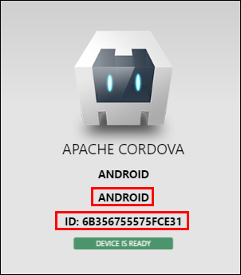

	_Output from the Device plugin_

1. Stop the debugger.

If you select a different platform and run the app again, the platform name and device ID should update accordingly. 

<a name="Exercise4"></a>
## Exercise 4: Connect to an Azure App Service Mobile App ##

Azure App Service Mobile Apps provide a convenient and powerful platform for adding backend functionality to your Cordova apps.  With Mobile Apps, you can create apps that store data in the cloud with or without offline data synchronization, add authentication and authorization, and configure push notifications, among other features.    

In this exercise, you will first use Visual Studio to create a new Azure App Service Mobile App instance.  Then you will use the Mobile Apps Easy Tables feature to quickly configure a database table and expose access to this table through a REST endpoint. You will also add some server-side data validation logic for this table.  Finally, you will configure your Cordova app to call this service in order to both consume and update data that is stored in the cloud.

> While you could perform this step in the Azure Portal, Visual Studio simplifies the process by providing a wizard-like set of tools that you can use to both create the service and its resources, as well as to make several changes to your Cordova project in order to enable your code to communicate with the newly created service.

1. The first step is to use the Visual Studio "Add Connected Service" to provision a new Azure App Service Mobile App instance.  In the Visual Studio Solution Explorer locate and double-click on the **Connected Services** node.

	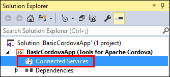

	_Selecting Connected Services_

1. Click on the link titled **Mobile Backend with Azure App Service Mobile App**.
 
	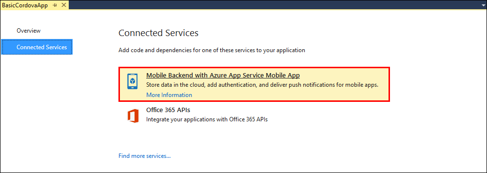

	_Connecting to a Mobile Backend Service_

1. In the **Azure Mobile Apps** dialog, if you already have connected Visual Studio to your Azure Subscription, select the account to use in the upper right hand corner and skip ahead to step 6 below.  Otherwise, you will need to add your Azure account to Visual Studio.
		
1. To add a new account, click on the **Add an account** button in the upper right corner of the dialog.
	
	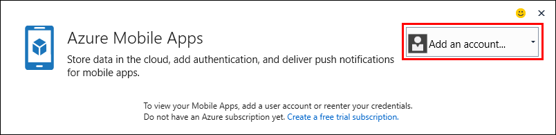

	_Adding an Azure account_

1. In the **Sign in to your account** dialog, enter the credentials to sign in to your Azure subscription.
	
1. Once you have an Azure Account selected in the **Azure Mobile Apps** dialog, click on the **Create Service** button to create a new Azure App Service Mobile App instance.

	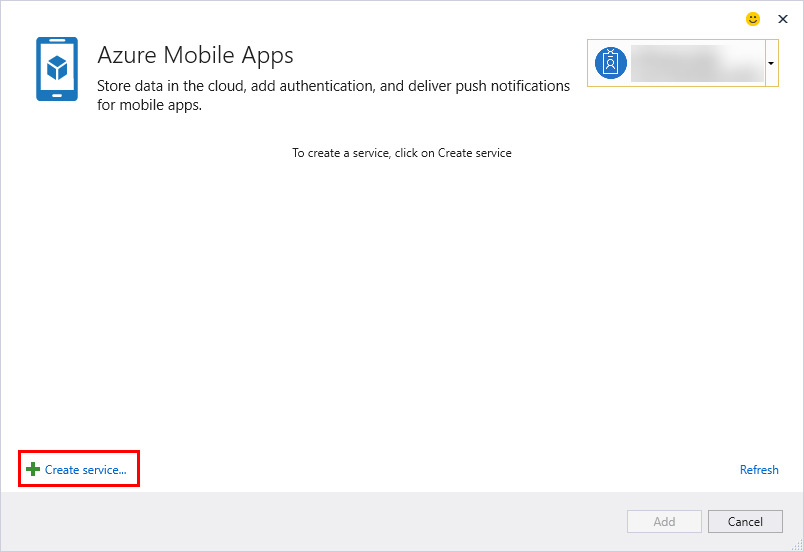

	_Create a new Azure Mobile Apps service_

1. In the **Hosting** section of the **Create App Service** dialog, keep the default value for **Mobile App Name** (this name needs to be unique, and Visual Studio will generate a unique default name for you.)
		
1. Use the **Subscription** dropdown to select the subscription in which you want your new service created.

1. Click on the **New...** button next to the **Resource Group** dropdown. Enter the name *"BasicCordovaApp"* as the **New Resource Group Name** and press the **OK** button.

1. Click the **New...** button next to the **App Service Plan** dropdown.   

1. In the **Configure Service Plan** dialog, leave the default name in the **App Service Plan** text box, change the **Location** value to be a region closest to where you are, and select *Free* as the **Size** for the new App Service Plan.

1. Click the **OK** button to accept the App Service Plan settings.

	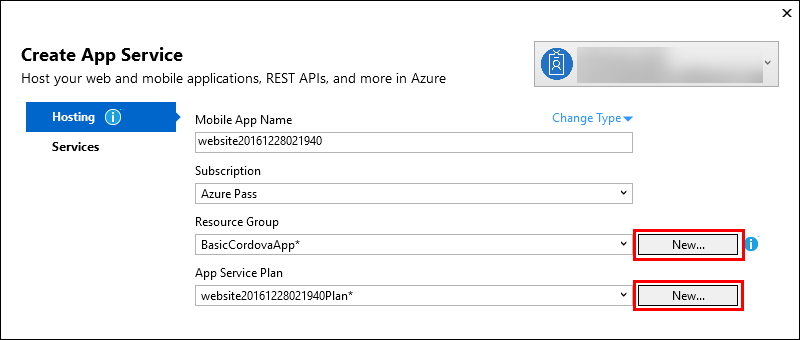

	_Configure Hosting options for the new Azure Mobile Apps service_

1. In the **Services** section of the **Create App Service** dialog, under the text "*Select any additional Azure resources your app will need*", click the **+** button next to the SQL Database entry.
		
	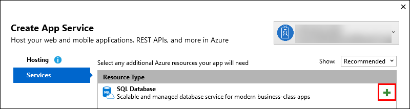
	
	_Add a new SQL Database service_

1. In the **Configure SQL Database** dialog, click the **New...** button next to the **SQL Server** dropdown.

1. In the **Configure SQL Server** dialog:
	- Leave the default value for the **Server Name**.
	- Enter *"cordova"* for the **Administrator Username** field.
	- Enter "c0rd0va!" for both the **Administrator Password** and **Administrator Password (confirm)** fields.
	- Click the **OK** button to commit the SQL Server configuration values.

1. Back in the **Configure SQL Database** dialog, leave the default **Database Name** value, change the **Connection String Name** value to *"MS_TableConnectionString"*, and then click the **OK** button to commit the SQL Database configuration values.

	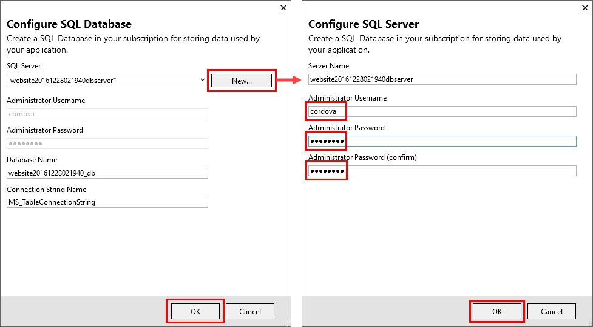

	_Configuring the SQL Database and Server_

1. Click the **Create** button in the **Create App Service** dialog to start provisioning the Azure App Service Mobile App instance.

	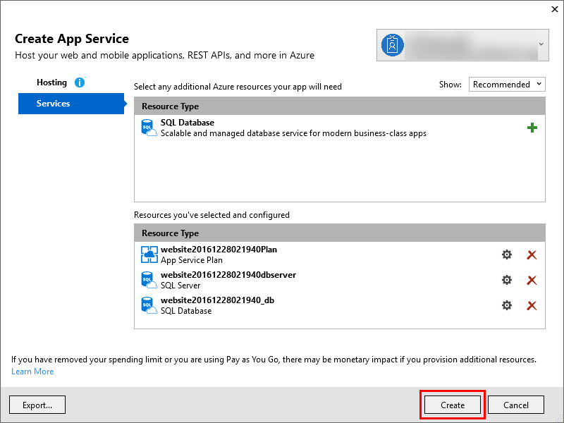
	
	_Completing the App Service creation_

	The deployment process progress will be reported at the bottom of the **Create App Service** dialog and may take a couple of minutes to complete.

1. Once the service has been created, it will appear in the **Azure Mobile Apps** dialog.  Make sure it is selected and click on the **Add** button. This will start the process of connecting your Cordova app to your newly created Azure App Service Mobile App instance, including:
	- Installing the Azure Mobile Apps plugin to your Cordoca project
	- Adding a new JavaScript file in your app's *www/services/mobileApps/setttings* folder.
	- Adding a new *script* tag in your project's Start Page (*index.html*) to reference this newly added JavaScript file.

	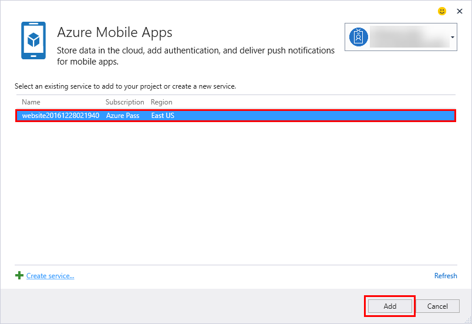

	_Adding the newly created Azure Mobile App to your Cordova project_

	The next step is to use the Azure Portal to configure the content of the Azure App Service Mobile App that you just created.  This includes setting up the Easy Tables functionality, creating the database table that your app will use to store data, and adding validation logic that will run server-side to ensure the data your app supplies is valid.

1. Open the Azure Portal in a web browser using the URL [https://portal.azure.com](https://portal.azure.com) and sign in with your Azure credentials

1. In the Azure Portal, open the **Resource Groups** blade by clicking on on the **Resource Groups** item in the shortcut list on the left hand side. In the **Resource groups** blade that opens, click the *"BasicCordovaApp"* resource group to open its management blade.

	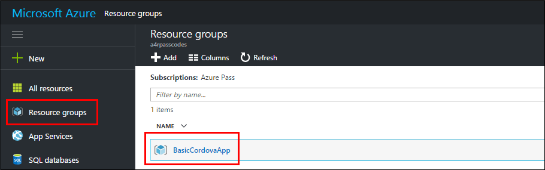

	_Opening the BasicCordovaApp resource group_

1. In the **BasicCordovaApp** resource group blade, locate the entry with the type name *"App Service"* and click on it to open the blade for managing your Azure App Service Mobile App instance.

	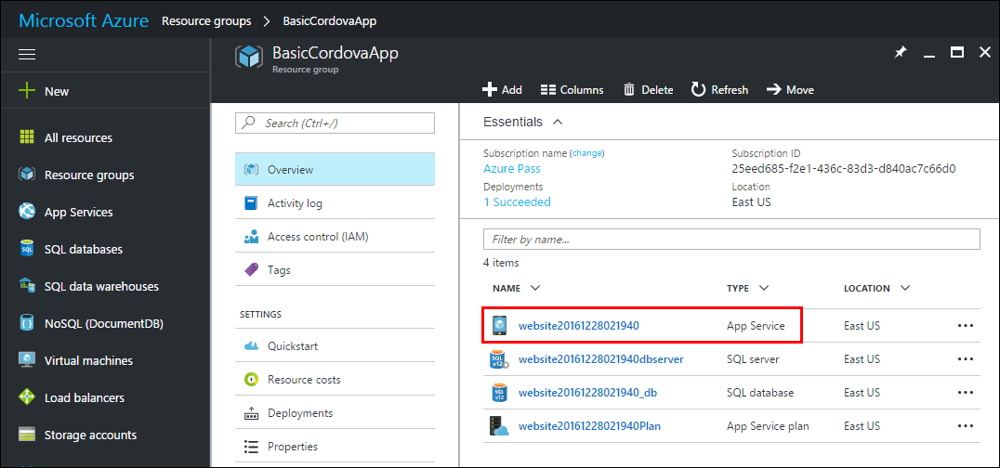

	_Opening the Mobile App management blade_

1. In the management blade for your Azure App Service Mobile App instance, scroll down the list of options on the left side to reveal the **Mobile** section and click on the **Easy Tables** entry.  This will display the Easy Tables configuration panel for your Azure App Service Mobile App.

	

	_Opening the Easy Tables configuration blade_

1. In the Easy Tables configuration panel for your Azure App Service Mobile App, click on the alert at the top that reads *"Need to configure Easy Tables/Easy APIs - Click here to continue -->"*

	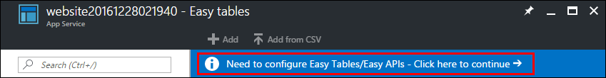

	_Accessing Easy Tables configuration_

1. In the **Easy Tables** configuration blade check the initialization acknowledgment text and then click the **Initialize App** button.

	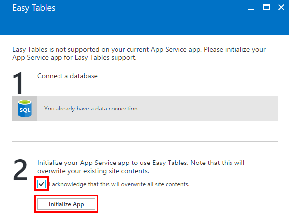

	_Configure the Easy Tables database_	
	 
1. When the backend initialization completes, the **+Add** button in the Easy Tables configuration panel will be enabled.  Click on the **+Add** button to open the **Add a table blade**.

1. Type *"scores"* in the table **Name** field and press the **OK** button (leave the permission defaults.)

	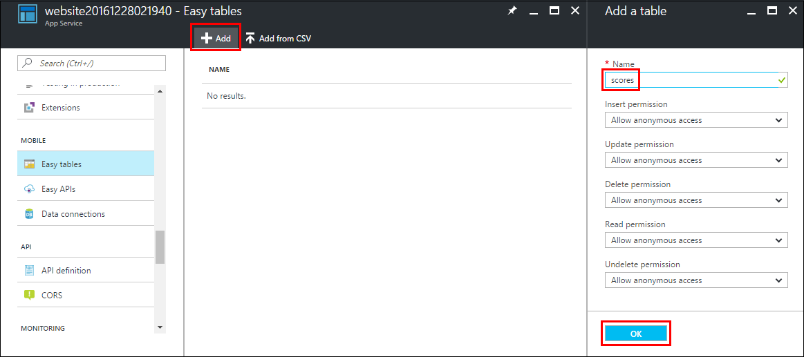

	_Add the scores table_

1. When the table is created, you will have a *scores* entry in the **Easy Tables** panel.  Click on the table name to open the table management blade, then click on **Edit script**.

	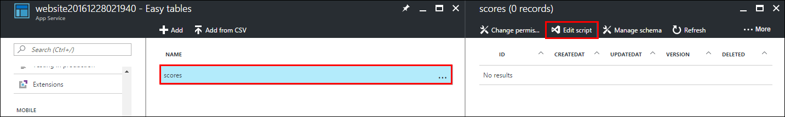

	_Manage the scores table_

	This will open a new browser tab that displays an online editor for the code in your Azure App Service Mobile App instance.  

1. Paste the following code into the App Service Editor window:

	```JavaScript
	table.insert(function(context) {
		if (context.item.homeTeamName !== context.item.awayTeamName){
			return context.execute();
		}
		context.logger.error('Home Team and Away Team must be different.');
		throw new Error('Home Team and Away Team must be different.');
	});
	```

	This code simply checks to ensure the Home Team and Away Team names are different before committing the data into the database.  You do not need to do anything special to save the code changes.   Changes in the App Service Editor are saved as you go.

1.  Now you will update the application to work with the Azure App Services Mobile App instance you just created and configured.  Before getting started, the app is going to display a message dialog if there is an error communicating with the Azure App Services Mobile App instance.  To display these error messages, you will need to add install the *Notifications* plugin in your app.

	In Visual Studio, locate and open the project's *config.xml* file.

1. Select the **Plugins** panel, scroll down to select the **Notification** plugin, and click on the **Add** button. 

1. Locate the *index.html* file in the project's **www** folder.  Replace the existing content inside of the `<div class="app">` element with the following HTML:

	```HTML
	<h1>Apache Cordova</h1>
	<div id="newScore">
	    <div><label>Home Team: <input id="homeTeamName" type="text"></label></div>
	    <div><label>Home Score: <input id="homeTeamScore" type="text"></label></div>
	    <div><label>Away Team: <input id="awayTeamName" type="text"></label></div>
	    <div><label>Away Score: <input id="awayTeamScore" type="text"></label></div>
	    <button id="newScoreButton">Add Score</button>
	</div>
	<div id="scores">
	    <button id="getScoresButton">Refresh Scores</button>
	    <table>
	        <thead>
	            <tr>
	                <td>Home</td>
	                <td>Home Score</td>
	                <td>Away</td>
	                <td>Away Score</td>
	            </tr>
	        </thead>
	        <tbody></tbody>
	    </table>
	</div>
	```

1. Locate the *index.js* file in the the project's **www/scripts** folder.  Replace the *onDeviceReady* function with the following code (removing some of the code you wrote in the previous exercises):

	```JavaScript
	function onDeviceReady() {
	    // Handle the Cordova pause and resume events
	    document.addEventListener( 'pause', onPause.bind( this ), false );
	    document.addEventListener( 'resume', onResume.bind( this ), false );
	    
		var cordovaLabClient = UPDATE_THIS_VALUE;
	    $("#getScoresButton").click(function () {
	        updateScores();
	    });
	
	    $("#newScoreButton").click(function () {
	        addNewScore();
	    });
	
	    function updateScores() {
	        // Get the scores from the service
	        var scoresTable = cordovaLabClient.getTable("scores");
	        scoresTable
	            .read()
	            .then(success, failure);
	
	        function success(results) {
	            // Access and clear the table content
	            $("#scores table > tbody").empty();
	
	            $.each(results, function (i, item) {
	                $('#scores table > tbody:last-child')
	                    .append(
	                        "<tr>" +
	                        "<td>" + item.homeTeamName + "</td>" +
	                        "<td>" + item.homeTeamScore + "</td>" +
	                        "<td>" + item.awayTeamName + "</td>" +
	                        "<td>" + item.awayTeamScore + "</td>" +
	                        "</tr>");
	            });
	        }
	
	        function failure(error) {
	            throw new Error("Error loading data: ", error);
	        }
	    }
	
	    function addNewScore() {
	        // Get the values from the UI
	        // Post the value to the service
	        var scoreEntry = {
	            "homeTeamName": $("#homeTeamName").val(),
	            "homeTeamScore": $("#homeTeamScore").val(),
	            "awayTeamName": $("#awayTeamName").val(),
	            "awayTeamScore": $("#awayTeamScore").val(),
	        };
	
	        var scoresTable = cordovaLabClient.getTable("scores");
	        scoresTable
	            .insert(scoreEntry)
	            .done(insertSuccess, insertFailure);
	
	        function insertSuccess(result) {
	            if (result.error) {
	                navigator.notification.alert("Error inserting data: " + result.error);
	                return;
	            }
	
	            // Refresh the scores on success to pick up the new entry
	            updateScores();
	        };
	
	        function insertFailure(error) {
	            navigator.notification.alert("Error inserting data: " + result.error);
	        };
	    }
	};
	```

	Although there appears to be a lot of content there, there really is not all that much.  The *updateScores* function makes a call into the Azure App Service Mobile App instance to retrieve the values of the *scores* table, then uses those values to update the table in the user interface.  The *addNewScore* function retrieves values for a new score entry from the user interface and then makes a call into the Azure App Service Mobile App to add the new value.  If the call succeeds, the function then calls *updateScores* to update ensure the table is udpated with the new entry.
 
1. In the Solution Explorer, open the script file in the project's *www/services/mobileApps/settings* folder.  The first line in this file should be a variable declaration of the form `var variable_name;`  Copy or otherwise make a note of this variable name.
 
1. Return to the *index.js* file.  In the script you just pasted into that file, locate the line that reads `var cordovaLabClient = UPDATE_THIS_VALUE;`  Replace the text *"UPDATE_THIS_VALUE"* with the variable name you just recorded. 

1. In the Solution Explorer, open the *index.css* file from the *www/css* folder.  Replace the style definition for the *app* class with the following:

	```css
	.app {
	    background: url(../images/cordova.png) no-repeat center top; 
	    position: absolute;             
	    left: 50%;
	    height: 50px;                  
	    width: 225px;                   
	    text-align: center;
	    padding: 180px 0px 0px 0px;     
	    margin: 10px 0px 0px -112px;
	}

	button {
	    margin: 2px;
	}
	```

	Your app should now be ready to run.

1. As you did in the previous exercises, select either the **Android** or **iOS** platform options and make sure that one of the **Simulate in Browser** options are displayed in the standard toolbar in Visual Studio and click the button to run the app in the Cordova Simulate application simulator.

1. Enter the following values in the app interface as a new score entry, then press the **Add Score** button.

	- Home Team: *Us*
	- Home Score: *10*
	- Away Team: *Them*
	- Away Score: *5*

	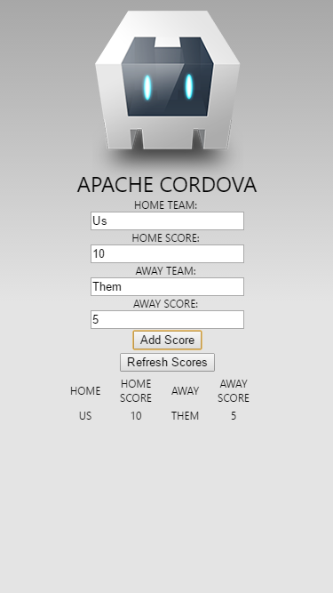

	_Entering data in the mobile app_

1. Enter 2 or 3 more scores.

1. Now try to exercise the server-side validation logic by entering the following score, then pressing the **Add Score** button.

	- Home Team: *Us*
	- Home Score: *10*
	- Away Team: *Us*
	- Away Score: *5*

	Note the error that is displayed - this shows the server has detected a data validation error since the Home Team and Away Team values are the same.

	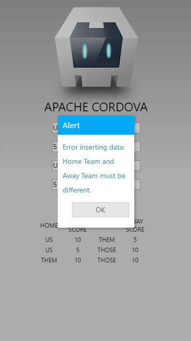

	_Entering bad data in the mobile app_

1. The final step is to clean up your Azure resources.  The Azure App Services Mobile App instance you created will result in two sets of charges against your Azure subscription - one set for the App Service instance and one for the Azure SQL Database instance.  In order to keep from accruing charges for these resources, you should delete them both.  Fortunately, since they were placed in the same Azure Resource Group, you do all of the necessary cleanup in one place.

	If it is not still open, open the Azure Portal in a web browser using the URL [https://portal.azure.com](https://portal.azure.com) and sign in with your Azure credentials

1. As you did before in the Azure Portal, open the **Resource Groups** blade by clicking on on the **Resource Groups** item in the shortcut list on the left hand side. In the **Resource groups** blade that opens, click the *"BasicCordovaApp"* resource group to open its management blade.

1. In the *BasicCordovaApp* Resource Group management blade, click on the Delete button.

	

	_Deleting the resource group_

1. In the "Are you sure you want to delete "BasicCordovaApp"?" blade that is displayed, enter the resource group name *"BasicCordovaApp"* in the section where you are prompted to confirm the deletion.  Click the Delete button to delete the resources.  The deletion process might take a few minutes to complete.

	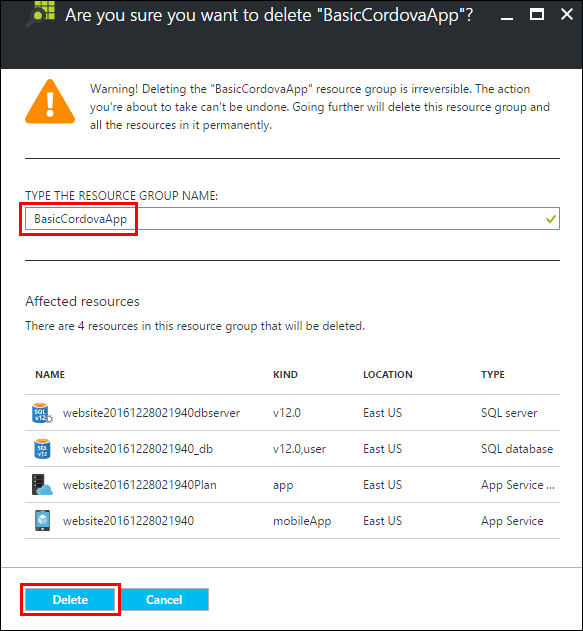

	_Confirming deletion of the resource group_

## Summary ##

In this hands-on lab, you learned how to:

- Create a new Cordova project in Visual Studio 2017.
- Use the Cordova Simulate application simulator to test your Cordova application.
- Add resources that are used only when your app is running on a specific platforms.
- Use a Cordova Plugin to access device functionality. 
- Configure an Azure App Service Mobile App instance and connect to it with your Cordova app.

As you have seen, Visual Studio and the Visual Studio Tools for Apache Cordova can greatly help you develop mobile apps on top of the Apache Cordova framework.  With these tools, you can quickly stand up, develop, manage, test, and debug your Cordova apps on a variety of platforms, using either the Cordova Simulate application simulator or other tools to run the app under development.  Furthermore, with Visual Studio's integration with the Microsoft Azure services, you can quickly stand up a cloud-hosted backend for your mobile app and greatly extend both the functionality and the reach of your mobile application.  

---

Copyright 2016 Microsoft Corporation. All rights reserved. Except where otherwise noted, these materials are licensed under the terms of the MIT License. You may use them according to the license as is most appropriate for your project. The terms of this license can be found at https://opensource.org/licenses/MIT.