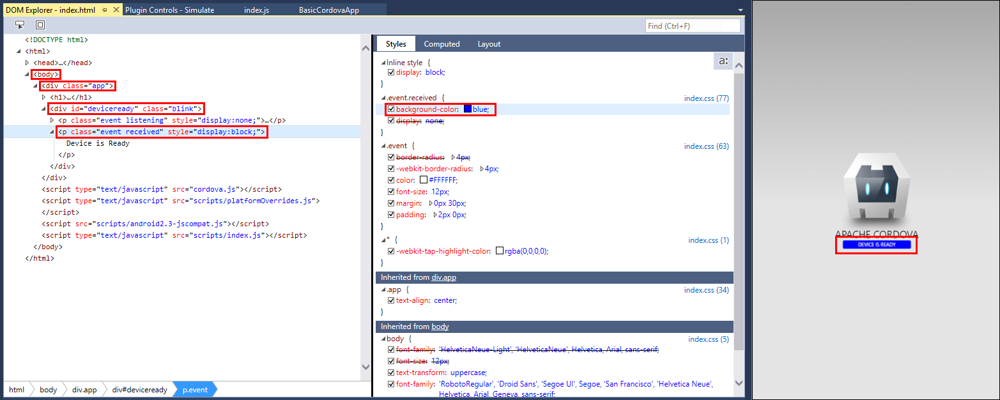

<a name="HOLTitle"></a>
# Building Cross-Platform Mobile Apps with Visual Studio, Apache Cordova, and Microsoft Azure #

---

<a name="Overview"></a>
## Overview ##

[Apache Cordova](https://cordova.apache.org/) is an open-source framework for developing cross-platform mobile apps using industry-standard technologies such as HTML5, CSS3, and JavaScript. It is especially useful in organizations that already have expertise in developing Web apps. In Cordova, your app is basically built as a Web application, with the Cordova framework managing the presentation of a WebView control that displays the app assets and coordinates communication between the app and the underlying operating system. Essentially, your app runs as an "app within an app."

The [Visual Studio tools for Apache Cordova](https://www.visualstudio.com/vs/cordova/) extend Visual Studio to support the development of Cordova apps that target Windows, iOS, and Android. These tools provide project templates for creating Cordova apps in JavaScript and TypeScript. The Visual Studio IDE is regarded as one of the more powerful developer productivity tools available, and includes features such as syntax highlighting, Intellisense, GUI-facilitated project and plugin configuration, integrated source control, integrated debugging, and built-in deployment tooling.

As the name implies, Azure App Service Mobile Apps are part of and build on top of the Azure App Service platform-as-a-service offering and include both client and server-side components.   On the server-side, Mobile Apps make it easy to stand up either .NET or Node.js based REST endpoints for data CRUD (create, read, update, and delete) operations as well as HTTP endpoints that allow you to perform custom actions not directly tied to data CRUD operations.  In addition, Mobile Apps includes features like Easy Tables and Easy APIs which make it simple to create connections to and manage the underlying database tables which your Mobile App instance will be communicating.  The service also provides for easy configuration of Authentication and Authorization via both social and enterprise identity providers.  On the client, Mobile Apps provides several ready-built SDKs that facilitate communication between your app and a Mobile App service, as well as tooling to support offline data sync.  You can learn more about the Azure Mobile Apps service [here](https://azure.microsoft.com/en-us/services/app-service/mobile/).

In this lab, you will learn how you can use Visual Studio 2017 and the Tools for Apache Cordova to create Cordova-based mobile apps.  You will explore how you can write code that is specific to each platform being targeted, and also how Visual Studio can help you discover and select Cordova Plugins to access additional functionality exposed by the device.  Finally, you will configure an Azure App Service Mobile Apps instance and see how you can use the corresponding Cordova Plugin to access this service and extend the reach of your app to the Cloud.

<a name="Objectives"></a>
### Objectives ###

In this hands-on lab, you will learn how to:
- Create a new Cordova project in Visual Studio 2017.
- Use the Cordova Simulate application simulator to test your Cordova application.
- Add resources that are used only when your app is running on a specific platforms.
- Use a Cordova Plugin to access device functionality. 
- Configure an Azure App Service Mobile App instance and connect to it with your Cordova app.

<a name="Prerequisites"></a>
### Prerequisites ###

The following are required to complete this hands-on lab:

- Visual Studio 2017 RC (Community Edition or higher) with the "Mobile development with JavaScript" workload installed.  The Visual Studio 2017 installer can be downloaded [here](https://www.visualstudio.com/vs/visual-studio-2017-rc).  Note that this lab is only supported on the Windows OS.
- The Google Chrome browser, which can be downloaded [here](https://www.google.com/chrome/browser)
- An active Microsoft Azure subscription. If you do not already have an Azure subscription, you can [sign up for a free trial](http://aka.ms/WATK-FreeTrial).

<a name="Exercises"></a>
## Exercises ##

This hands-on lab includes the following exercises:

- [Exercise 1: Creating a new Cordova Project in Visual Studio](#Exercise1)
- [Exercise 2: Writing platform-specific code](#Exercise2)
- [Exercise 3: Using Cordova Plugins](#Exercise3)
- [Exercise 4: Building and Connecting to an Azure App Service Mobile App](#Exercise4)

Estimated time to complete this lab: **90** minutes.

<a name="Exercise1"></a>
## Exercise 1: Creating a new Cordova Project in Visual Studio ##

The Visual Studio Tools for Apache Cordova allow you to use Visual Studio 2017 to build, manage, and test Cordova applications that run on Android, iOS, and Windows.  In this exercise, you will create a new Cordova application project in Visual Studio and debug it using the Cordova Simulate application simulator, which will run your app inside of a simulated environment within the Google Chrome browser.  You can learn more about Cordova Simulate [here](https://taco.visualstudio.com/en-us/docs/vs-taco-2017-cordova-simulate/)

> Note: While your Cordova project will run as an iOS app on the Cordova Simulate application simulator, if you want to be able to deploy the application to an iOS emulators, to actual devices, or to the Apple App Store, you will need access to an a Macintosh computer running XCode.

1. If you have not done so yet, you will need to install the Visual Studio 2017 IDE and the Visual Studio Tools for Apache Cordova.  Instructions for installing these tools can be found [here](https://taco.visualstudio.com/en-us/docs/vs-taco-2017-install/).
1. Launch Visual Studio 2017 and create a new project by selecting the **File** menu, followed by **New** and then **Project**.

    
     _Creating a new project_

1. In the **New Project** dialog, select **Mobile Apps** from within the **JavaScript** node.  Note that **JavaScript** may be listed directly under the **Templates** node, or it may be under **Other Languages**, depending on how you have configured your Visual Studio installation.
	- Make sure **Blank App (Apache Cordova)** is selected.
	- Enter *BasicCordovaApp* for the project **Name**.
	- Leave the **Location** set to the default value.
	- Leave the **Solution** name set to the default value.
	- Click the **OK** button to create the project.

    
     _New project settings_

	> Note that the .NET Framework selection in this dialog is irrelevant, since Cordova apps do not use the .NET runtime.

1. Take a minute to look over the contents of the Solution Explorer in your new project.  Key elements to note include:
	- The **Dependencies** folder, which contains any *Bower* and *NPM* packages you have loaded into your project.
	- The **merges** folder, which contains any files that should be present only in particular platform deployments.
	- The **res** folder, which contains the files like icons and splash screens that are needed by your app within the platform they are installed on.
	- The **www** folder, which contains the HTML, CSS, JavaScript, and other resources needed by your running app.
	- Several "loose" files, of which the **config.xml** file is perhaps the most important, as it includes the settings that Cordova will use to build and run your app.

    
     _New project content_

1.  To build your project, click to open the **Build** menu and then click on **Build Solution**. 

	The first time you build your project, Visual Studio will retrieve the Cordova runtime version that is specified in the project's config.xml file.  While it does so, your first build will take a little extra time and will require an active Internet connection.

1. The next step will be to run your Cordova project with the Visual Studio debugger attached.  To do this, you will run it using the Cordova Simulate application simulator.  This will run your app in a simulated device within the Google Chrome web browser.  The Cordova Simulate application simulator supports both Android and iOS applications, but does not currently support running Windows Applications.  To run and debug your app, click the **Simulate in Browser - Nexus 7 (Tablet)** button in the standard toolbar in Visual Studio (once this value is set, you can also use the **F5** key on your keyboard to start debugging.)

    
     _Run the app with the Cordova Simulate application simulator_

	In a couple of seconds, a Google Chrome browser window will open with your running app displayed in the content area.
 
    
     _An app running in Cordova Simulate_
	
	In addition to launching your app inside of the simulator, it will also open two new tabs in Visual Studio:
	- The **DOM Explorer** tab shows an interactive view of the HTML DOM (Document Object Model) for your running application.  You can use this view to locate the markup for items in your user interface, as well as highlighting items in your user interface by selecting them in the DOM.  You can also make changes to the HTML and related style elements in your DOM and preview the effects of these changes in your application's user interface. 

	    
	
	     _The DOM Explorer tab in Visual Studio_

	- The **Plugin Controls - Simulate** tab shows a collection of panels that can be used to simulate external inputs to the device (as if the app was receiving input from an actual physical device), such as GPS position, and device orientation. 

	    	
	     _The Plugin Controls tab in Visual Studio_

1. In this step you will use the DOM Explorer to see what a color change in the user interface might look like.
	- In the **DOM Explorer** tab in Visual Studio, locate the **Styles** display for the div element with the class values set to *"event received"* 
		- To get to this div element, expand the *"body"*, *"div class='app'"*, and *"div id='devicereaday'"* nodes in the DOM tree.  
	- Locate the *"background-color"* entry in the *".event.received"* style selector in the **Styles** tab.  
	- Click on the *"#4B946A;"* color value to open the text editor for the value, and replace its contents with a new color value (for example, *"blue"*.)  
	- Notice that the *"Device is Ready"* button in the user interface changes to reflect your new color value.

	
	_Updating the DOM in Visual Studio_

	When you are done, stop debugging by selecting **"Stop Debugging"** from the **"Debug"** menu. 

	Updating your app's DOM on-the-fly like this can help with both fine-tuning your layout as well as troublshooting user interface issues.
	
1. Now you will update the app's JavaScript and explore how to set and catch breakpoints in Visual Studio.
	- Open the file *"index.js"* from within the *"www/scripts"* folders in the **Solution Explorer**.
	- Replace the existing *onPause* and *onResume* functions with the code below:	
		```
	    function onPause() {
	      // TODO: This application has been suspended. Save application state here.
	      console.log("Pausing");
	    };
	    
	    function onResume() {
	      // TODO: This application has been reactivated. Restore application state here.
	      console.log("Resuming");
	    };
		```
	- Add a breakpoint to the line that reads *console.log("Pausing")* by moving your cursor to the beginning of the line and selecting **Toggle Breakpoint** from the **Debug** menu (you can also use the **F9** key on your keyboard.)  
	- Start to debug the application again by selecting **Start Debugging** from the **Debug** menu.
	- Open the **Plugin Controls - Simulate** tab in Visual Studio and locate the **Events** panel.
	- Select "*pause*" from the dropdown by the label **Events to fire**.
	- Click on the **Fire Event** button

		
		_Firing the simulated Pause event_
	
		When you click on the button, notice that Visual Studio will pause execution at the breakpoint you set in the index.js file.  If you resume execution (By selecting **Continue** from the **Debug** menu, use the **Continue** button from the Stanadrd toolbar, or using the **F5** key on your keyboard), you will see the message *"Pausing"* added to the **JavaScript Console** in the Visual Studio IDE.

		
		_Execution paused at a breakpoint in Visual Studio_

	- Resume the application by returning to the **Plugin Controls - Simulate** tab and selecting "*resume*" from the dropdown by the label **Events to fire** and clicking the **Fire Event** button.  Notice that the message *"Resuming"* is added to the **JavaScript Console** in the Visual Studio IDE.
	- When you are done, stop debugging by selecting **"Stop Debugging"** from the **"Debug"** menu.

<a name="Exercise2"></a>
## Exercise 2: Writing platform-specific code ##

Apache Cordova projects include the *"merges"* folder in order to support including elements as part of your app that are only deployed to a specific platform.  This is useful when you need to support different features or comply with expected layout design standards that may differ from one platform or device to another.  In this exercise you will update the project you started in the previous exercise to show different content depending on the platform the app is running on.

> The JavaScript in this exercise will use the jQuery library to manipulate DOM content.  When writing a Cordova project, you will most likely be using a JavaScript framework like AngularJS or the Ionic framework to facilitate the Single Page Application (SPA) model of web development.  This lab, however, will opt to simply use jQuery for DOM manipulation in order to simplify the discussion.

1. The first step is to add a JSON file to the project to configure the location of content installed with the Bower package manager.
	- In Visual Studio, right click your project file in the **Solution Explorer** and select **Add/New Item...**.
	- Select **Text File**, and in the **Name** box enter *".bowerrc"*
	- Click the **Add** button.
	- Add the following content to the newly created file
	```
	{
	  "directory": "www/lib"
	}
	```
	- Click the **Save** icon to save your file.
	
	> Note: When you use Bower to retrieve a particular JavaScript library, it often will bring in a variety of files and other content.  You can either download the content to an intermediate location and individually copy just the files you want into the www portion of your project - generally a manual process - or you can use the Bower configuration file to indicate you want the entire content pulled into your www file.  In this instance, you are including the entire Bower package contents in your app's www/lib folder. 
	
1. The next step is to use the Bower package manager to include jQuery in your project.
	- Select **Manage Bower Packages...** from the **Project** menu.
	- In the **Bower: BasicCordovaApp** tab, make sure the **Browse** tab is selected.
	- Locate the *jQuery* entry and click on the **Install** button.

	
	_Including the jQuery Bower package_

1. Next you will update the main page HTML file.
	- Open the *index.html* file contained in the **www** folder.
	- Add the following line of markup after the line that reads `<h1>Apache Cordova</h1>`.
		```
		<h2 id="ex2Platform">Override Platform</h2>
		```
	- Add the following line to the beginning of the `<script>` block at the end of the file.
		```
		<script type="text/javascript" src="lib/jquery/dist/jquery.js"></script>
		```
	- Save the changes to the file.

1. Now you will add the per-platform code to update the user interface.
	- Using the **Solution Explorer**, open the *platformOverrides.js* file in the **www/scripts** folders in your project.  Note that this file is empty except for some code comments.
	- Android	
		- Open the *platformOverrides.js* file in the **merges/android/scripts** folder in your project.
		- Within the self-executing function body, add the following line of JavaScript code, which locates the element with the ID "ex2Platform" and replaces its contents with the word "Android":
			```
			$("#ex2Platform").html("Android");
			```
		- Save the updated file.
	- iOS
		- Right click the **merges/iOS** folder in your project and select **Add/New Folder...** from the context menu. Name the new folder *"scripts"*.
		- Right-click the newly created *"scripts"* folder and select **Add/New Item...**
		- In the **Add New Item - BasicCordovaApp** dialog, select **JavaScript File** and name the file *"platformOverrides.js"*  Click the **Add** button to complete the dialog.
		- Add the following code, which locates the element with the ID "ex2Platform" and replaces its contents with the word "iOS", to the newly created *platformOverrides.js* file.
			```
			(function () {
			    $("#ex2Platform").html("iOS");
			} ());
			```
		- Save the updated file. 

1. The final step is to run the app under several different platforms to see the per-platform code running.
	- Android	
		- Make sure that the **Android** platform is selected and one of the **Simulate in Browser** options is displayed in the standard toolbar in Visual Studio and click the button to run the app in Cordova Simulate as an Android app.
		
		_Running the app in the Android platform_
		-  Notice that the app displays Android as the platform name.
		
		_Displaying the Android platform_
		- Stop the debugger.
	- iOS	
		- Make sure that the **iOS** platform is selected and one of the **Simulate in Browser** options is displayed in the standard toolbar in Visual Studio and click the button to run the app in Cordova Simulate as an Android app.
		
		_Running the app in the iOS platform_
		-  Notice that the app displays iOS as the platform name.
		
		_Displaying the iOS platform_
		- Stop the debugger.

<a name="Exercise3"></a>
## Exercise 3: Using Cordova Plugins ##

In Apache Cordova development, plugins provide access to native device capabilities that are outside the scope of what a basic web app can interact with.  This includes access to device information, access to sensors like accelerometers, GPS, and Bluetooth, and access to device information services such as Contacts and File System access.  Plugins are cross-platform libraries that provide a JavaScript wrapper over the top of the native code that provides the desired functionality.

Plugins are configured in each app's *config.xml* file.  The Visual Studio Tools for Apache Cordova includes a list of predefined "core" plugins that can be selected from the designer UI.  You can also configure access to custom plugins that you download or write yourself.

In this exercise you will continue to work on the same project as the prior exercises, using the Device plugin as an alternative way to display a similar device platform name as you did in the previous exercise.

1. Start by locating the *config.xml* file in the Visual Studio Solution Explorer.  Double click the file to open it using the Visual Studio designer.

1. Select the **Plugins** panel and make sure the **Core** set of plugins are selected.  Scroll through the the list of available core plugins and select the *Device* plugin. Click the **Add** button to install the plugin.

	
	_Installing the Device plugin_

	The text in the plugin display will change to indicate whether or not it has been installed successfully, and if so, the Add button text will change to *"Remove"*.

1. Re-open the *index.html* file that you edited in the previous exercise.  Below the `<h2 id="ex2Platform">Override Platform</h2>` element that you added previously, add the following new elements:
	```
	<h2 id="ex3Platform">Plugin Platform</h2>
	<h2 id="ex3Id">Plugin Device ID</h2>
	```

1.  Re-open the *index.js* file that you edited in the first exercise.  Inside of the *onDeviceReady* function, add the following code:
	```
	var devicePlatform = device.platform;
	var deviceId = device.uuid;
	$("#ex3Platform").html(devicePlatform);
	$("#ex3Id").html("ID: " + deviceId);
	```

	This code retrieves the Platform and UUID values from the *device* plugin, then updates the appropriate user interface elements with the values.  The *onDeviceReady* function is called in response to the *deviceready* event, which is fired when the Cordova framework has been fully loaded and is ready to be accessed by your code.

1.  Select either the **Android** or **iOS** platform options and make sure that one of the **Simulate in Browser** options are displayed in the standard toolbar in Visual Studio and click the button to run the app in Cordova Simulate.
	Notice that the new platform value is being displayed in addition to the previous one you implemented.  The device ID is also being displayed in the following line.  

	
	_Displaying the Device plugin values_

	If you stop the app, select a different platform, and then restart it, you should see the new platform name displayed and a new device ID value corresponding to the selected platform. 

	Stop the debugger when you have finished.

<a name="Exercise4"></a>
## Exercise 4: Building and Connecting to an Azure App Service Mobile App ##

Azure App Service Mobile Apps provide a convenient and powerful platform for adding backend functionality to your Cordova apps.  With Mobile Apps, you can create apps that store data in the cloud with or without offline data synchronization, add authentication and authorization, and configure push notifications, among other features.    

In this exercise, you will first use Visual Studio to create a new Azure App Service Mobile App instance.  Then you will use the Mobile Apps Easy Tables feature to quickly configure a database table and expose access to this table through a REST endpoint. You will also add some server-side data validation logic for this table.  Finally, you will configure your Cordova app to call this service in order to both consume and update data that is stored in the cloud.

1. The first step is to use the Visual Studio "Add Connected Service" to provision a new Azure App Service Mobile App instance.  While you could perform this step in the Azure Portal, Visual Studio simplifies the process by providing a wizard-like set of tools that you can use to both create the service and its resources, as well as to make several changes to your Cordova project in order to enable your code to communicate with the newly created service.

	- In the Visual Studio Solution Explorer locate and double-click on the **Connected Services** node.
		
		_Selecting Connected Services_

	- Click on the link titled **Mobile Backend with Azure App Service Mobile App**.
		
		_Connecting to a Mobile Backend Service_

	- In the **Azure Mobile Apps** dialog:
		- If you already have connected Visual Studio to your Azure Subscription, select the account to use in the upper right hand corner.  Otherwise, you will need to add your Azure account to Visual Studio.
			- To add a new account, click on the **Add an account** button in the upper right corner of the dialog.
			
			_Adding an Azure account_
			- In the **Sign in to your account** dialog, enter the credentials to sign in to your Azure subscription.
		- Once you have an Azure Account selected in the **Azure Mobile Apps** dialog, click on the **Create Service** button to create a new Azure App Service Mobile App instance.
			
			_Create a new Azure Mobile Apps service_
	
		- In the **Hosting** section of the **Create App Service** dialog:
			- Keep the default value for **Mobile App Name** (this name needs to be unique, and Visual Studio will generate a unique default name for you.)
			- Use the **Subscription** dropdown to select the subscription in which you want your new service created.
			- Click on the **New...** button next to the **Resource Group** dropdown. Enter the name *"BasicCordovaApp"* as the **New Resource Group Name** and press the **OK** button.
			- Click the **New...** button next to the **App Service Plan** dropdown.   In the **Configure Service Plan** dialog, leave the default name in the **App Service Plan** text box, change the **Location** value to be a region closest to where you are, and select *Free* as the **Size** for the new App Service Plan.  Click the **OK** button to accept the App Service Plan settings.
			
			_Configure Hosting options for the new Azure Mobile Apps service_
	
		- In the **Services** section of the **Create App Service** dialog:
			- Under the text "*Select any additional Azure resources your app will need*", click the **+** button next to the SQL Database entry.
			
			_Add a new SQL Database service_
	
			- In the **Configure SQL Database** dialog:
				- Click the **New...** button next to the **SQL Server** dropdown.
				- In the **Configure SQL Server** dialog:
					- Leave the default value for the **Server Name**.
					- Enter *"cordova"* for the **Administrator Username** field.
					- Enter "c0rd0va!" for both the **Administrator Password** and **Administrator Password (confirm)** fields.
					- Click the **OK** button to commit the SQL Server configuration values.
				- Leave the default **Database Name** value.
				- Change the **Connection String Name** value to *"MS_TableConnectionString"*
				- Click the **OK** button to commit the SQL Database configuration values.
	
				
				_Configuring the SQL Database and Server_
	
		- Click the **Create** button in the **Create App Service** dialog to start provisioning the Azure App Service Mobile App instance.
	
			
			_Completing the App Service creation_
	
			The deployment process progress will be reported at the bottom of the **Create App Service** dialog and may take a couple of minutes to complete.
		- Once the service has been created, it will appear in the **Azure Mobile Apps** dialog.  Make sure it is selected and click on the **Add** button. This will start the process of connecting your Cordova app to your newly created Azure App Service Mobile App instance, including:
			- Installing the Azure Mobile Apps plugin to your Cordoca project
			- Adding a new JavaScript file in your app's *www/services/mobileApps/setttings* folder.
			- Adding a new *script* tag in your project's Start Page (*index.html*) to reference this newly added JavaScript file.
	
			
			_Adding the newly created Azure Mobile App to your Cordova project_

1. The next step is to use the Azure Portal to configure the content of the Azure App Service Mobile App that you just created.  This includes setting up the Easy Tables functionality, creating the database table that your app will use to store data, and adding validation logic that will run server-side to ensure the data your app supplies is valid.

	- Open the Azure Portal in a web browser using the URL [https://portal.azure.com](https://portal.azure.com) and sign in with your Azure credentials
	-  In the Azure Portal, open the **Resource Groups** blade by clicking on on the **Resource Groups** item in the shortcut list on the left hand side. In the **Resource groups** blade that opens, click the *"BasicCordovaApp"* resource group to open its management blade.
	
	_Opening the BasicCordovaApp resource group_
	-  In the **BasicCordovaApp** resource group blade, locate the entry with the type name *"App Service"* and click on it to open the blade for managing your Azure App Service Mobile App instance.
	
	_Opening the Mobile App management blade_
	- In the management blade for your Azure App Service Mobile App instance, scroll down the list of options on the left side to reveal the **Mobile** section and click on the **Easy Tables** entry.  This will display the Easy Tables configuration panel for your Azure App Service Mobile App.
	
	_Opening the Easy Tables configuration blade_
	- In the Easy Tables configuration panel for your Azure App Service Mobile App, click on the alert at the top that reads *"Need to configure Easy Tables/Easy APIs - Click here to continue -->"*
	
	_Accessing Easy Tables configuration_
	- In the **Easy Tables** configuration blade check the initialization acknowledgment text and then click the **Initialize App** button.
	
	_Configure the Easy Tables database_		 
	- When the backend initialization completes, the **+Add** button in the Easy Tables configuration panel will be enabled.  Click on the **+Add** button to open the **Add a table blade**.
	- Type *"scores"* in the table **Name** field and press the **OK** button (leave the permission defaults.)
		
		_Add the scores table_
	- When the table is created, you will have a *scores* entry in the **Easy Tables** panel.  Click on the table name to open the table management blade, then click on **Edit script**.
		
		_Manage the scores table_
		This will open a new browser tab that displays an online editor for the code in your Azure App Service Mobile App instance.  
	- Paste the following code into the App Service Editor window:
		```
		table.insert(function(context) {
			if (context.item.homeTeamName !== context.item.awayTeamName){
				return context.execute();
			}
			context.logger.error('Home Team and Away Team must be different.');
			throw new Error('Home Team and Away Team must be different.');
		});
		```
		This code simply checks to ensure the Home Team and Away Team names are different before committing the data into the database.  You do not need to do anything special to save the code changes.   Changes in the App Service Editor are saved as you go.

1.  Now you will update the application to work with the Azure App Services Mobile App instance you just created and configured.
	- Before getting started, the app is going to display a message dialog if there is an error communicating with the Azure App Services Mobile App instance.  To display these error messages, you will need to add install the *Notifications* plugin in your app.
		- In Visual Studio, locate and open the project's *config.xml* file.
		- Select the **Plugins** panel, scroll down to select the **Notification** plugin, and click on the **Add** button. 
	- Locate the *index.html* file in the project's **www** folder.  Replace the existing content inside of the `<div class="app">` element with the following HTML:
		```
		<h1>Apache Cordova</h1>
		<div id="newScore">
		    <div><label>Home Team: <input id="homeTeamName" type="text"></label></div>
		    <div><label>Home Score: <input id="homeTeamScore" type="text"></label></div>
		    <div><label>Away Team: <input id="awayTeamName" type="text"></label></div>
		    <div><label>Away Score: <input id="awayTeamScore" type="text"></label></div>
		    <button id="newScoreButton">Add Score</button>
		</div>
		<div id="scores">
		    <button id="getScoresButton">Refresh Scores</button>
		    <table>
		        <thead>
		            <tr>
		                <td>Home</td>
		                <td>Home Score</td>
		                <td>Away</td>
		                <td>Away Score</td>
		            </tr>
		        </thead>
		        <tbody></tbody>
		    </table>
		</div>
		```  
	- Locate the *index.js* file in the the project's **www/scripts** folder.  Replace the *onDeviceReady* function with the following code (removing some of the code you wrote in the previous exercises):
		```
		function onDeviceReady() {
		    // Handle the Cordova pause and resume events
		    document.addEventListener( 'pause', onPause.bind( this ), false );
		    document.addEventListener( 'resume', onResume.bind( this ), false );
		    
			var cordovaLabClient = UPDATE_THIS_VALUE;
		    $("#getScoresButton").click(function () {
		        updateScores();
		    });
		
		    $("#newScoreButton").click(function () {
		        addNewScore();
		    });
		
		    function updateScores() {
		        // Get the scores from the service
		        var scoresTable = cordovaLabClient.getTable("scores");
		        scoresTable
		            .read()
		            .then(success, failure);
		
		        function success(results) {
		            // Access and clear the table content
		            $("#scores table > tbody").empty();
		
		            $.each(results, function (i, item) {
		                $('#scores table > tbody:last-child')
		                    .append(
		                        "<tr>" +
		                        "<td>" + item.homeTeamName + "</td>" +
		                        "<td>" + item.homeTeamScore + "</td>" +
		                        "<td>" + item.awayTeamName + "</td>" +
		                        "<td>" + item.awayTeamScore + "</td>" +
		                        "</tr>");
		            });
		        }
		
		        function failure(error) {
		            throw new Error("Error loading data: ", error);
		        }
		    }
		
		    function addNewScore() {
		        // Get the values from the UI
		        // Post the value to the service
		        var scoreEntry = {
		            "homeTeamName": $("#homeTeamName").val(),
		            "homeTeamScore": $("#homeTeamScore").val(),
		            "awayTeamName": $("#awayTeamName").val(),
		            "awayTeamScore": $("#awayTeamScore").val(),
		        };
		
		        var scoresTable = cordovaLabClient.getTable("scores");
		        scoresTable
		            .insert(scoreEntry)
		            .done(insertSuccess, insertFailure);
		
		        function insertSuccess(result) {
		            if (result.error) {
		                navigator.notification.alert("Error inserting data: " + result.error);
		                return;
		            }
		
		            // Refresh the scores on success to pick up the new entry
		            updateScores();
		        };
		
		        function insertFailure(error) {
		            navigator.notification.alert("Error inserting data: " + result.error);
		        };
		    }
		};
		```
		Although there appears to be a lot of content there, there really is not all that much.  The *updateScores* function makes a call into the Azure App Service Mobile App instance to retrieve the values of the *scores* table, then uses those values to update the table in the user interface.  The *addNewScore* function retrieves values for a new score entry from the user interface and then makes a call into the Azure App Service Mobile App to add the new value.  If the call succeeds, the function then calls *updateScores* to update ensure the table is udpated with the new entry. 
	- In the Solution Explorer, open the script file in the project's *www/services/mobileApps/settings* folder.  The first line in this file should be a variable declaration of the form `var variable_name;`  Copy or otherwise make a note of this variable name.
	- Return to the *index.js* file.  In the script you just pasted into that file, locate the line that reads `var cordovaLabClient = UPDATE_THIS_VALUE;`  Replace the text *"UPDATE_THIS_VALUE"* with the variable name you just recorded. 
	- In the Solution Explorer, open the *index.css* file from the *www/css* folder.  Replace the style definition for the *app* class with the following:
		```
		.app {
		    background: url(../images/cordova.png) no-repeat center top; 
		    position: absolute;             
		    left: 50%;
		    height: 50px;                  
		    width: 225px;                   
		    text-align: center;
		    padding: 180px 0px 0px 0px;     
		    margin: 10px 0px 0px -112px;
		}

		button {
		    margin: 2px;
		}
		```

1. Your app should now be ready to run.  
	- As you did in the previous exercises, select either the **Android** or **iOS** platform options and make sure that one of the **Simulate in Browser** options are displayed in the standard toolbar in Visual Studio and click the button to run the app in the Cordova Simulate application simulator.
	- Enter the following values in the app interface as a new score entry, then press the **Add Score** button. 
		- Home Team: *Us*
		- Home Score: *10*
		- Away Team: *Them*
		- Away Score: *5*
		
		_Enter data in the mobile app_
	- Enter 2 or 3 more scores.
	- Now try to exercise the server-side validation logic by entering the following score, then pressing the **Add Score** button.
		- Home Team: *Us*
		- Home Score: *10*
		- Away Team: *Us*
		- Away Score: *5*
		Note the error that is displayed - this shows the server has detected a data validation error since the Home Team and Away Team values are the same.
			
			_Enter bad data in the mobile app_

1. The final step is to clean up your Azure resources.  The Azure App Services Mobile App instance you created will result in two sets of charges against your Azure subscription - one set for the App Service instance and one for the Azure SQL Database instance.  In order to keep from accruing charges for these resources, you should delete them both.  Fortunately, since they were placed in the same Azure Resource Group, you do all of the necessary cleanup in one place.

	- If it is not still open, open the Azure Portal in a web browser using the URL [https://portal.azure.com](https://portal.azure.com) and sign in with your Azure credentials
	-  As you did before in the Azure Portal, open the **Resource Groups** blade by clicking on on the **Resource Groups** item in the shortcut list on the left hand side. In the **Resource groups** blade that opens, click the *"BasicCordovaApp"* resource group to open its management blade.
	- In the *BasicCordovaApp* Resource Group management blade, click on the Delete button. 
		
		_Delete the BasicCordovaApp resource group_
	- In the "Are you sure you want to delete "BasicCordovaApp"?" blade that is displayed, enter the resource group name *"BasicCordovaApp"* in the section where you are prompted to confirm the deletion.  Click the Delete button to delete the resources.  The deletion process might take a few minutes to complete. 
		
		_Confirm deletion of the BasicCordovaApp resource group_

## Summary ##

In this hands-on lab, you learned how to:
- Create a new Cordova project in Visual Studio 2017.
- Use the Cordova Simulate application simulator to test your Cordova application.
- Add resources that are used only when your app is running on a specific platforms.
- Use a Cordova Plugin to access device functionality. 
- Configure an Azure App Service Mobile App instance and connect to it with your Cordova app.

As you have seen, Visual Studio and the Visual Studio Tools for Apache Cordova can greatly help you develop mobile apps on top of the Apache Cordova framework.  With these tools, you can quickly stand up, develop, manage, test, and debug your Cordova apps on a variety of platforms, using either the Cordova Simulate application simulator or other tools to run the app under development.  Furthermore, with Visual Studio's integration with the Microsoft Azure services, you can quickly stand up a cloud-hosted backend for your mobile app and greatly extend both the functionality and the reach of your mobile application.  

---