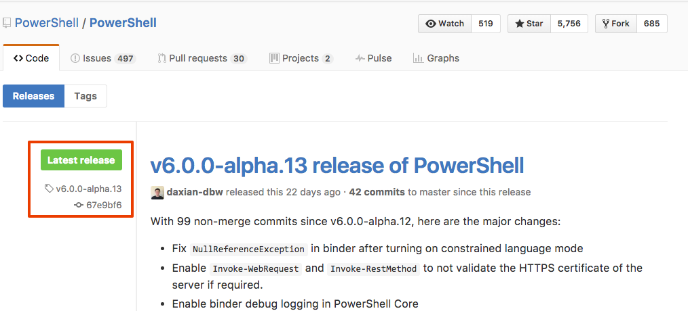
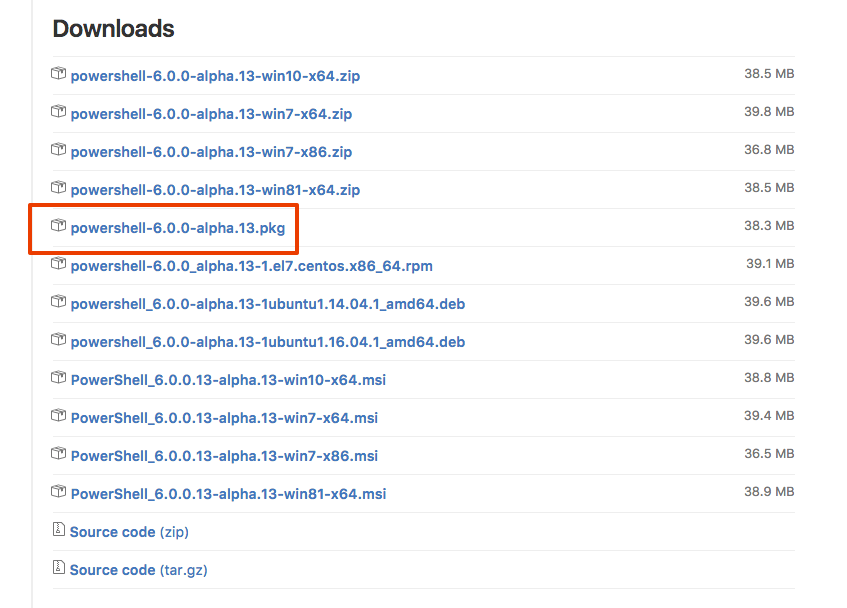
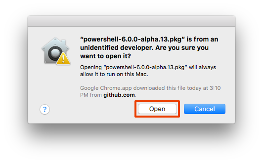
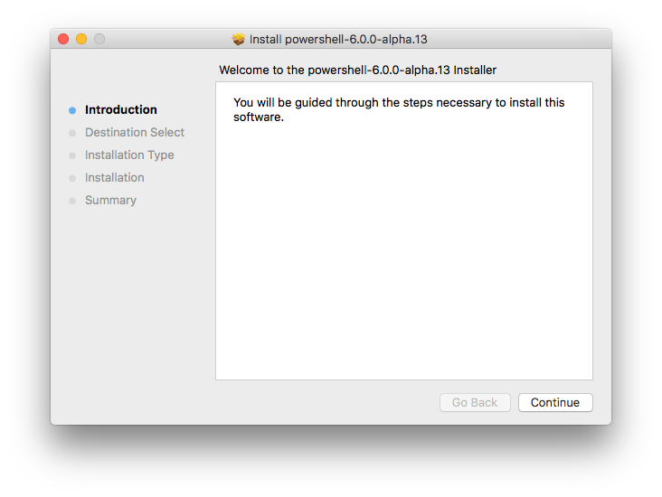
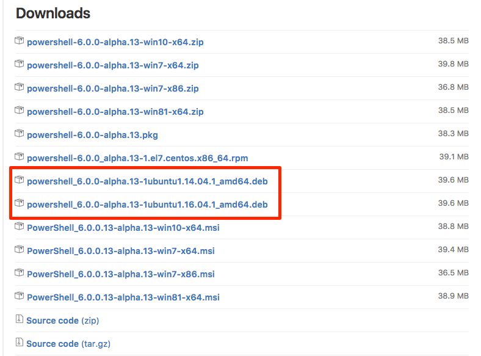
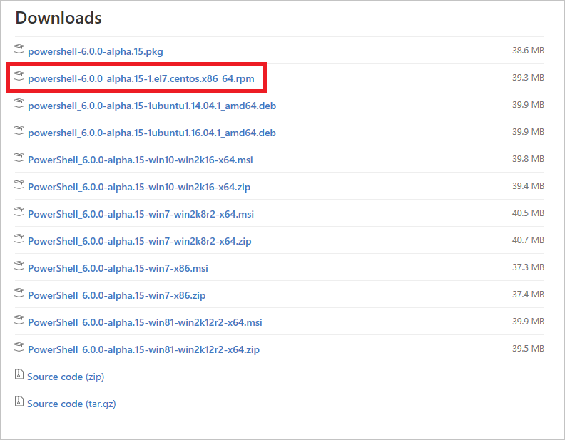

# PowerShell for Linux and macOS #

---

## Overview ##

PowerShell has been available for Windows since 2006 and is a vital tool in the hands of software developers and sysadmins alike. In August 2016, Microsoft introduced PowerShell for Linux, macOS, and Windows as an [open-source project on GitHub](https://github.com/PowerShell/PowerShell). Microsoft works closely with the community to refine and expand the product and to make sure that it works equally well on any operating system and with a variety of Linux distros. For more information about where to get it, the many learning resources that are available, and how to contribute, see the [official announcement](https://blogs.msdn.microsoft.com/powershell/2016/08/18/powershell-on-linux-and-open-source-2/) in the Windows PowerShell blog.

PowerShell is both a command/terminal environment and a scripting tool. One of the more remarkable aspects of its architecture is that PowerShell commands are object-based. You use commands to manipulate the properties and methods on objects to achieve the result you want. Once you learn about the numerous objects available, formulating commands is a straightforward process that is not unlike manipulating objects in code.

In this lab, you will install PowerShell on the macOS or Linux and perform a few exercises to familiarize yourself with PowerShell and learn about a few of the many things it can do. Along the way, you will experience the "Zen of PowerShell" and build a foundation for further learning.

### Objectives ###

In this hands-on lab, you will learn how to:

- Install and run PowerShell on Linux and macOS
- Working with and manipulating files
- Finding the right command (cmdlet) in PowerShell for accomplishing a task
- How to get help in PowerShell
- How to build complicated pipelines to accomplish a lot of work without coding

### Prerequisites ###

The following are required to complete this hands-on lab:

- An Internet connection
- Sufficient permissions to install software on your Linux desktop or Mac
- Ubuntu 14.04 or 16.04 or CentOS/Oracle/Red Hat 7 or higher  (Linux users)
- macOS 10.11 or higher (Mac users)

---

## Exercises ##

This hands-on lab includes the following exercises:

- [Exercise 1: Installing PowerShell on macOS](#Exercise1)
- [Exercise 2: Installing PowerShell on Ubuntu](#Exercise2)
- [Exercise 3: Installing PowerShell on CentOS/Oracle/Red Hat Linux](#Exercise3)
- [Exercise 4: Using the PowerShell Command Line](#Exercise4)
- [Exercise 5: Copying and Manipulating Files](#Exercise5)
- [Exercise 6: Working with the Contents of Files](#Exercise6)
 
Estimated time to complete this lab: **45** minutes.

## Exercise 1: Installing PowerShell on macOS ##

The first step in using PowerShell on a Mac is to download it and install it. Installation requires an Apple computer running macOS 10.11 (Yosemite) or higher. If you are using a Linux desktop operating system, please skip this exercise and go to [Exercise 2](#Exercise2) or [Exercise 3](#Exercise3). 

1. Open a browser and navigate to https://github.com/PowerShell/PowerShell/releases. Then click **Latest release**.

    

    _Finding the latest release_

1. Scroll down to the "Downloads" section below the latest release and click the **.pkg** file.

    

    _Downloading the macOS package_

1. Because of the [App Sandbox](https://developer.apple.com/library/content/documentation/Security/Conceptual/AppSandboxDesignGuide/AboutAppSandbox/AboutAppSandbox.html) protections in macOS, you **CANNOT** just double click on the installer to run it. You will see the following message, which prevents you from installing PowerShell. This limitation will go away once PowerShell reaches beta levels as Microsoft will digitally sign the installer at that point.

    

    _macOS Sandbox Warning_

1. To install the PowerShell package, open up Finder and navigate to your **Downloads** directory. **Right click" on the "powershell-6.0.0-alpha.??.pkg" file, select **Open With**, and in the pop out menu, select "Installer (default)" or "Installer.app (default)" (if you have show file extensions turned on).

    

    _Using Open With on the Downloaded File_

1. A similar macOS App Sandbox warning will appear, but this one will have the **Open** button allowing you to continue with the installation. Click the **Open** button to start the installation.

    

    _macOS Sandbox Warning After Open With_

1. The PowerShell installation is a standard macOS package Follow the prompts to complete the installation.

    

    _PowerShell Installation UI_

1. _**This is an optional step**_. If you want to use PowerShell's networking functionality, you will need to also install OpenSSL. Apple deprecated OpenSSL in favor of their own libraries. The easiest way to install is install [Homebrew](http://brew.sh/) and execute the following two commands in a Terminal window. Again, _**this is an optional step**_ and not required to complete this set of hands-on-labs.

    <pre>
    brew install openssl
    brew install curl --with-openssl
    </pre>

1. Once PowerShell is installed, open the **Terminal** application. Once it is open, type **powershell** and press Enter to start it. It should look like the following. Note that the color, username, and prompt will be different on your computer.

    

    _Running PowerShell_

Installing and running PowerShell is easy on macOS. Make sure to check back to the [PowerShell release page](https://github.com/PowerShell/PowerShell/releases) every couple of weeks because the team is progressing very fast. Please jump to [Exercise 4](#Exercise4) to continue the hand-on-labs.

## Exercise 2: Installing and Running PowerShell on Ubuntu ##

Microsoft loves Ubuntu as does the PowerShell team. They fully support PowerShell on Ubuntu 14.04 and 16.04 at the current time. This exercise will walk you through installing PowerShell on your Ubuntu desktop. 

1. In your Ubuntu computer, open a **Terminal** window and check your version by typing the following command:

    <pre>
    lsb_release -r
    </pre>

    If the reported version number is anything other than 14.04 or 16.04, please update your Ubuntu installation to one of those version.

    Here is an example of a correctly reported version

    <pre>
    john@ubuntu:~$ lsb_release -r
    Release:	14.04
    </pre>

1. Open a web browser go to the following URL: [https://github.com/PowerShell/PowerShell/releases](https://github.com/PowerShell/PowerShell/releases) to go to the PowerShell release page on GitHub. 

1. On the Released page, look for the **Latest release** tag.

    

    _Finding the latest release_

1. Scroll down to the **Downloads** below the latest release. Note that the file names listed will also have the name of the release in them. For Ubuntu, click on the **.DEB** file that corresponds to your version of Ubuntu to down load the correct file.

    

    _Downloading the Ubuntu package_

1. With the default Mozilla Firefox download location is **~/Downloads**. In your Terminal window change to that directory. If you have customized your download location, substitute that in for **Downloads**. In your Ubuntu Terminal window, execute the following commands replacing the filename with the filename for the version you downloaded.

    <pre>
    sudo dpkg -i powershell_6.0.0-alpha.13-1ubuntu1.14.04.1_amd64.deb 
    sudo apt-get install -f
    </pre>

    The dpkg command will report there was an error installing, but that will be fixed by the apt-get command.

    A correct installtion looks like the following:

    <pre>
    john@ubuntu:~$ sudo dpkg -i powershell_6.0.0-alpha.13-1ubuntu1.13.04.1_amd64.deb 
    [sudo] password for john: 
    Selecting previously unselected package powershell.
    (Reading database ... 164429 files and directories currently installed.)
    Preparing to unpack .../powershell_6.0.0-alpha.13-1ubuntu1.14.04.1_amd64.deb ...
    Unpacking powershell (6.0.0-alpha.14-1ubuntu1.13.04.1) ...
    dpkg: dependency problems prevent configuration of powershell:
    powershell depends on libunwind8; however:
    Package libunwind8 is not installed.
    dpkg: error processing package powershell (--install):
    dependency problems - leaving unconfigured
    Processing triggers for man-db (2.6.7.1-1ubuntu1) ...
    Errors were encountered while processing:
    powershell
    john@ubuntu:~$ sudo apt-get install -f
    Reading package lists... Done
    Building dependency tree       
    Reading state information... Done
    Correcting dependencies... Done
    The following extra packages will be installed:
    libunwind8
    0 upgraded, 1 newly installed, 0 to remove and 218 not upgraded.
    1 not fully installed or removed.
    Need to get 48.3 kB of archives.
    After this operation, 194 kB of additional disk space will be used.
    Do you want to continue? [Y/n] Y
    Get:1 http://us.archive.ubuntu.com/ubuntu/ trusty/main libunwind8 amd64 1.1-2.2ubuntu3 [48.3 kB]
    Fetched 48.3 kB in 3s (14.6 kB/s)       
    Selecting previously unselected package libunwind8.
    (Reading database ... 164957 files and directories currently installed.)
    Preparing to unpack .../libunwind8_1.1-2.2ubuntu3_amd64.deb ...
    Unpacking libunwind8 (1.1-2.2ubuntu3) ...
    Setting up libunwind8 (1.1-2.2ubuntu3) ...
    Setting up powershell (6.0.0-alpha.14-1ubuntu1.14.04.1) ...
    Processing triggers for libc-bin (2.19-0ubuntu6.7) ...
    </pre>

1. Once PowerShell is installed, in your Terminal window, type **powershell** and press Enter to start it. It should look like the following. Note that the color, username, and prompt will be different on your computer.

    

    _Running PowerShell_

Installing and running PowerShell is easy on Ubuntu. Make sure to check back to the [PowerShell release page](https://github.com/PowerShell/PowerShell/releases) every couple of weeks because the team is progressing very fast. Please jump to [Exercise 4](#Exercise4) to continue the hand-on-labs.

## Exercise 3: Installing PowerShell on CentOS/Oracle/Red Hat Linux ##

Microsoft loves Linux as does the PowerShell team. They fully support PowerShell on CentOS 7, Oracle Linux 7, and Red Hat Enterprise 7. This exercise will walk you through installing PowerShell on one of those operating systems.

1. In your CentOS/Oracle Linux/Red Hat computer, open a **Terminal** window and check your version by typing the following command:

    <pre>
    cat /etc/*release*
    </pre>

    Here is the example output from CentOS 7. If you do not see at least version 7.0, please update your operating system.

    <pre>
    [john@centos-linux ~]$ cat /etc/*release*
    CentOS Linux release 7.3.1611 (Core) 
    Derived from Red Hat Enterprise Linux 7.3 (Source)
    NAME="CentOS Linux"
    VERSION="7 (Core)"
    ID="centos"
    ID_LIKE="rhel fedora"
    VERSION_ID="7"
    PRETTY_NAME="CentOS Linux 7 (Core)"
    ANSI_COLOR="0;31"
    CPE_NAME="cpe:/o:centos:centos:7"
    HOME_URL="https://www.centos.org/"
    BUG_REPORT_URL="https://bugs.centos.org/"
    CENTOS_MANTISBT_PROJECT="CentOS-7"
    CENTOS_MANTISBT_PROJECT_VERSION="7"
    REDHAT_SUPPORT_PRODUCT="centos"
    REDHAT_SUPPORT_PRODUCT_VERSION="7"
    CentOS Linux release 7.3.1611 (Core) 
    CentOS Linux release 7.3.1611 (Core) 
    </pre>

1. Open a web browser go to the following URL: [https://github.com/PowerShell/PowerShell/releases](https://github.com/PowerShell/PowerShell/releases) to go to the PowerShell release page on GitHub.

1. On the Released page, look for the **Latest release** tag.

    

    _Finding the latest release_

1. Scroll down to the **Downloads** below the latest release. Note that the file names listed will also have the name of the release in them. For CentOS/Oracle Linus/Red Hat, click on the **owershell-6.0.0_alpha.??-1.el7.centos.x86_64.rpm** file to down load the correct file, where "??" is the build number.

    

    _Downloading the CentOS/Oracle Linux/Red Hat package_

1. With the default Mozilla Firefox download location is **~/Downloads**. In your Terminal window change to that directory. If you have customized your download location, substitute that in for **Downloads**. In your Ubuntu Terminal window, execute the following commands replacing the filename with the filename for the version you downloaded.

    <pre>
    sudo yum install ./powershell-6.0.0_alpha.14-1.el7.centos.x86_64.rpm 
    </pre>

    A correct installation will look like the following:

    <pre>
    [john@centos-linux Downloads]$ sudo yum install ./powershell-6.0.0_alpha.13-1.el7.centos.x86_64.rpm 
    We trust you have received the usual lecture from the local System
    Administrator. It usually boils down to these three things:
        #1) Respect the privacy of others.
        #2) Think before you type.
        #3) With great power comes great responsibility.
    [sudo] password for john: 
    Loaded plugins: fastestmirror, langpacks
    Examining ./powershell-6.0.0_alpha.13-1.el7.centos.x86_64.rpm: powershell-6.0.0_alpha.14-1.el7.centos.x86_64
    Marking ./powershell-6.0.0_alpha.13-1.el7.centos.x86_64.rpm to be installed
    Resolving Dependencies
    --> Running transaction check
    ---> Package powershell.x86_64 0:6.0.0_alpha.13-1.el7.centos will be installed
    --> Processing Dependency: uuid for package: powershell-6.0.0_alpha.14-1.el7.centos.x86_64
    Loading mirror speeds from cached hostfile
    * base: ftp.usf.edu
    * extras: mirror.es.its.nyu.edu
    * updates: mirrors.gigenet.com
    --> Running transaction check
    ---> Package uuid.x86_64 0:1.6.2-26.el7 will be installed
    --> Finished Dependency Resolution
    Dependencies Resolved
    ================================================================================
    Package
        Arch   Version       Repository                                      Size
    ================================================================================
    Installing:
    powershell
        x86_64 6.0.0_alpha.13-1.el7.centos
                            /powershell-6.0.0_alpha.13-1.el7.centos.x86_64 124 M
    Installing for dependencies:
    uuid x86_64 1.6.2-26.el7  base                                            55 k
    Transaction Summary
    ================================================================================
    Install  1 Package (+1 Dependent package)
    Total size: 124 M
    Total download size: 55 k
    Installed size: 124 M
    Is this ok [y/d/N]: Y
    Downloading packages:
    uuid-1.6.2-26.el7.x86_64.rpm                               |  55 kB   00:00     
    Running transaction check
    Running transaction test
    Transaction test succeeded
    Running transaction
    Installing : uuid-1.6.2-26.el7.x86_64                                     1/2 
    Installing : powershell-6.0.0_alpha.13-1.el7.centos.x86_64                2/2 
    Verifying  : uuid-1.6.2-26.el7.x86_64                                     1/2 
    Verifying  : powershell-6.0.0_alpha.13-1.el7.centos.x86_64                2/2 
    Installed:
    powershell.x86_64 0:6.0.0_alpha.14-1.el7.centos                               
    Dependency Installed:
    uuid.x86_64 0:1.6.2-26.el7                                                    
    Complete!
    </pre>

1. Once PowerShell is installed, in your Terminal window, type **powershell** and press Enter to start it. It should look like the following. Note that the color, username, and prompt will be different on your computer.

    

    _Running PowerShell_

Installing and running PowerShell is easy on CentOS/Oracle Linux/Red Hat. Make sure to check back to the [PowerShell release page](https://github.com/PowerShell/PowerShell/releases) every couple of weeks because the team is progressing very fast. 

## Exercise 4: Using the PowerShell Command Line ##

PowerShell offers an outstanding command line editing experience. In this exercise, you will learn about its features because they can help you immensely when learning and using PowerShell.

1. If you have PowerShell running in a Terminal window from the previous exercise, bring it to the foreground. If you do not have a terminal window open, start one and execute _powershell_ inside the window.

1. The PowerShell command line supports auto completion of almost everything. This runs from PowerShell cmdlets themselves, to the programs already on your computer. On macOS and Linux, you have a lot of programs you probably use every day from the command line. A good example is the vi editor. Because PowerShell is a command line environment, you can simply type _vi_ and launch it. 

    What if you are unsure of the full program name? In that case PowerShell's autocompletion support comes into play. In your PowerShell environment, type the following. Note that **&lt;TAB&gt;** means press the tab key.

    <pre>
    vi&lt;TAB&gt;&lt;TAB&gt;
    </pre>

    You will see something similar to the following. 

    <pre>
    PS /Users/john/Documents> vi             
    vi        vifs      vimdiff   vipw      visudo
    view      vim       vimtutor  vis                                  PS /Users/john/Documents> vi    
    </pre>

    The command prompt still has _vi_ so you can keep typing. Clear out the command line by pressing _CTRL+C_

1. While you are probably thinking that what you just did in the previous step is exactly what Bash does, you are correct. Now it is time to try something a little more interesting. Open up a new Terminal window running the standard shell for your computer (Bash, Zsh, or whatever). In that Terminal window type the following:

    <pre>
    ls -&lt;TAB&gt;&lt;TAB&gt;
    </pre>

    Nothing happens on most computers, unless you have installed some special helpers into your shell. Switch back to your PowerShell window and we will execute the PowerShell equivalent to the _ls_ command, _Get-ChildItem_.

    <pre>
    Get-Chi&lt;TAB&gt;&lt;TAB&gt;
    </pre>

    That auto expanded to the full _Get-ChildItem_. Add a space and a dash to the command line and press tab once more

    <pre>
    Get-ChildItem -&lt;TAB&gt;&lt;TAB&gt;
    </pre>

    Do you see the magic? PowerShell knows all the possible parameters to cmdlets as shown below:

    <pre>
    Path                 Attributes           WarningAction
    LiteralPath          Directory            InformationAction
    Filter               File                 ErrorVariable
    Include              Hidden               WarningVariable
    Exclude              ReadOnly             InformationVariable
    Recurse              System               OutVariable
    Depth                Verbose              OutBuffer
    Force                Debug                PipelineVariable
    Name                 ErrorAction                           
    </pre>

    Of course, if you typed _-d&lt;TAB&gt;_ you would only see those parameters that started with the 'D' character.

    What is even more important is that any cmdlets you add to PowerShell, either by writing your own, or adding modules written by others, the full parameter discoverability is automatically supported. No adding of special tab completion code. It is just part of PowerShell.

1. The most important feature of the PowerShell command line is that the prompt can show you when your command line has an error. Type the following into your PowerShell window and do not press ENTER:

    <pre>
    Get-ChildItem |
    </pre>

    That is an invalid command line because you are missing the cmdlet for the rest of the pipeline. The trick is to look carefully at your prompt as show below.

    

    _Command Line Error Warning_

    Keep a good eye on the &gt; part of the prompt. If it is red, you have an error. This quick glance error indicator is evaluated on each keystroke so you can see when you fix the error. Do note that this just looks if there is a parsing error on the command line you are entering, not if the command is wrong or non-existant.

What you have seen in this exercise is a few of the helpful command line editing features supported by PowerShell. As you get more serious about using PowerShell, you may be interested in extending the command line processing. See the discussion of [PSReadLine](https://blogs.technet.microsoft.com/heyscriptingguy/tag/psreadline/), the module that handles the command line editing.

## Exercise 5: Copying and Manipulating Files] ##

Now that you have seen some of the wonderful features of command line editing in PowerShell, it is time to turn to learning about the cmdlets and pipelines you can use to manipulate files. PowerShell can obviously do much more than just work with files, but this exercise will have you working with various parts of PowerShell and give you solid techniques for doing more on your own.

1. If you do not have a **Terminal** window open, start one and start PowerShell by typing **powershell**. In PowerShell navigate to the directory where you expanded the ZIP file of these hands-on-labs. If you expanded everything to ~/Documents/PowerShell, you would type the following in PowerShell to change directories.

    <pre>
    cd ~/Documents/PowerShell
    </pre>

1. Once in the correct location, you will want to take a look at the files included with this lab. As you saw in the slides, you only need to memorize three cmdlets: _Get-Command_, _Get-Help_, and _Get-Member_. None of those have anything to do with the file system so the first step is to find the command. PowerShell follows a _Verb-Noun_ approach to naming, which you can read about in the [Approved Verbs for Windows PowerShell Commands](https://msdn.microsoft.com/en-us/library/ms714428(v=vs.85).aspx) documentation. Accordingly, you will see that **Get** is the verb to "Specifies an action that retrieves a resource". 

    In your PowerShell window, execute the following command so you can see the parameters to _Get-Command_:

    <pre>
    Get-Command -&lt;TAB&gt;&lt;TAB&gt;
    </pre>

    You will see the list of possible parameters: 

    <pre>
    Name                  Syntax                Verbose
    InformationVariable   Verb                  ShowCommandInfo
    Debug                 OutVariable           Noun 
    ArgumentList          ErrorAction           OutBuffer 
    Module                All                   WarningAction
    PipelineVariable      FullyQualifiedModule  ListImported          
    InformationAction     CommandType           ParameterName         
    ErrorVariable         TotalCount            ParameterType         
    WarningVariable  
    </pre>

    It might take a little looking, but do you see the _Verb_ parameter? That is the one you can use to find all the cmdlets that start with a specific verb. Execute the following to find all the cmdlets that start with _Get_.

    <pre>
    Get-Command -Verb Get 
    </pre>

    You will see that there are a lot of cmdlets that start with _Get_! As you look through the list you might notice there is a _Get-Verb_ cmdlet, which will list the approved verbs for PowerShell. But, that is not the cmdlet that will get you the list of files.

    A little more looking shows two possible commands that look like they might be appropriate, _Get-Item_ and _Get-ChildItem_.

1. What is the difference between _Get-Item_ and _Get-ChildItem_? Fortunately, it is easy to find out with the second command you have memorized, _Get-Help_. Execute the following two commands and read the output carefully:

    <pre>
     Get-Help Get-Item
     Get-Help Get-ChildItem
    </pre>

    As you can read, they both get files and folders. As you read through the help you will see that the main difference is that _Get-Item_ is great for finding a single item, where _Get-ChildItem_ returns all the files and folders. Since you want to return everything, _Get-ChildItem_ is the cmdlet you want to use.

    While looking at the help in a Terminal window is great for quick looks at what a cmdlet does, when you want to really learn about a cmdlet, it is better to look at that help on the web so you can follow links and dig in more. To do that simply add the _-online_ option to open the help in your default browser. Practice that now by doing the following command:

    <pre>
    Get-Help Get-ChildItem -online
    </pre>

    Do note that if you are using Mozilla Firefox on CentOS or Ubuntu, you may see some extranious output in the Terminal window from FireFox pertaining to it's startup if it is not already running.

1. With the right cmdlet in hand, execute it in the PowerShell window where you navigated to the folder where you extracted this set of hands-on-labs and look at the list of files by executing the following command:

    <pre>
    Get-ChildItem
    </pre>

    If you are in the correct location, you should see the following (the dates and lengths will probably be different):

    <pre>
    Directory: /Users/john/Documents/PowerShell

    Mode                LastWriteTime         Length Name
    ----                -------------         ------ ----
    d-----         12/19/16   5:25 PM                Images
    d-----         12/20/16   6:00 PM                resources
    ------         12/21/16   2:43 PM          26412 PowerShell for Linux and macOS.md
    ------         12/19/16   3:35 PM        1038661 PowerShellForLinux-macOS.pptx     
    </pre>

    The files you are going to use in the lab are in the **resources** directory. To look in that folder, execute the following command:

    <pre>
    Get-ChildItem ./resources/ -Recurse
    </pre>

    You will see there are a bunch of text files in that directory.

1. Because you may want to do these hands-on-labs again, you will want to copy those files to another location so you retain the original set of files. First, you have to find which cmdlet does the copy. Execute the following command:

    <pre>
    Get-Command -Verb Copy
    </pre>

    Based on the output, which cmdlet do you think is the one to use? If you picked _Copy-Item_, you are correct. This is such an important cmdlet, you should read the full help to see all of parameters and examples. Execute the following to read the help:

    <pre>
    Get-Help Copy-Item -Online
    </pre>

1. If you read the online help carefully, you saw that Example 2 showed how to copy the contents of a directory, which is the task you will do now. Before you jump into doing the copy, or any PowerShell cmdlet that might change state, you will want to see what that command will do. Back in the slides, you learned about the only parameter you need to memorize: _-WhatIf_. This parameter is the one that can save your job! 

    To check what a cmdlet will do, type everything you normally would and add the magic _-WhatIf_ parameter to the end.

    Execute the following command to see what _Copy-Item_ will do:

    <pre>
    Copy-Item ./resources/ ./workspace -Recurse -WhatIf 
    </pre>

    Now you can see what a command will do before you execute it. In the cmdlet you just executed, the _Copy-Item_ cmdlet automatically figured out what the source and destination folders are just by parameter order. A good PowerShell habit you will want to get into, especially if you start writing scripts, is to be explicit about all parameters so there are no mistakes.

    To do the actual copy of the files to a new directory, execute the following command and notice the explicit parameter usage:

    <pre>
    Copy-Item -Path ./resources/ -Destination ./workspace -Recurse 
    </pre>

    If you recall, there is no directory called **workspace** that currently exists in the folder. The good news for us is that the _Copy-Item_ cmdlet will automatically create the destination directories if needed. This even works if you specify a multi-layer path. 

    Now that you have the files copied, change to temporary directory with the following command:

    <pre>
    cd workspace
    </pre>

1. With some of the basics out of the way, it is time to work with the PowerShell pipeline. The first task is to get the complete filenames of all files. As with any time you use the pipeline, you need to know the types being returned by a cmdlet. In the workspace directory, take a look at the type returned by _Get-ChildItem_ by executing the following command:

    <pre>
    Get-ChildItem | Get-Member
    </pre>

    You will see that for this directory, the type being returned is _System.IO.FileInfo_ and you see all the properties and methods supported by that object, which are returned in the order they are found on the object. That sometimes gets hard to read because they are not in alphabetical order. Fortunately, getting output in any form you want is easy to do with PowerShell!

    What you want to do is sort the _Name_ column in alphabetical order. As you saw in the slide presentation, there is a _Sort-Object_ cmdlet. With that cmdlet, you tell it which property to sort on. In this case, that is the _Name_ column. Execute the following command:

    <pre>
    Get-ChildItem | Get-Member | Sort-Object Name
    </pre>

    Just because you are working with a key PowerShell cmdlet, _Get-Member_, does not mean you can not apply PowerShell to anything and everything. As you read through the alphabetized _Name_ output, do you see any method or property that would give you the full name?

    If you guessed the _FullName_ property, you are correct. What you want to do is for each object coming down the pipeline from _Get-ChildItem_, you want to pass on just the _FullName_ property. Writing out, or thinking out, what you want to do in PowerShell, makes it easy to figure out which pipeline cmdlet you want to use. In this case, it is _ForEach-Object_. Execute the following command in your PowerShell window:

    <pre>
    Get-ChildItem | ForEach-Object FullName 
    </pre>

    The pipeline you just entered is using the newer format for the ForEach-Object where you just specify the property name you want to pass on. The old format, which much of the examples you will find on the Internet and will always be supported looks like the following. Enter that into your PowerShell window to verify the output is the same.
    
    <pre>
    Get-ChildItem | ForEach-Object {$_.FullName}
    </pre>

1. Your next task is to sort the list of files by their sizes, but in reverse order. You saw in the previous step using _Sort-Object_ is just the thing you need for sorting on a property. As you looked through the properties and methods on the _System.IO.FileInfo_, there is a _Length_ property. What is the output when you execute the following?

    <pre>
    Get-ChildItem | Sort-Object Length 
    </pre>

    As you can see, the default sorting is in ascending order, but you were tasked with getting the results in descending order. It might be a good idea to look at the help for _Sort-Object_.

    <pre>
    Get-Help Sort-Object
    </pre>

    Did you find the appropriate parameter? Execute the following pipeline to see the results:

    <pre>
    Get-ChildItem | Sort-Object Length -Descending
    </pre>

    That is all you have to do to sort in PowerShell.

1. The final task of this exercise is to only show the files that are between 800 and 1024 bytes in length (exclusive). Think about how you can phase this task to give you a hint as to which pipeline cmdlets you would use.

    "I want to output the files in the workspace directory, where they fall between 800 and 1024 bytes in size."

    If you are thinking that _Where-Object_ is the pipeline cmdlet to use, you are correct!

    Because you are going to have to do some conditional expressions with greater than and less than, you should review the "Comparison Operators" slide in the slide deck. PowerShell uses a different format than any scripting or programming language than you have probably used.

    Before you look below at the answer, try to come up with the solution on your own.

    <pre>
    Get-ChildItem | Where-Object {($_.Length -gt 800) -and ($_.Length-lt 1024)} 
    </pre>

    Execute the above statement and verify that it produced the correct information.

This exercise gave you a good introduction to the pipeline to accomplish some basic tasks. As you can see, some of the most important commands are _Get-Command_, to find cmdlets and programs, as well as _Get-Help_, to learn about the commands.

## Exercise 6: Working with the Contents of Files ##

It is time to take your PowerShell knowledge up a notch. In this exercise you will work with the contents of the files and learn how to find particular data in those files. You will also see how to look at interesting statistics based on what you find. As part of this you will be building up some complicated "one liners." That is PowerShell-speak for doing a ton of work at the command line and not having to write a program to do the same work.

1. You already know how to look at files, now you need to look into files. Because you are working with text, you have to find the cmdlets that can work with strings. Execute the following command and look to see if there is a cmdlet that might help you out.

    <pre>
    Get-Command *string* 
    </pre>

    The _Get-Command_ cmdlet happily accepts wildcards so that command will return any programs and cmdlets that have "string" in the name. As you look through the output, you will see cmdlets related to converting to and from specific strings. As you look down the list, you will run into _Select-String_, that looks like a promising cmdlet.

    Take a look at the help for _Select-String_ with the following command:

    <pre>
    Get-Help Select-String -Online 
    </pre>

    Read through the help carefully to see what the _Select-String_ cmdlet can do.

1. Based on your reading of the help, it looks like _Select-String_ will do exactly what we need. Your task in this step is to find all the lines that contain "we" in the files. The _Select-String_ help shows that there are two parameters related to pattern matching, _-SimpleMatch_ for basic string matching, and _-Pattern_ for full regular expression support. As you are starting with the task of finding all the "we" words in the files, it is best to start with _-SimpleMatch_.

    Execute the following command in your PowerShell window:

    <pre>
    Get-ChildItem | Select-String -SimpleMatch "we" 
    </pre>

    That yielded a good number of matches. The output is in the form of **&lt;filename&gt;:&lt;line number&gt;:&lt;line&gt;**. Look through the output and see how many "we" strings you matched. 

1. As you noticed, you matched "we", but you also matched "were", "wealthy", and "weather" among many others. Considering you only want the lines with "we" in them, you are going to have to think more about how you are going to pull the correct lines out. Because you are matching any words starting with "we", an easy solution might be to look for "we " (adding a space on the end). Execute the following command in your PowerShell window.

    <pre>
    Get-ChildItem | Select-String -SimpleMatch "we "
    </pre>

    Based on reading the output, you are now seeing just the files and lines that contain "we". This seems like a reasonable solution, but is it? What might you be missing here? Think about that for a moment. 

1. Did you figure out what set of "we" words you might be missing? You are looking for "we " that has a trailing space. What happens if a line ends with "we" followed by a line break? Would you miss that instance? If that is what you were thinking, good job! What you really need to be searching for is a "we" that are preceeded by either the start of the line or whitespace and end with either a line end or whitespace. That screams turning to regular expressions. What is the old joke about regular expressions? "You have a problem and you solve it with a regular expression. Now you have two problems!" 

    Regular expressions have a reputation as something magical, and it is partially earned. There is not enough time to give you a tutorial on regular expression in this hands-on-labs. PowerShell uses the .NET regular expression library under the hood. Here is the [Regular Expression Quick Reference](https://msdn.microsoft.com/en-us/library/az24scfc(v=vs.110).aspx), which is very helpful when working with PowerShell regular expressions.

    For this step, the regular expression you want to use is **(^|\s)we($|\s)**. You can read this as (beginline or whitespace)we(endline or whitespace). Because you are switching over to regular expressions, you need to change the _Select-String_ parameter to _-Pattern_.

    Execute the following command in your PowerShell window:

    <pre>
    Get-ChildItem | Select-String -Pattern "(^|\s)we($|\s)"
    </pre>

    Look carefully at the output of the two commands you just executed. Do you see any differences If you manually count the lines, you will see that with regular expression, you matched one more line. 

1. Your original task here was to get the number of "we" words. Sure you can manually count the lines, but it seems that the count should be done by PowerShell. What you need are some cmdlets that can do the counting for you. Because everything in PowerShell follows the "verb-noun" format, you need to find the verb PowerShell uses. Instead of using _Get-Command_, this time you will use _Get-Verb_ to find the appropriate verb for counting, measuring, or summing.

    In your PowerShell window, execute the following command:

    <pre>
    Get-Verb
    </pre>

    That cmdlet shows you the list of approved verbs and which group they belong. As you scroll down the list, pay attention to the Diagnostic group.

    <pre>
    Verb        Group
    ----        -----
    . . .
    Debug       Diagnostic    
    Measure     Diagnostic    
    Ping        Diagnostic    
    Repair      Diagnostic    
    Resolve     Diagnostic    
    Test        Diagnostic    
    Trace       Diagnostic
    . . .
    </pre>

    The verb **Measure** looks promising. Now go look to see what cmdlets start with **Measure** by executing the following in your PowerShell window:

    <pre>
    Get-Command -Verb measure
    </pre>
    
    You see there are two cmdlets, _Measure-Command_ and _Measure-Object_. Execute the following commands to read the help and decide which one is better for your task in this exercise.

    <pre>
     Get-Help Measure-Command -Online
     Get-Help Measure-Object -Online
    </pre>

    If you think _Measure-Object_ is the right cmdlet, you are a winner.

1. For the first step, simply pump the outout of _Select-String_ so you can see the result of _Measure-Object_ by executing the following into your PowerShell window:

    <pre>
    Get-ChildItem | Select-String -Pattern "(^|\s)we($|\s)" | Measure-Object
    </pre>

    The text shows you the default output from _Measure-Object_:

    <pre>
    Count    : 7
    Average  : 
    Sum      : 
    Maximum  : 
    Minimum  : 
    Property : 
    </pre>

    Because you don not care about the sum or averages, execute the following command to return just the important information:

    <pre>
    Get-ChildItem | Select-String -Pattern "(^|\s)we($|\s)" | Measure-Object | Select-Object Count
    </pre>

    Now your output tells you exactly what you needed to know.

    _Measure-Object_ is an extremely useful cmdlet. For example, if your task was to find the total size of a set of files, with their average length and also showing the minimum and maximum lengths, all you have to do is the following:

    <pre>
    Get-ChildItem | Measure-Object -Property Length -Average -Sum -Maximum -Minimum
    </pre>

    Execute the above command and enjoy your new found power.

1. Before ending, you should see a more complicated example that shows you some of the power in PowerShell. If your task was to replace "we" in all the files with "ya'll" (a Southern American expression), you might think you need to write a whole program. With PowerShell, you can do it all at the command line.

    A variable in PowerShell starts with a dollar sign followed by the name. Some are built into PowerShell already, such as _$PSVersionTable_. Execute the following command to see the value of that variable:

    <pre>
    $PSVersionTable 
    </pre>

    This is a good variable to know because it shows you the exact version of PowerShell you are running.

    Back to the task. Here is the command you will execute in your PowerShell window. It might be easiest to copy and paste it in.
    <pre>
    Get-ChildItem  |
    Foreach-Object {
        $content = ($_ | Get-Content) 
        $content = $content -replace "(^|\s)we($|\s)"," ya'll "
        $content | Set-Content $_.FullName
    }
    </pre>

    What this one-liner does is get the files in the directory and pipeline them to the _Foreach-Object_. Inside the curly braces of the _Foreach-Object_ is a **script block**, where you can do pretty much anything you want. In the first line, it takes the current file and reads in the contents storing it into variable _$content_. The second line does the search and replace on all contents in the _$content_ variable and assigns the result back to _$content_. The third line is where the contents of the $content variable is pipped into the _Set-Content_ cmdlet, which writes out the content to the current file's full name, thus overwriting the original content.

    That is an amazing amount of work in a few lines at the command line! You might be wondering why the replacement us " ya'll " (notice the surrounding spaces). That is because the regular expression is matching the whitespace on both sides of "we" so if you do not use spaces around "ya'll" you will lose them.

    To verify the replacement worked, execute the following command:

    <pre>
     Get-ChildItem | Select-String "ya'll"
    </pre>

1. If you want to delete the **workspace** directory so you can start this hands-on labs again, execute the following two commands:

    <pre>
    cd ..
    Remove-Item ./workspace/ -Recurse -Force
    </pre>

This exercise covered a lot of ground. You learned how to pull text from files based on matches, how to measure the number of items returned in the pipeline. Finally, you saw a complicated one-liner that replaces text in files. As with anything PowerShell, the more time you spend reading the help, the more you will understand.

## Summary ##

In this hands-on lab you learned how to:

- Install and run PowerShell on Linux and macOS
- Working with and manipulating files
- Finding the right command (cmdlet) in PowerShell for accomplishing a task
- How to get help in PowerShell
- How to build complicated pipelines to accomplish a lot of work without coding

PowerShell is a wonderful addition to the open source world. Having a command line environment that makes for easy discoverability and avoids "pray-based parsing" is a huge boon to macOS and Linux. This hands-on lab tried to teach you the Zen of PowerShell so you have some confidence when staring at that blinking cursor.

To continue your PowerShell journey, take a good read of the [PowerShell documentation](https://msdn.microsoft.com/en-us/powershell/scripting/powershell-scripting). For macOS and Linux developers, Microsoft makes the free development environment, [Visual Studio Code](https://code.visualstudio.com/) and the free [PowerShell extension](https://marketplace.visualstudio.com/items?itemName=ms-vscode.PowerShell) to make it easy to write and debug one-liners and full scripts. Good luck on your journey! 

----

Copyright 2016 Microsoft Corporation. All rights reserved. Except where otherwise noted, these materials are licensed under the terms of the MIT License. You may use them according to the license as is most appropriate for your project. The terms of this license can be found at https://opensource.org/licenses/MIT.