<a name="HOLTitle"></a>
# Using Python with Visual Studio Code #

---

<a name="Overview"></a>
## Overview ##

Python is a widely used programming language that is familiar to legions of developers. It features a dynamic type system and automatic memory manangement and is complemented by a comprehensive standard library as well as countless open-source libraries and frameworks, including [Django](http://www.djangoproject.com/), [Pyramid](http://www.pylonsproject.org/), [Flask](http://flask.pocoo.org/) and [Bottle](http://bottlepy.org/). Python interpreters are freely available for numerous operating systems, enabling Python developers to write apps that run cross-platform. Python enjoys wide support in academia and in the scientific and data-science communities, and is the programming language that powers popular Web sites such as [YouTube](https://www.youtube.com/), [DropBox](https://www.dropbox.com/), [Survey Monkey](https://www.surveymonkey.com/), [Reddit](https://www.reddit.com/), and [Yahoo Maps](https://maps.yahoo.com/b/).

Python code can be written with any code editor, including Microsoft's free, open-source, and cross-platform code editor, [Visual Studio Code](https://code.visualstudio.com). Combined with any of several freely available Python extensions, Visual Studio Code offers a [rich environment for writing, testing, and debugging Python code](https://code.visualstudio.com/docs/languages/python). And it works equally well on Windows, macOS, and Linux.

In this lab, you will use Visual Studio Code to create a Python app that tk.


<a name="Objectives"></a>
### Objectives ###

In this hands-on lab, you will learn how to:

- TODO: Add objective here
- TODO: Add objective here
- TODO: Add objective here
- TODO: Add objective here
- TODO: Add objective here

<a name="Prerequisites"></a>
### Prerequisites ###

The following are required to complete this hands-on lab:

- [Python](https://www.python.org/downloads/)
- [Visual Studio Code](https://code.visualstudio.com/download)
- [Git](https://git-scm.com/download)

---

<a name="Exercises"></a>
## Exercises ##

This hands-on lab includes the following exercises:

- [Exercise 1: Set Up the Environment](#Exercise1)
- [Exercise 2: Download an App](#Exercise2)
- [Exercise 3: Run the app](#Exercise3)

Estimated time to complete this lab: **30** minutes.

<a name="Exercise1"></a>
## Exercise 1: Set Up the Environment

Setting up Visual Studio Code to do Python development is fairly straightforward. It involves installing Python, installing Visual Studio Code, and then installing the Python Extension for Visual Studio Code. In this exercise, you will configure your environment for doing Python development with Visual Studio Code.

1. Visit https://www.python.org/downloads/ and download the installer for Python 3 for your operating system. Then run the installer to install Python 3. If the installer offers an option for including Python in your PATH, be sure to select this option.
 
	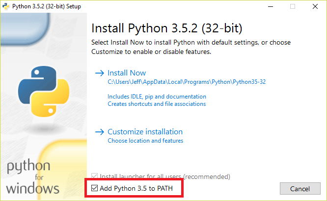

	_Installing Python_

1. Visit https://code.visualstudio.com/ and download and install Visual Studio Code.

1. Create a directory named "PythonLab" in the location on your choice to serve as the project directory.

1. Start Visual Studio Code and use the **File -> Open Folder** command (on a Mac, **File -> Open**) to open the folder you created in the previous step.

1. Click the **Extensions** button in the ribbon on the left side in Visual Studio Code. Type "python" (without quotation marks) into the search box, and then click the **Install** button for the Python extension by Don Jayamanne.

	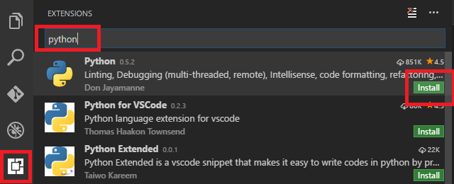

	_Installing the Python extension_

1. Once the extension is installed, click the **Reload** button that appears where the **Install** button appeared before.

1. Use the **File -> New File** command to crate a new file. Then paste the following code into the file:

	```
	print("Hello World")
	```

1. Use the **File -> Save** command to save the file, and name it "test.py." If Visual Studio Code displays an error message saying "Linter pylint is not installed," click **Install pylint** to install pylint.

	> [pylint](https://www.pylint.org/) is a popular linting tool for Python. Visual Studio Code uses it to check for common programming errors in your code.

	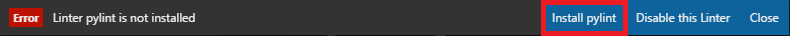

	_Installing pylint_

1. Click the **Debug** button in the ribbon on the left. Then click the gear icon and select **Python** from the drop-down list that appears. Visual Studio responds by adding a file named **launch.json** to the project containing configuration information for Python projects. 

	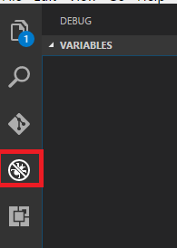

	_Adding launch.json_

1. Click **test.py** to make it the current file in the editor. Then click the **Start Debugging** button (the green arrow) to run the app.

	> If you are running Windows and see a dialog warning you that "Windows Firewall has blocked some features of this app," click the **Allow access** button.

	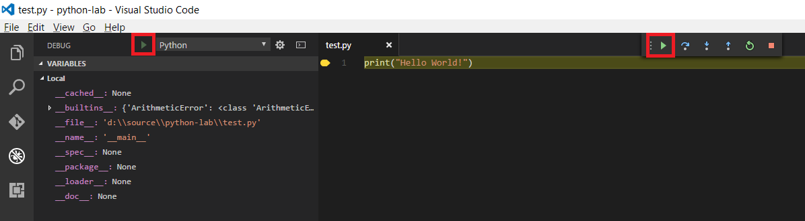

	_Running the app in the debugger_

1. The app will start and the debugger will break at the first (and only) line. Click the **Continue** button (the green arrow) to continue executing the app.

	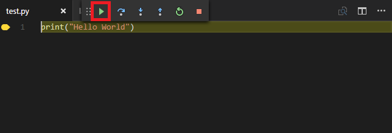

	_Continuing in the debugger_
	
1. Confirm that the output "Hello World" appears in the debug console. This verifies that Python is properly installed and that Visual Studio Code is configured to run Python apps.

	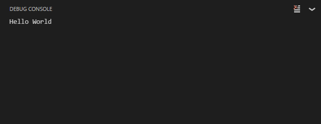

	_Output from test.py_

TODO: Add closing paragraph.

<a name="Exercise2"></a>
## Exercise 2: Download an app and prepare the data

Visual Studio Code has integrated support for Git and GitHub, which makes it easy to pull projects from GitHub and work on them locally. In this exercise, you will download a Python app from GitHub and run a Python script to create a data file that the app relies on.

The app consists of two parts: a client half and a server half. The web services run on a lightweight web framework called [Flask](http://flask.pocoo.org/). Flask is an easy to use web framework with an integrated HTTP server. Flask uses decorators on the code to route URL to methods in the appplication. It is the only external dependency the application has that needs to be installed. The other part of the application is web page that uses standard web technologies like HTML, CSS, and JavaScript, which is contained in the "static" folder. Flask will also serve up the HTML as well. The HTML frontend combined with a Python backend is a common application architecture called [Single Page Applications](https://en.wikipedia.org/wiki/Single-page_application).

The app itself downloaded from GitHub is part practical and part theoretical in that it implements [Dijkstra's algorithm](https://en.wikipedia.org/wiki/Dijkstra's_algorithm) in a practical way. Dijkstra's algorithm finds the short distance between two nodes on a weighted graph. The app uses a distance table for all the General Aviation airports in the "Lower 48" states. A distance table contains a set of rows and columns wherein all the points of interest have both a row and column. The intersection of the points of interest contains the distance between the points of interest. The example below shows distances between European cities. 


The user selects a origin airport, destination airport, and a range in miles. The app then constructs in memory from the distance table a weighted graph where each airport is a node and each straight-line flight path is an edge. It will only create edges between nodes where the nodes are less than the supplied range. After the graph is created, it applies the algorithm to calculate the shortest path between the two airports.


1. If Git isn't installed on your computer, go to https://git-scm.com/download and install it now.

	> One way to determine whether Git is installed is to open a terminal window or Command Prompt window and execute a **git** command.

1. In Visual Studio Code, use the **View -> Integrated Terminal** command to open an integrated terminal. Then execute a **cd** command in the TERMINAL window to navigate to the directory where you would like the project you download from GitHub to be stored.

1. Execute the following command in the TERMINAL window to clone a GitHub repository:

	```
	git clone https://github.com/theonemule/python-lab/
	```

	This will create a directory named "python-lab" in the current directory.

1. Use the **File -> Open Folder** command (on a Mac, **File -> Open**) to open the folder you created in the previous step.

1. Expand the "static" folder and click **index.html** to open **index.html** in the editor. Take a moment to examine its content. This is the Web front-end for the application. TODO: Add more description.

	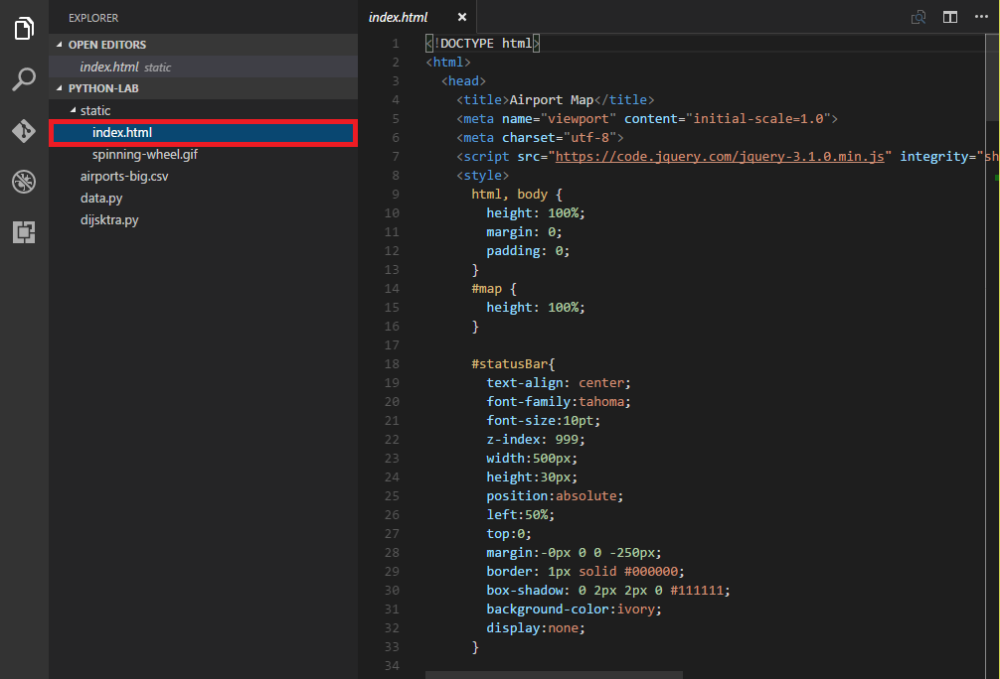

	_Examining index.html_

1. Click **dijkstra.py** to open **dijkstra.py** in the editor. Take a moment to examine its content. TODO: Add more description.

	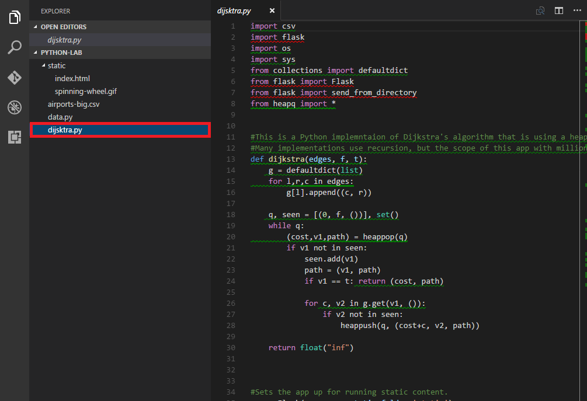

	_Examining dijkstra.py_

1. Click **data.py** to open **data.py** in the editor. Take a moment to examine its content. TODO: Add more description.

	

	_Examining data.py_


### Build the Distance Table
<a name="#table"></a>

Before the application can run, it needs the distance table to be computed. The included script, data.py, builds the distance table from another source files that contains a list of the General Aviation airports and their latitude and longi66=-p;tude. The script reads this table and calculates the distance between airports using a distance formula for two points on a sphere.

1. Open data.py from the "Explorer" pane.

1. Select the "Debug" icon, then set the language to "Python"

	

1. Run the app by click the "Start Debugging" icon or press F5. This will the app to start and break on the first line in the the app. Another tool bar for interactive debugging will appear on the screen. To continue execution, click the "Continue" icon there.

	
	
1. Watch the Debug console for output. This script may take a while to run, given that it is a CPU intense operation and it's calculating over 20 million possible distances!

	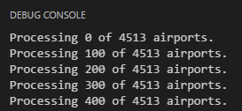

<a name="Exercise3"></a>
## Exercise 3: Run the app

As mentioned, the app has two parts. The app itself needs Flask installed so it can run.

1. Open dijkstra.py from the "Explorer" pane.

1. Select from the menu bar "View" -> "Integrated Terminal"

1. Type in the following commands to install Flask. 

	```
	pip3 install flask
	```

1. Select the "Debug" icon, then set the language to "Python"

	

1. Run the app by click the "Start Debugging" icon or press F5. This will the app to start and break on the first line in the the app. Another tool bar for interactive debugging will appear on the screen. To continue execution, click the "Continue" icon there.

	
	
1. Watch the Debug console for output. 

	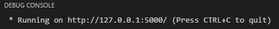

1. Open a browser and point the browser to:

	```
	http://127.0.0.1:5000/index.html
	```

	Notice the output in the Debug Console after the page loads

1. Stop the app. Currently, the app only searches for airports based on the airport code. Modify the app so that it will search on the name of the airport and the city for a match. Hint: you'll need to look in other fields from the airport list and modify the conditional in the search method.

1. Run the app with the new search. Try a few variations of the same origin and destination with different ranges to see how it affects the flight path. Using destionals in places like New England or Florida will affect the curvature of the flight path more drastically.

	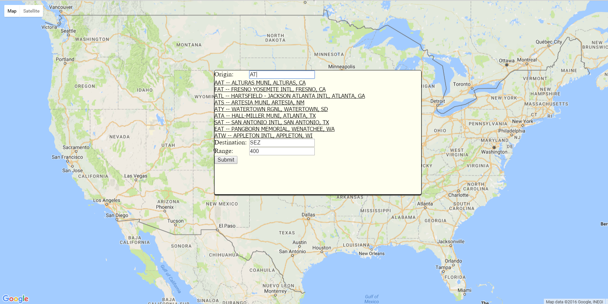

	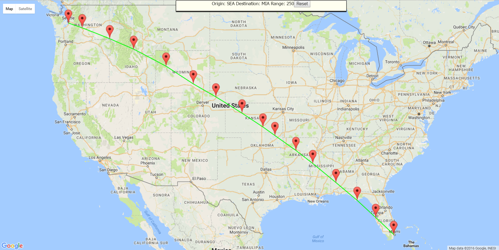

## Summary ##

TODO: Add summary here.

---

Copyright 2016 Microsoft Corporation. All rights reserved. Except where otherwise noted, these materials are licensed under the terms of the MIT License. You may use them according to the license as is most appropriate for your project. The terms of this license can be found at https://opensource.org/licenses/MIT.