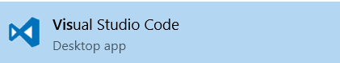
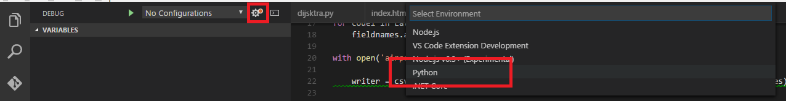
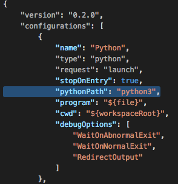

<a name="HOLTitle"></a>
# Using Python with Visual Studio Code #

---

<a name="Overview"></a>
## Overview ##

TODO: Add overview here.

<a name="Objectives"></a>
### Objectives ###

In this hands-on lab, you will learn how to:

- TODO: Add objective here
- TODO: Add objective here
- TODO: Add objective here
- TODO: Add objective here
- TODO: Add objective here

<a name="Prerequisites"></a>
### Prerequisites ###

The following are required to complete this hands-on lab:

- [Visual Studio Code](https://code.visualstudio.com/download)
- [Python Extension for Visual Studio Code](https://www.python.org/downloads)

---

<a name="Exercises"></a>
## Exercises ##

This hands-on lab includes the following exercises:

- [Exercise 1: Set Up and Test the Environment](#Exercise1)
- [Exercise 2: Download an App](#Exercise2)
- [Exercise 3: Run the app](#Exercise3)

Estimated time to complete this lab: **45** minutes.

<a name="Exercise1"></a>
## Exercise 1: Set Up and Test the Environment

Setting up Visual Studio Code to do Python Development is fairly straightfoward. It involves installing Python, Installing VS Code, then installing the Python extension for VS Code.

1. Visit https://www.python.org/downloads/ to download the Python installer for Python 3 for your platform. Python's webpage will attempt to detect your operating system and make a suggestion. Download and install it according to the instructions provided by Python

1. Visit https://code.visualstudio.com/ to get Visual Studio Code. Like Python's page, this will detect your operating system and suggest the appropriate installer for Visual Studio Code. Install VS Code according to the instructions for your environment.

1. Launch Visual Studio Code. For MacOS, look under Applications. For Windows, the installer will create an icon on the Start menu. For Linux, the icon will create a link that shuold appear in your distros application menus

	

1. Install the VS Code Python Extension.

	* Select the Extensions pane
	* Search for "python"
	* Click "Install"

	

	Once installed, click "Reload". This will appear where the Install button appeared before. After the reload, the environment should be setup to start developing with Python.
	

1. Go to the "File" menu, then copy and paste the following code into the new file

	```
	print("Hello World")
	```

	Save the new app as "test.py"

1. Select the "Debug" icon.

	

1. Select "Configure or Fix launch.json", then select the Python environment.

	

1. This will create a new file called launch.json. This file tells Visual Studio Code how to compile and run Python scripts. 

	* **Note** -- If you're running on MacOS, you may need to modify the file. In the first section under configurations with the Name "Python", set the pythonPath to "python3". This is neccessary on some macs because an earlier version of Python is likely installed on the Mac. Setting it to python3 explicitly will tell VS Code to run all the apps under python3

	 	

Save the file ("File" -> "Save") then close it.

1. Run the app by click the "Start Debugging" icon or press F5. This will the app to start and break on the first line in the the app. Another tool bar for interactive debugging will appear on the screen. To continue execution, click the "Continue" icon there.

	
	
1. Watch the Debug console for output.

	

1. When finished, select "File" -> "Close Folder" to completely close all editors.

<a name="Exercise2"></a>
## Exercise 2: Download an app

**This step is optional, as the source code is already included in the bundle. However, using git will show how the Git integration with VS Code works.**

VS Code has integrated support for Git and GitHub, so pulling applications from GitHub is fairly easy to do.

1. Check if git is installed. Go to "View" -> "Integrated Console" and type in "git". If it is installed, the command will show integrated documentation. Install git if it is not already installed, go to https://git-scm.com/download to download the appropiate installer for your platform.

1. Select "View" -> Integrated Terminal, then type in the following command.

	```
	git clone https://github.com/theonemule/python-lab/
	```

1. This will create a folder called "python-lab" in the directory that the terminal is pointed to. (ie. c:\users\usersname\python-lab)

1. Select "File" -> "Open Folder" from the File Menu (or just "Open" on a Mac), then find the new folder git created.

1. The "Explorer" pane will have the files associated with the app.

1. The Git Pane will show changes as they are made to the app for version control.

### Working with Python
<a name="python"></a>

The app has two parts -- one part uses python to serve up web services. The web services run on a lightweight web framework called [Flask](http://flask.pocoo.org/). Flask is an easy to use web framework with an integrated HTTP server. Flask uses decorators on the code to route URL to methods in the appplication. Iti is the only external dependency the application has that needs to be installed. The other part of the application is web page that uses standard web technologies like HTML, CSS, and JavaScript, which is contained in the "static" folder. Flask will also serve up the HTML as well. The HTML frontend combined with a Python backend is a common application architecture called [Single Page Applications](https://en.wikipedia.org/wiki/Single-page_application).

The app itself downloaded from GitHub is part practical and part theoretical in that it implements [Dijkstra's algorithm](https://en.wikipedia.org/wiki/Dijkstra's_algorithm) in a practical way. Dijkstra's algorithm finds the short distance between two nodes on a weighted graph. The app uses a distance table for all the General Aviation airports in the "Lower 48" states. A distance table contains a set of rows and columns wherein all the points of interest have both a row and column. The intersection of the points of interest contains the distance between the points of interest. The example below shows distances between European cities. 


The user selects a origin airport, destination airport, and a range in miles. The app then constructs in memory from the distance table a weighted graph where each airport is a node and each straight-line flight path is an edge. It will only create edges between nodes where the nodes are less than the supplied range. After the graph is created, it applies the algorithm to calculate the shortest path between the two airports.

### Build the Distance Table
<a name="#table"></a>

**This step is optional, as the created distance table is already included in the lab bundle.**

Before the application can run, it needs the distance table to be computed. The included script, data.py, builds the distance table from another source files that contains a list of the General Aviation airports and their latitude and longi66=-p;tude. The script reads this table and calculates the distance between airports using a distance formula for two points on a sphere.

1. Open data.py from the "Explorer" pane.

1. Select the "Debug" icon, then set the language to "Python"

	

1. Run the app by click the "Start Debugging" icon or press F5. This will the app to start and break on the first line in the the app. Another tool bar for interactive debugging will appear on the screen. To continue execution, click the "Continue" icon there.

	
	
1. Watch the Debug console for output. This script may take a while to run, given that it is a CPU intense operation and it's calculating over 20 million possible distances!

	

<a name="Exercise3"></a>
## Exercise 3: Run the app

As mentioned, the app has two parts. The app itself needs Flask installed so it can run.

1. Open dijkstra.py from the "Explorer" pane.

1. Select from the menu bar "View" -> "Integrated Terminal"

1. Type in the following commands to install Flask. 

	```
	pip3 install flask
	```

1. Select the "Debug" icon, then set the language to "Python"

	

1. Run the app by click the "Start Debugging" icon or press F5. This will the app to start and break on the first line in the the app. Another tool bar for interactive debugging will appear on the screen. To continue execution, click the "Continue" icon there.

	
	
1. Watch the Debug console for output. 

	

1. Open a browser and point the browser to:

	```
	http://127.0.0.1:5000/index.html
	```

	Notice the output in the Debug Console after the page loads

1. Stop the app. Currently, the app only searches for airports based on the airport code. Modify the app so that it will search on the name of the airport and the city for a match. Hint: you'll need to look in other fields from the airport list and modify the conditional in the search method.

1. Run the app with the new search. Try a few variations of the same origin and destination with different ranges to see how it affects the flight path. Using destionals in places like New England or Florida will affect the curvature of the flight path more drastically.

	

	

## Summary ##

TODO: Add summary here.

---

Copyright 2016 Microsoft Corporation. All rights reserved. Except where otherwise noted, these materials are licensed under the terms of the MIT License. You may use them according to the license as is most appropriate for your project. The terms of this license can be found at https://opensource.org/licenses/MIT.