<a name="HOLTitle"></a>
# Developing Apps for the Universal Windows Platform (UWP) #

---

<a name="Overview"></a>
## Overview ##

The [Universal Windows Platform](https://docs.microsoft.com/en-us/windows/uwp/get-started/whats-a-uwp) (UWP) is a set of APIs and associated runtimes that provide a rich app platform for Windows 10. With UWP, you can use one set of APIs to build apps that run on a variety of Windows devices, including PCs, tablets, phones, Xbox, HoloLens, and Surface Hub.

App structure, page layout, and navigation are the foundation of the UWP experience. Through *adaptive layout*, the Universal Windows Platform makes it extremely easy to create a user interface that harmonizes across a variety of devices with different display sizes, as well as navigation paradigms that make sense across devices. Because a UWP app runs on a range of devices with different form factors and modes of input, you want the apps that you write to be tailored to each device and to leverage the unique capabilities of each one. Each device family features unique APIs in addition to the guaranteed core API layer. By writing *adaptive code*, you can access those unique APIs conditionally so that your app lights up features specific to one type of device while presenting a different experience on other devices. 

In this lab, you will create a UWP app in Visual Studio 2017 using XAML and C# that enables users to view PDF documents and annotate pages in those documents with handwritten notes. You will also build adaptive layouts that adjust, resize, or reposition UI elements based on the screen or window width.

<a name="Objectives"></a>
### Objectives ###

In this hands-on lab, you will learn how to:

- Create a Universal Windows Platform (UWP) app targeting multiple devices and form factors
- Brand an app with custom image assets
- Add common logic and models 
- Add pages and page navigation
- Use visual states and adaptive triggers to create adaptive layouts

<a name="Prerequisites"></a>
### Prerequisites ###

The following are required to complete this hands-on lab:

- Windows 10
- [Visual Studio Community 2017](https://www.visualstudio.com/) or higher 
- The Visual Studio 2017 **.NET desktop development** workload
- The Visual Studio 2017 **Universal Windows Platform development** workload

---

<a name="Exercises"></a>
## Exercises ##

This hands-on lab includes the following exercises:

- [Exercise 1: Create a Universal Windows Platform solution](#Exercise1)
- [Exercise 2: Add custom branding](#Exercise2)
- [Exercise 3: Add common logic and models](#Exercise3)
- [Exercise 4: Add pages and page navigation](#Exercise4)
- [Exercise 5: Add visual states and adaptive triggers](#Exercise5)
- [Exercise 6: Test the app](#Exercise6)

Estimated time to complete this lab: **60** minutes.

<a name="Exercise1"></a>
## Exercise 1: Create a Universal Windows Platform solution ##

Creating a Universal Windows Platform (UWP) app is quick and easy using the built-in templates that ship with Visual Studio 2017. In this exercise, you will use Visual Studio 2017 to create a UWP solution that includes initial scaffolding for an app.

1. Start the Visual Studio installer. (An easy way to do that is to press the Windows key, type "installer," and select **Visual Studio Installer** from the menu.) Click the **Modify** button to view a list of installed components. Under "Workloads," make sure **Universal Windows Platform development** and **.NET desktop development** are checked. If they are not, check them and allow the installer to add these workloads.

    

    _Installing the UWP and .NET development workloads_

1. Close the installer. Then start Visual Studio 2017 use the **File** -> **New** -> **Project** command to create a new Visual C# **Blank App (Universal Windows)** solution named "PdfReviewer" 

    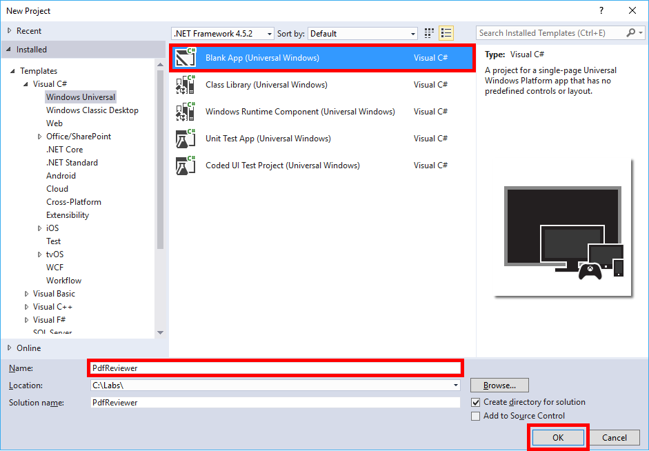

    _Creating a new UWP solution_

1. When prompted to choose target and minimum platform requirements, accept the defaults and click **OK**.

    

    _Specifying the platform versions_

1. Go to Solution Explorer and review the files and folders created for the solution, taking special notice of the "Assets" folder and the **Package.appxmanifest** file. You will be working with these in the next exercise. 

	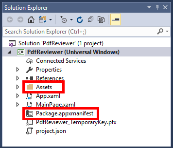

	_The new UWP solution_

You could build and run the app right now, but it wouldn't be very exciting because the app has a blank UI and uses generic branding assets for icons, splash images, and other visuals. The next step is to begin customizing the app by applying app-specific branding.

<a name="Exercise2"></a>
## Exercise 2: Add custom branding ##

In this exercise, you will import images into the project and use them to customize the app's tiles, splash screen, and other visual assets.

1. In Solution Explorer, right-click the project's "Assets" folder and select **Add** -> **Existing Item...**.

    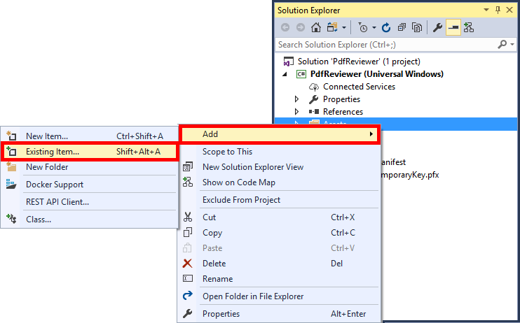

    _Adding items to the "Assets" folder_

1. In the "Add Existing Item" dialog, browse to the "Assets" folder in the "Resources" folder that accompanies this lab. Select all of the files in the "Assets" folder and click **Add**.

    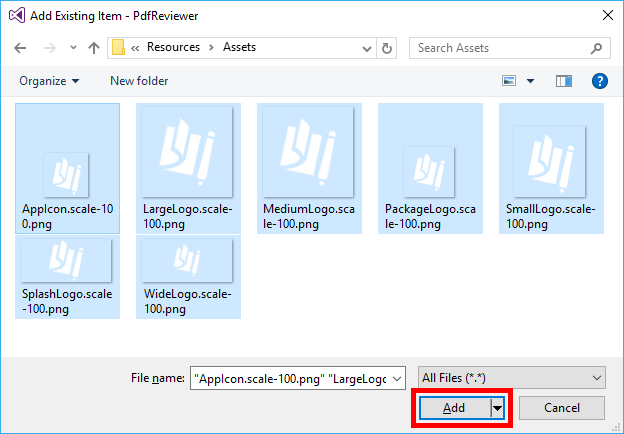

    _Adding images to the "Assets" folder_

1. In Solution Explorer, double-click **Package.appxmanifest** to open it for editing. This file, known as the "app manifest," contains information about the app regarding images, display names, permissions, and capabilities. In the manifest editor, ensure that **Application** is selected in the upper-left corner.

    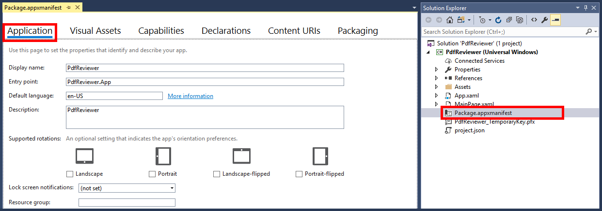

    _The app manifest_

1. Change the app's display name from "Pdf Reviewer" to "Pdf Reviewer." (You are simply adding a space character between "Pdf" and "Reviewer" to give your app a more readable display name.) Then change the app's description to "Pdf Reviewer for Windows."

    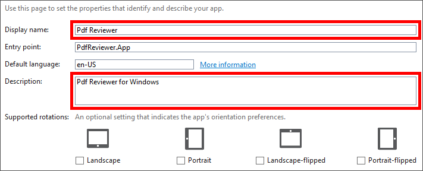

    _Changing the display name and description_

1. Click **Visual Assets** and ensure that **All Visual Assets** is selected on the left. These settings control the images, icons, and background colors used for the app's icons, logos, and splash screen.

    

    _Viewing visual assets_

1. Scroll down to "Display Settings" and enter the hexadecimal color value #CE0809 for both **Tile background** and **Splash screen background**.

    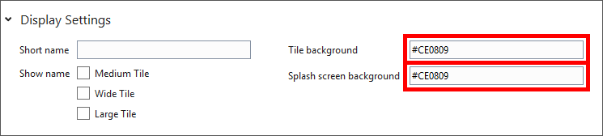

    _Updating the tile and splash-screen background colors_

1. Scroll down to "Preview Images." Type "Assets\SmallLogo.png" into the **Small Tile** box. Confirm that a thumbnail image appears below.
 
    

    _Updating the small-tile image_

	> You can optionally provide small-tile images of various resolutions to make tiles created for your app look great on different devices. The Universal Windows Platform is smart enough to determine which image to display based on the screen resolution. If you provide only one image, Windows automatically scales it up and down as needed.

1. Scroll down to **Medium Tile** and enter "Assets\MediumLogo.png" into the box.
 
    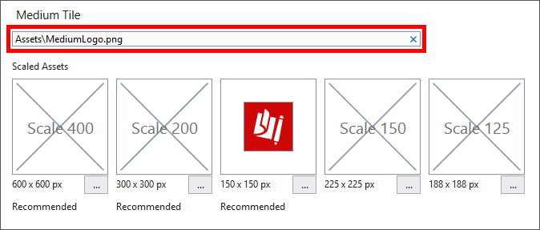

    _Updating the medium-tile image_

1. Scroll down to **Wide Tile** and enter "Assets\WideLogo.png" into the box.
 
    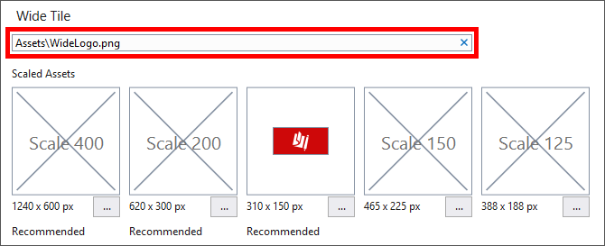

    _Updating the wide-tile image_

1. Repeat the previous steps to enter the following values for the following assets:

	- For **Large Tile**, enter "Assets\LargeLogo.png"
	- For **App Icon**, enter "Assets\AppIcon.png"
	- For **Splash Screen**, enter "Assets\SplashLogo.png"
	- For **PackageLogo**, enter "Assets\PackageLogo.png"
 
    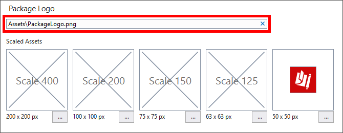

    _Updating the package logo_

These steps help make sure that your app will stand out from the rest with unique branding. Now it's time to write some code as a first step in making the app do something useful.

<a name="Exercise3"></a>
## Exercise 3: Add common logic and models ##

In most apps, but especially in a UWP app, it's helpful to write code that is centralized and shared by other parts of the app. As a best practice, the Model-View-ViewModel (MVVM) pattern is recommended for UWP apps. Implementing MVVM means creating pages ("views") to provide the visual experience, models to define the structure of data, and one or more view-models to connect views to models and manage the user experience. In this exercise, you will add a model and a view-model to the app.

1. In Solution Explorer, right-click the **PdfReviewer (Windows Universal)** project and use the **Add** -> **New Folder** command to add a folder named "Models" to the project.

1. Repeat the previous step to add a folder named "ViewModels" to the project.
 
1. Right-click the "Models" folder and use the **Add** -> **Class** command to add a class file named **PreviewInformation.cs** to the folder.
 
    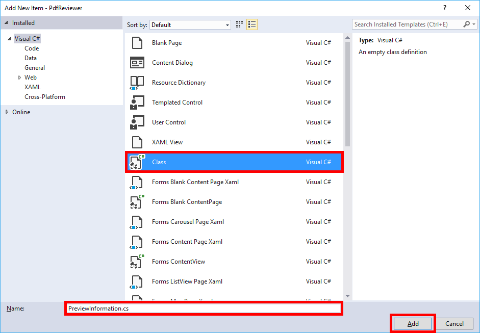

    _Adding the PreviewInformation class_

1. Change the scope of the ```PreviewInformation``` class to public by adding the keyword ```public``` to the class definition:
 
    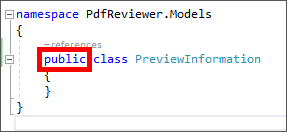

    _Changing the class scope_

1. Add the following ```using``` statement to the top of the file:

	```C#
	using Windows.UI.Xaml.Media.Imaging;
	```

1. Add the following property declarations to the ```PreviewInformation``` class:

	```C#
	public int PageNumber { get; set; }
	public BitmapImage PageImage { get; set; }
	public BitmapImage AnnotationImage { get; set; }
	```

1. Right-click the "ViewModels" folder and use the **Add** -> **Class** command to add a class file named **MainViewModel.cs** to the project.
 
    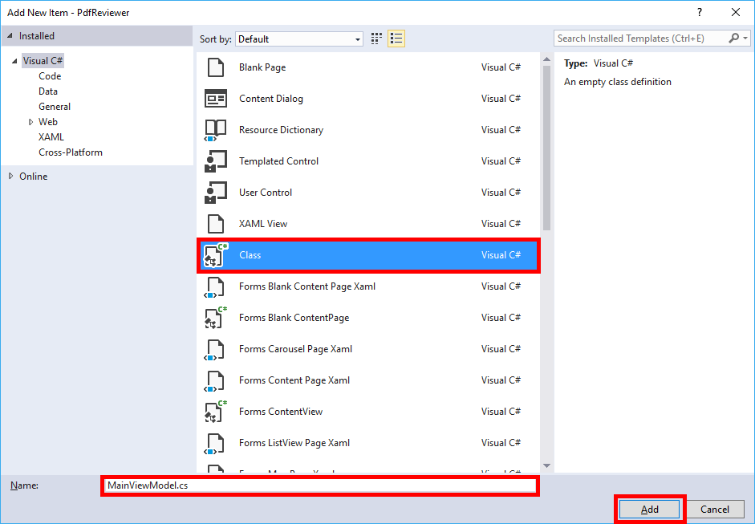

    _Adding the MainViewModel class_

1. Change the scope of the ```MainViewModel``` class to public by adding the keyword ```public``` to the class definition.

    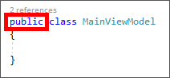

    _Changing the class scope_

1. Add the following ```using``` statements to the top of the file:

	```C#
	using PdfReviewer.Models;
	using System.Collections.ObjectModel;
	```

1. Add the following code to the ```MainViewModel``` class:

	```C#
	public MainViewModel()
    {
        this.AllDocuments = new ObservableCollection<PreviewInformation>();
    }

    public ObservableCollection<PreviewInformation> AllDocuments { get; set; }
    public PreviewInformation SelectedDocument { get; set; }
	```

1. In Solution Explorer, click the triangle next to **App.xaml** to reveal **App.xaml.cs**. Then double-click **App.xaml.cs** to open it for editing, and add the following line of code to the ```App``` class: 

	```C#
	public static ViewModels.MainViewModel ViewModel = new ViewModels.MainViewModel();
	```

	> In UWP apps, the ```App``` class represents the app itself and contains code that executes at critical times during the app's lifetime, such as when the app starts up or the app is suspended.

The "Pdf Reviewer" app now contains a model to describe the data that the app manages (in this case, pages imported from PDF documents) and a view-model to drive the user experience. The next step is to begin crafting the user interface.

<a name="Exercise4"></a>
## Exercise 4: Add pages and page navigation ##

In this exercise, you will modify the page included in the app when the project was created to show thumbnails representing pages in a PDF, add add a page for displaying individual PDF pages. You will also leverage Inking controls included in the Universal Windows Platform to allow users to annotate those pages.

1. In Solution Explorer, open **MainPage.xaml**. Then replace the contents of the file with the following XAML:

	```XAML
	<Page
    x:Class="PdfReviewer.MainPage"
    xmlns="http://schemas.microsoft.com/winfx/2006/xaml/presentation"
    xmlns:x="http://schemas.microsoft.com/winfx/2006/xaml"
    xmlns:local="using:PdfReviewer"  
    xmlns:d="http://schemas.microsoft.com/expression/blend/2008"
    xmlns:mc="http://schemas.openxmlformats.org/markup-compatibility/2006"
    mc:Ignorable="d">

    <Page.BottomAppBar>
        <CommandBar  IsOpen="True" IsSticky="True" RequestedTheme="Dark" Background="Black">
            <AppBarButton Icon="OpenFile" Label="Open" Click="OnOpenFileClick" />
        </CommandBar>
    </Page.BottomAppBar>

    <Grid x:Name="mainGrid" Background="{ThemeResource ApplicationPageBackgroundThemeBrush}">
        <Grid.RowDefinitions>
            <RowDefinition Height="Auto"/>
            <RowDefinition Height="Auto"/>
            <RowDefinition/>
        </Grid.RowDefinitions>

        <TextBlock Margin="10,0" x:Name="titleLabel" FontWeight="Bold" Text="Welcome to Pdf Reviewer for Windows"/>
        <TextBlock Margin="10,0" x:Name="subtitleLabel" Grid.Row="1" Text="Tap 'Open' from the toolbar to load a Pdf document to view all pages. Tap a document page to make annotations."/>

        <Border Margin="10" BorderThickness="1" BorderBrush="DarkGray" HorizontalAlignment="Stretch" VerticalAlignment="Stretch" Grid.Row="2">
            <GridView Margin="10" DataContext="{Binding}" ItemsSource="{Binding AllDocuments}">
                <GridView.ItemTemplate>
                    <DataTemplate>
                        <Border BorderThickness="1" BorderBrush="DarkGray" Width="200">
                            <Grid Margin="5">
                                <Image Source="{Binding PageImage}" Stretch="Uniform"/>
                                <Image Source="{Binding AnnotationImage}" Stretch="Uniform"/>
                                <Border RequestedTheme="Dark" VerticalAlignment="Bottom" HorizontalAlignment="Right" Width="30" Height="30" Background="Black">
                                    <TextBlock VerticalAlignment="Center" HorizontalAlignment="Center" TextAlignment="Center" Text="{Binding PageNumber}"/>
                                </Border>
                            </Grid>
                        </Border>

                    </DataTemplate>
                </GridView.ItemTemplate>
            </GridView>
        </Border>

        <ProgressBar Foreground="#FFCE0809" Visibility="Collapsed" Margin="20" Grid.RowSpan="3" VerticalAlignment="Center" HorizontalAlignment="Stretch" x:Name="loadingProgress"/>

    </Grid>
	</Page>
	```

1. Open **MainPage.xaml.cs** file and replace the contents of that file with the following code:

	```C#
	using PdfReviewer.Models;
	using System;
	using Windows.Data.Pdf;
	using Windows.Storage;
	using Windows.Storage.Pickers;
	using Windows.Storage.Streams;
	using Windows.UI.Xaml;
	using Windows.UI.Xaml.Controls;
	using Windows.UI.Xaml.Media.Imaging;
	
	namespace PdfReviewer
	{
	    /// <summary>
	    /// An empty page that can be used on its own or navigated to within a Frame.
	    /// </summary>
	    public sealed partial class MainPage : Page
	    {
	        public MainPage()
	        {
	            this.InitializeComponent();
	            this.Loading += MainPage_Loading;
	        }
	
	        private void MainPage_Loading(FrameworkElement sender, object args)
	        {
	            this.DataContext = App.ViewModel;
	        }
	
	        private void OnOpenFileClick(object sender, RoutedEventArgs e)
	        {
	            BrowseForFileAsync();
	        }
	
	        private async void BrowseForFileAsync()
	        {
	            var picker = new FileOpenPicker();
	            picker.FileTypeFilter.Add(".pdf");
	            StorageFile file = await picker.PickSingleFileAsync();
	
	            if (file != null)
	            {
	                App.ViewModel.AllDocuments.Clear();
	                var pdfDocument = await PdfDocument.LoadFromFileAsync(file);
	
	                var pageCount = pdfDocument.PageCount;
	
	                loadingProgress.Visibility = Visibility.Visible;
	                loadingProgress.Minimum = 1;
	                loadingProgress.Maximum = pageCount;
	
	                for (int i = 0; i < pageCount; i++)
	                {
	
	                    using (PdfPage page = pdfDocument.GetPage((uint)i))
	                    {
	                        loadingProgress.Value = i + 1;
	                        var stream = new InMemoryRandomAccessStream();
	                        var options1 = new PdfPageRenderOptions();
	                        await page.RenderToStreamAsync(stream);
	
	                        BitmapImage src = new BitmapImage();
	                        await src.SetSourceAsync(stream);
	
	                        App.ViewModel.AllDocuments.Add(new PreviewInformation()
	                        {
	                            PageNumber = i + 1,
	                            PageImage = src,
	                        });
	                    }
	                }
	
	            }
	
	            loadingProgress.Visibility = Visibility.Collapsed;
	        }
	
	        private void OnDocumentClick(object sender, ItemClickEventArgs e)
	        {
	        }
	    }
	}
	```

	Notice the ```FileOpenPicker``` used in the ```BrowseForFileAsync``` method. This control enables a user to browse files and folders on the device and select a PDF file. The file reference is then passed to the ```PdfDocument``` class to perform the magic of creating document thumbnails.

1. In Solution Explorer, right-click the **PdfReviewer (Universal Windows)** project and use the **Add** -> **New Item...** command to add a **Blank Page** named "ReviewPage.xaml."
 
    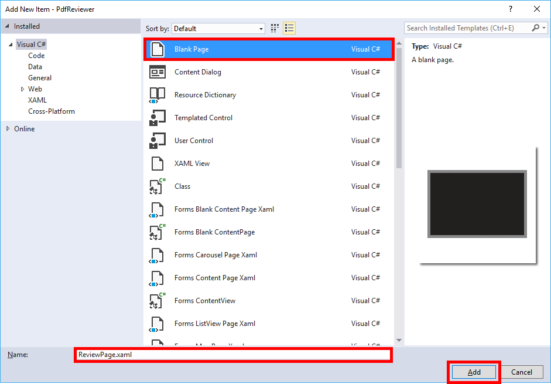

    _Adding a blank page to the project_

1. Open **ReviewPage.xaml** and replace the contents of the file with the following XAML:

	```XAML
	<Page
    x:Class="PdfReviewer.ReviewPage"
    xmlns="http://schemas.microsoft.com/winfx/2006/xaml/presentation"
    xmlns:x="http://schemas.microsoft.com/winfx/2006/xaml"
    xmlns:local="using:PdfReviewer"
    xmlns:d="http://schemas.microsoft.com/expression/blend/2008"
    xmlns:mc="http://schemas.openxmlformats.org/markup-compatibility/2006"
    mc:Ignorable="d">

    <Page.BottomAppBar>
        <CommandBar IsOpen="True" IsSticky="True" RequestedTheme="Dark" Background="Black">
            <AppBarButton Icon="Cancel" Label="Cancel" Click="OnCancelClick" />
            <AppBarButton Icon="Undo" Label="Undo" Click="OnUndoClick" />
            <AppBarButton Icon="Save" Label="Save" Click="OnSaveClick" />
        </CommandBar>
    </Page.BottomAppBar>

    <Grid x:Name="mainGrid" Background="{ThemeResource ApplicationPageBackgroundThemeBrush}">
        <Grid.RowDefinitions>
            <RowDefinition Height="Auto"/>
            <RowDefinition Height="Auto"/>
            <RowDefinition/>
        </Grid.RowDefinitions>

        <TextBlock Margin="10,0" x:Name="titleLabel" FontWeight="Bold" Text="Annotations"/>
        <TextBlock Margin="10,0" x:Name="subtitleLabel" Grid.Row="1" Text="Use the Ink Canvas toolbar to make annotations to your document. Tap 'Save' when complete."/>

        <Border Grid.Row="2" BorderBrush="DarkGray" BorderThickness="1" Margin="10">
            <Grid>
                <Image Source="{Binding PageImage}" Stretch="Uniform" HorizontalAlignment="Stretch" VerticalAlignment="Stretch"/>
                <InkCanvas x:Name="inkCanvas" HorizontalAlignment="Stretch" VerticalAlignment="Stretch" />
                <InkToolbar VerticalAlignment="Top" TargetInkCanvas="{x:Bind inkCanvas}" /> 
            </Grid>
        </Border>

    </Grid>
	</Page>
	```

	Notice the ```InkCanvas``` and ```InkToolbar``` controls declared in the page. These controls enable digital ink strokes to be rendered using pen, touch, or mouse input. They also provide a toolbar for changing inking options such as stroke type and stroke color. You will see these controls in action in [Exercise 6](#Exercise6).

1. Open **ReviewPage.xaml.cs** and replace its contents with the following code:

	```C#
	using System;
	using System.Collections.Generic;
	using Windows.Storage.Streams;
	using Windows.UI.Core;
	using Windows.UI.Input.Inking;
	using Windows.UI.Xaml;
	using Windows.UI.Xaml.Controls;
	using Windows.UI.Xaml.Media.Imaging;
	
	namespace PdfReviewer
	{
	    /// <summary>
	    /// An empty page that can be used on its own or navigated to within a Frame.
	    /// </summary>
	    public sealed partial class ReviewPage : Page
	    {
	        public ReviewPage()
	        {
	            this.InitializeComponent();
	            inkCanvas.InkPresenter.InputDeviceTypes = CoreInputDeviceTypes.Mouse | CoreInputDeviceTypes.Pen | CoreInputDeviceTypes.Touch;
	            this.DataContext = App.ViewModel.SelectedDocument;
	        }
	
	        private void OnSaveClick(object sender, RoutedEventArgs e)
	        {
	            RenderInkImageAsync();
	        }
	
	        private async void RenderInkImageAsync()
	        {
	            IReadOnlyList<InkStroke> currentStrokes = inkCanvas.InkPresenter.StrokeContainer.GetStrokes();
	
	            if (currentStrokes.Count > 0)
	            {
	                Windows.Storage.StorageFolder storageFolder = Windows.Storage.ApplicationData.Current.TemporaryFolder;
	                Windows.Storage.StorageFile file = await storageFolder.CreateFileAsync($"{Guid.NewGuid()}.png", Windows.Storage.CreationCollisionOption.ReplaceExisting);
	                if (file != null)
	                {
	                    Windows.Storage.CachedFileManager.DeferUpdates(file);
	                    IRandomAccessStream stream = await file.OpenAsync(Windows.Storage.FileAccessMode.ReadWrite);
	
	                    using (IOutputStream outputStream = stream.GetOutputStreamAt(0))
	                    {
	                        await inkCanvas.InkPresenter.StrokeContainer.SaveAsync(outputStream);
	                        await outputStream.FlushAsync();
	                    }
	                    stream.Dispose();
	                }
	
	                BitmapImage bm = new BitmapImage(new Uri($"ms-appdata:///temp/{file.Name}"));
	                App.ViewModel.SelectedDocument.AnnotationImage = bm;
	            }
	
	            Frame.GoBack();	
	        }
	
	        private void OnUndoClick(object sender, RoutedEventArgs e)
	        {
	            this.inkCanvas.InkPresenter.StrokeContainer.Clear();
	        }
	
	        private void OnCancelClick(object sender, RoutedEventArgs e)
	        {
	        }
	    }
	}
	```

1. With the main page and the review page in place, the next task is to add logic for navigating between pages. To begin, open **MainPage.xaml** and locate the ```GridView``` control.

    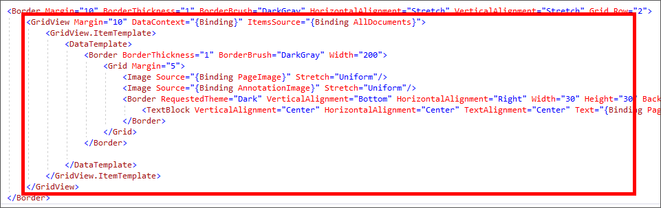

    _The MainPage GridView control_

1. Add the following attribute/value pairs immediately before the ```GridView``` control's ```Margin``` property to enable actions when a ```GridView``` item is clicked:

	```XAML
	ItemClick="OnDocumentClick" IsItemClickEnabled="True"
	```

    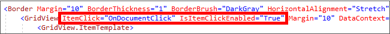

    _Updating the GridView control_

1. Right-click ```OnDocumentClick``` in the XAML you just added and select **Go to Definition** from the context menu. Then add the following code to the ```OnDocumentClick``` method.

	```C#
	App.ViewModel.SelectedDocument = e.ClickedItem as PreviewInformation;
	Frame.Navigate(typeof(ReviewPage));
	```

	Notice the use of ```Frame.Navigate``` to navigate to the review page when the user clicks an item in the ```GridView``` control.

1. Open **ReviewPage.xaml.cs** and add the following statement to the ```OnCancelClick``` method:

	```C#
	 Frame.GoBack();
	```

	UWP's ```Frame``` control provides several useful methods for navigating among an app's pages, including the ```GoBack``` method used here.

1. When designing an app's user experience, it is helpful to preview pages in Visual Studio's XAML designer to make sure everything looks the way you expect. This makes it easy to review page layouts at different resolutions and screen orientations before running the app.

	Open **MainPage.xaml** and click the **horizontal split icon** to make sure the XAML designer is visible.

    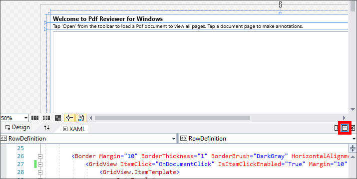

    _Previewing the UI in the XAML designer_

1. Locate the device-preview selector in the upper-left corner and select **5" Phone (1920 x 1080) 300% scale**. Observe that text is truncated on the right side of the page.

    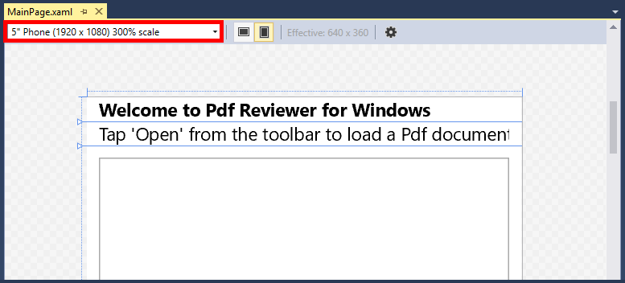

    _Previewing MainPage.xaml on a 5" phone_

1. Select **23" Desktop (1920 x 1080) 100% scale** from the device selector and observe the changes in the designer.

    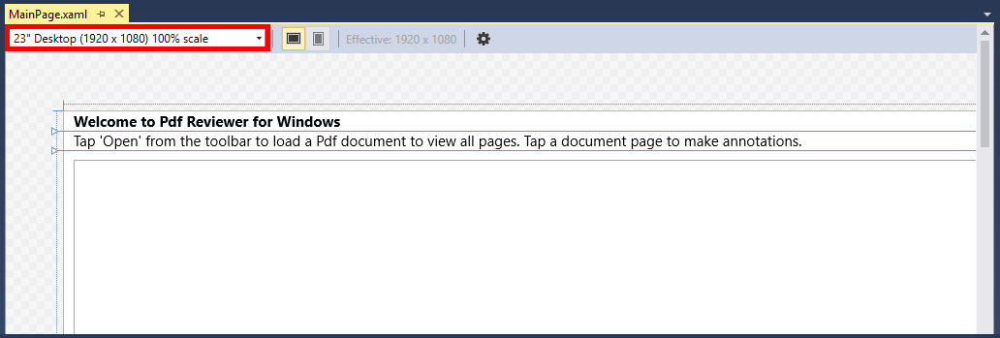

    _Previewing MainPage.xaml on a 23" desktop monitor_

1. Now select **8" Tablet (1280 x 800) 125% scale**.

    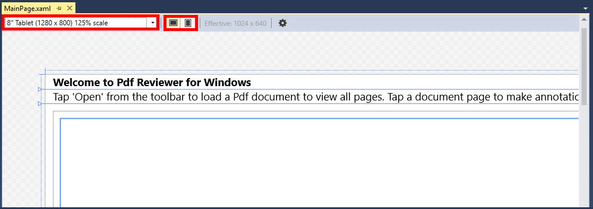

    _Previewing MainPage.xaml on an 8" tablet_

1. Click the portrait icon to see how **MainPage.xaml** looks on an 8" tablet rotated to portrait mode.

    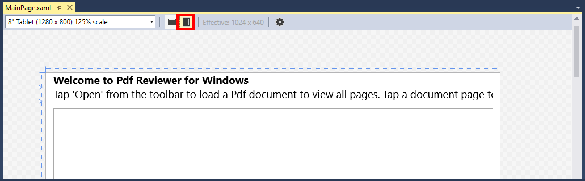

    _Previewing MainPage.xaml in portrait mode_

One of the most critical elements in the design of an app that can run on multiple devices and screen sizes is making sure it looks equally great on every one. From the previews in the XAML designer, it's obvious that more must be done to make sure this app meets this requirement. That's where visual states and adaptive triggers come in. 

<a name="Exercise5"></a>
## Exercise 5: Add visual states and adaptive triggers ##

One of the challenges to developing apps that run on a variety of devices is creating a user interface that looks great on any screen, and at any resolution. Before the Universal Windows Platform, this was often a cumbersome task, and code was difficult to maintain, especially as new devices entered the market. With UWP, building and maintaining adaptive user interfaces is a breeze. In this exercise, you will update the pages added in the previous exercise to take advantage of adaptive triggers and visual states.

1. Open **MainPage.xaml** and locate the closing ```Grid``` tag near the end of the file.

    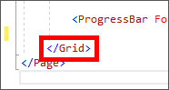

    _The Grid control's closing tag_

1. Add the following statements directly above the closing tag to define a pair of visual states named "WideLayout" and "NarrowLayout:"

	```XAML
	<VisualStateManager.VisualStateGroups>
	    <VisualStateGroup>
	        <VisualState x:Name="WideLayout">
	            <VisualState.StateTriggers>
	                <AdaptiveTrigger MinWindowWidth="900" />
	            </VisualState.StateTriggers>
	            <VisualState.Setters>
	                <Setter Target="mainGrid.Margin" Value="40" />
	                <Setter Target="titleLabel.Style" Value="{ThemeResource TitleTextBlockStyle}" />
	                <Setter Target="subtitleLabel.Style" Value="{ThemeResource SubtitleTextBlockStyle}" />
	            </VisualState.Setters>
	        </VisualState>
	
	        <VisualState x:Name="NarrowLayout">
	            <VisualState.StateTriggers>
	                <AdaptiveTrigger MinWindowWidth="0" />
	            </VisualState.StateTriggers>
	            <VisualState.Setters>
	                <Setter Target="mainGrid.Margin" Value="10" />
	                <Setter Target="titleLabel.Style" Value="{ThemeResource SubtitleTextBlockStyle}" />
	                <Setter Target="subtitleLabel.Style" Value="{ThemeResource BodyTextBlockStyle}" />
	            </VisualState.Setters>
	        </VisualState>
	    </VisualStateGroup>
	</VisualStateManager.VisualStateGroups>
	```

1. Observe the change to the wrapping of the text in the XAML designer.

    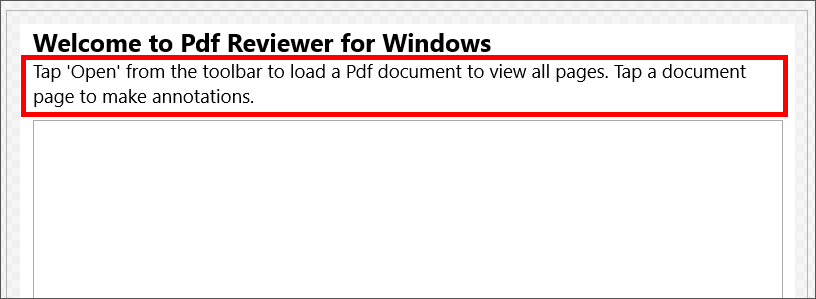

    _Previewing changes in the XAML designer_

1. Examine the visual state named "WideLayout." Using an ```AdaptiveTrigger```, this layout defines values for properties of certain elements in the user interface when the screen or window width is at least 900 effective pixels. Observe that visual states can define values not only for simple properties such as ```Margin```, but also for more complex properties such as ```Style```.

    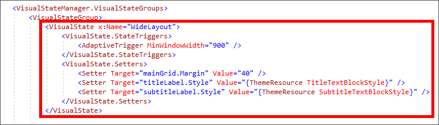

    _The "WideLayout" visual state_

1. Now examine the visual state named "NarrowLayout." This visual state assigns new values to  properties of the same elements in the user interface when the screen or window width is less than 900 effective pixels.

    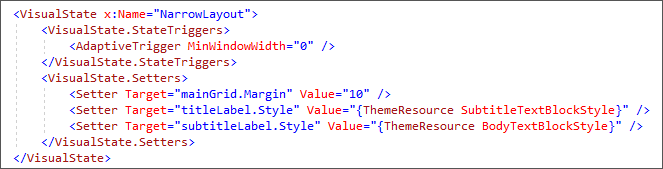

    _The "NarrowLayout" visual state_

1. In the device-preview selector, select a different device size and resolution, such as **23" Desktop (1920 x 1080) 100% scale**. Notice the changes that occur in the designer, including the increased margin size.

    

    _Previewing the layout on a 23-inch 1920 x 1080 desktop monitor_

1. Open **ReviewPage.xaml** and locate the closing ```Grid``` tag near the end of the file.

    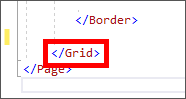

    _The Grid control's closing tag_

1. Add the following statements directly above the closing tag:

	```XAML
	<VisualStateManager.VisualStateGroups>
	    <VisualStateGroup>
	        <VisualState x:Name="WideLayout">
	            <VisualState.StateTriggers>
	                <AdaptiveTrigger MinWindowWidth="900" />
	            </VisualState.StateTriggers>
	            <VisualState.Setters>
	                <Setter Target="mainGrid.Margin" Value="40" />
	                <Setter Target="titleLabel.Style" Value="{ThemeResource TitleTextBlockStyle}" />
	                <Setter Target="subtitleLabel.Style" Value="{ThemeResource SubtitleTextBlockStyle}" />
	            </VisualState.Setters>
	        </VisualState>
	
	        <VisualState x:Name="NarrowLayout">
	            <VisualState.StateTriggers>
	                <AdaptiveTrigger MinWindowWidth="0" />
	            </VisualState.StateTriggers>
	            <VisualState.Setters>
	                <Setter Target="mainGrid.Margin" Value="10" />
	                <Setter Target="titleLabel.Style" Value="{ThemeResource SubtitleTextBlockStyle}" />
	                <Setter Target="subtitleLabel.Style" Value="{ThemeResource BodyTextBlockStyle}" />
	            </VisualState.Setters>
	        </VisualState>
	    </VisualStateGroup>
	</VisualStateManager.VisualStateGroups>
	```

1. Note the changes that occur in the designer as a result of the visual states you added.

    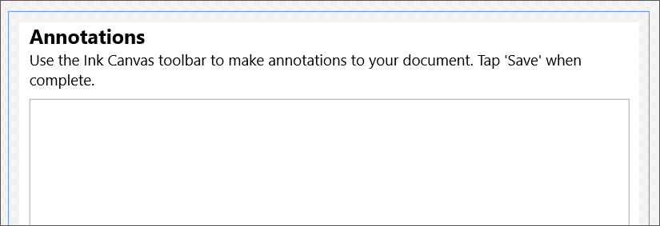

    _Previewing changes in the XAML designer_

	> You may notice that the XAML used for the visual states and adaptive triggers is the same for both pages. This isn't a requirement, and it's only the case here because the layout of the two pages is similar.

Visual states and adaptive triggers are important elements in most UWP apps and are the first line of defense in creating truly adaptive layouts. Realize that visual states can be considerably more complex than the ones you saw here. It is not uncommon for apps to define more than two states for each page and for each visual state to specify values for dozens of properties. UWP even supports custom triggers that can change the look and layout of a page in response to stimuli other than changing window widths. If you'd like to learn more about custom triggers, read [Using State Triggers to Customize UWP apps Across Devices](https://blogs.msdn.microsoft.com/mvpawardprogram/2017/02/07/state-triggers-uwp-apps/).

<a name="Exercise6"></a>
## Exercise 6: Test the app ##

In the final exercise, you will see the results of your efforts thus far by using the app to view and annotate PDF pages.

1. In order to build and run UWP apps on a Windows 10 PC, you must enable developer mode on the device. To ensure that developer mode is enabled, click the **Windows** button (also known as the Start button) in the lower-left corner of the desktop. Then select **Settings** from the menu and click **Update & security** in the Settings dialog. Now click **For developers** on the left and select **Developer mode** on the right, as shown below.

    

    _Enabling developer mode in Windows 10_

1. In Visual Studio, use the **Debug** -> **Start Without Debugging** command (or press **CTRL+F5**) to launch the app. Notice the splash screen that's displayed when the app starts. This is one of the image assets you imported in [Exercise 2](#Exercise2).

    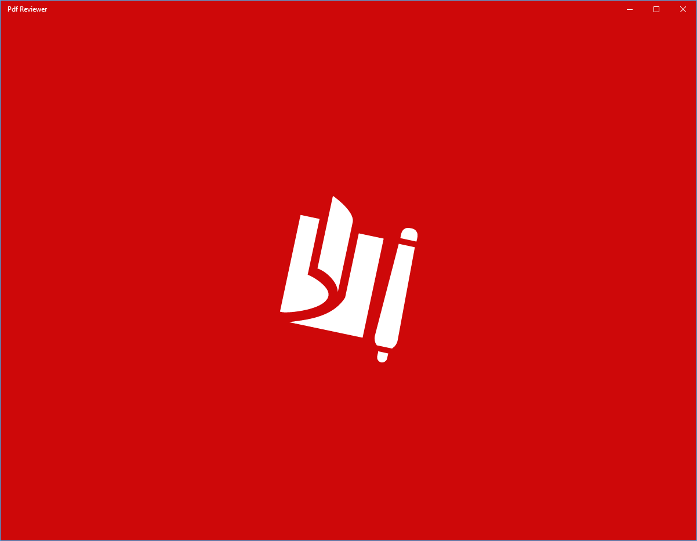

    _The Pdf Reviewer splash screen_

1. Click **Open** in the app's bottom app bar and browse to the "Resources\Documents" folder included with this lab.

    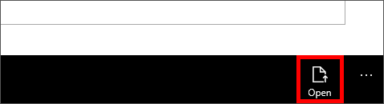

    _Opening a PDF file_

1. Select the file named **The Universal Windows Platform.pdf** and click **Open**. Confirm that the app displays a collection of thumbnails representing pages in the document.

    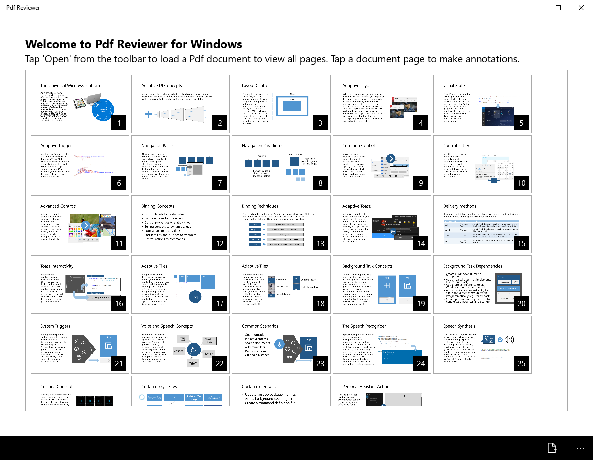

    _Pages in "The Universal Windows Platform.pdf"_

1. Resize the window to make it narrower and observe how the layout changes due to the adaptive trigger.

    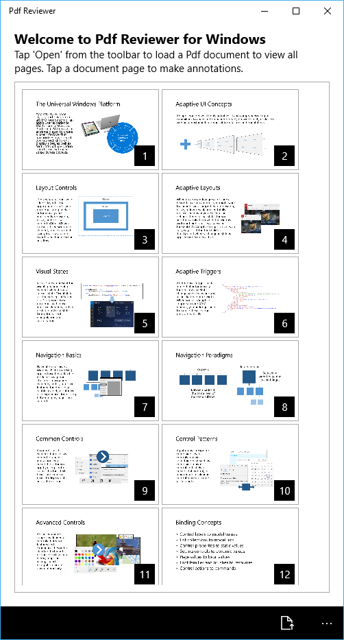

    _Adaptive layout in action_

1. Tap or click one of the page thumbnails to navigate to the review page and see an enlarged view of the page.

	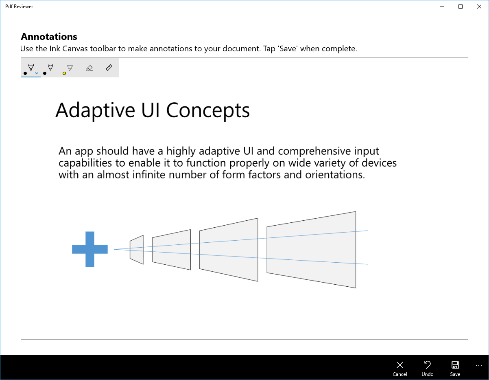

    _Page 2 of the document_

1. Using your mouse, pen, or finger if you're on a touch screen, select a color, such as red, from the Inking toolbar's "Ballpoint Pen" menu.

	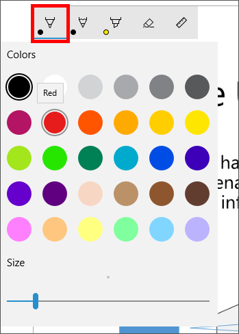

    _Using the Inking toolbar to change color_

1. Draw an annotation on the page.

	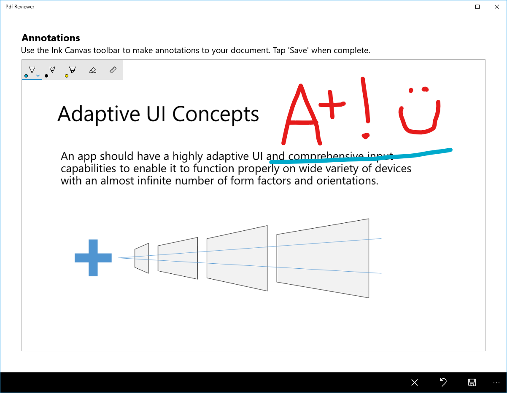

    _Annotating the page_

1. Experiment with other Inking control types such the Pencil, Highlighter, or Eraser, and try changing the size of the Inking element.

	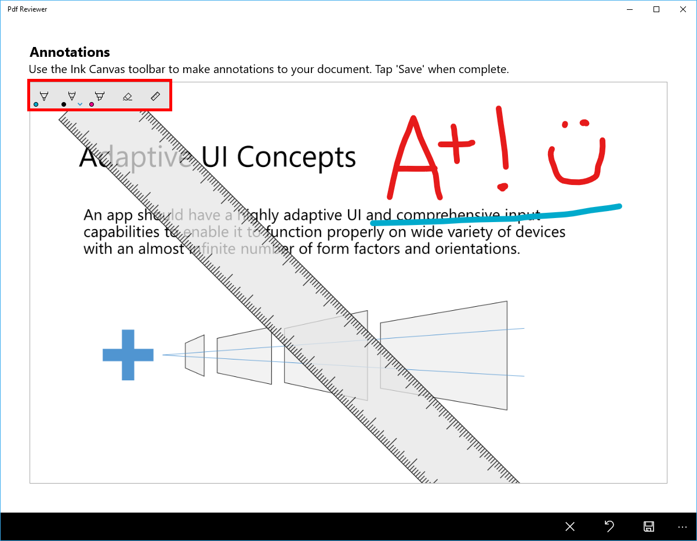

    _Using additonal Inking toolbar controls_

1. When you’re satisfied with your annotations, click **Save** in the bottom app bar.

	

    _Saving your annotations_

1. As you make other annotations on other pages, observe that your annotations appear in the page thumbnails on the home screen as well.
 
	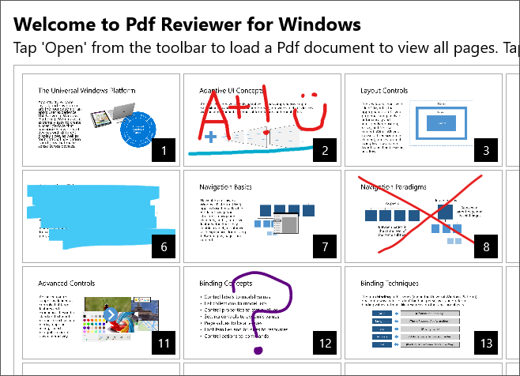

    _Thumbnails with annotations_

Feel free to experiment with the app on other UWP devices, including the built-in mobile emulators and even the [HoloLens Emulator](https://developer.microsoft.com/en-us/windows/holographic/install_the_tools) if you're curious to see how the app might look on a HoloLens.

<a name="Summary"></a>
## Summary ##

In this hands-on lab you learned how to:

- Create a Universal Windows Platform (UWP) app targeting multiple devices and form factors
- Brand an app with custom image assets
- Add common logic and models 
- Add pages and page navigation
- Use visual states and adaptive triggers to create adaptive layouts

This is just one example of how you can leverage the power of the Universal Windows Platform to develop robust, adaptive, and intelligent apps that can run on a range of devices and form factors, all while utilizing common and intuitive APIs, services, and controls. And it's a great place to start because it demonstrates some of the most important aspects of designing and executing a UWP app.

---

Copyright 2017 Microsoft Corporation. All rights reserved. Except where otherwise noted, these materials are licensed under the terms of the MIT License. You may use them according to the license as is most appropriate for your project. The terms of this license can be found at https://opensource.org/licenses/MIT.